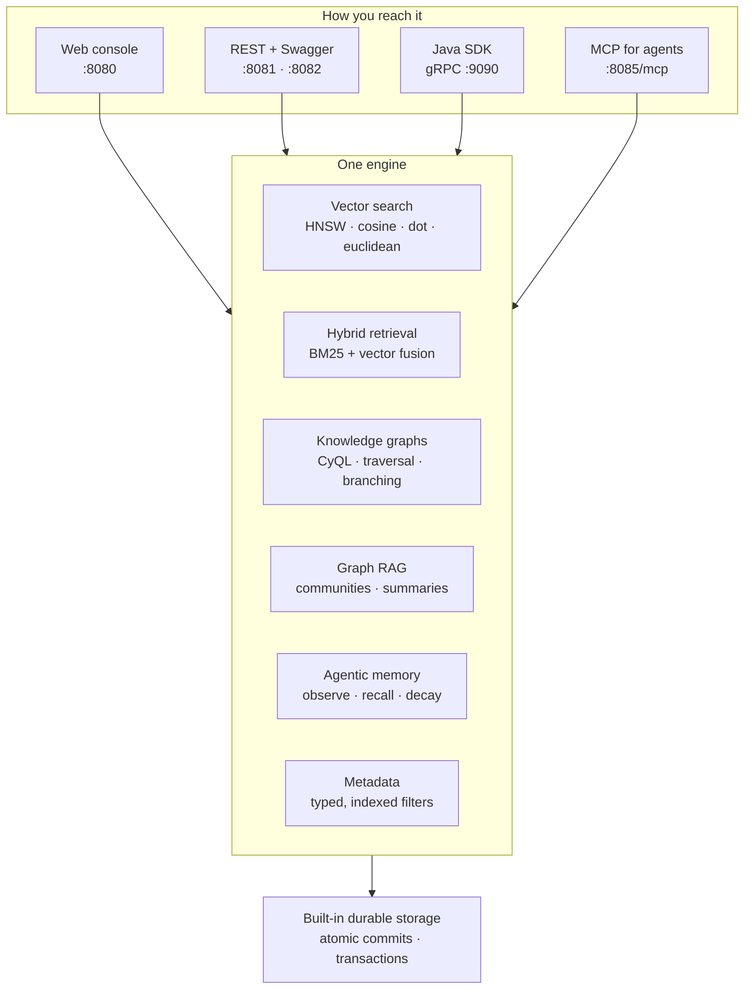

  

  <strong>The Unified AI Data Engine</strong>

Building an AI application usually means running a vector database, a graph database, a metadata
store and an agent memory layer side by side - four systems to deploy, connect and keep in sync.
CYROCK.AI DB replaces all of them with a single engine, with storage built in. No PostgreSQL, no
Redis, no Elasticsearch, no external vector store.

This manual covers the Early Access release. Everything here is driven from one container image:
the web console, the REST APIs, the Java SDK and the MCP endpoint for AI agents.

---

## Early Access scope

Please read this first - it shapes what you may do with the software.

- **Not for production.** Early Access is licensed for evaluation and internal, non-production
  development only. The evaluation image runs the whole engine in a single JVM with seeded,
  in-memory logins, so it is genuinely not built for production use.
- **Do not redistribute or embed.** The software may not be embedded in anything you ship or expose
  outside your own organization. The Java SDK is for evaluation and internal prototyping.
- **One container.** This release ships as a single all-in-one image. The multi-service deployment
  topology arrives at general availability.

The full terms are in the
[CYROCK.AI Early Access End-User License Agreement](https://github.com/cyrock-ai/early-access/blob/main/LICENSE).

---

## Capabilities

- **Vector search and hybrid retrieval** - approximate nearest-neighbour search over HNSW indices,
  fused with BM25 full-text scoring and typed metadata filters.
- **Knowledge graphs** - typed, weighted, directed graphs queried with CyQL, a Cypher-inspired
  language that also covers vector similarity, writes and schema changes.
- **Graph RAG** - community detection with hierarchical summaries and global search, plus graph
  branching so you can experiment on a copy.
- **Agentic memory** - an observe/recall/decay lifecycle, context-window construction and entity
  linking for autonomous agents.
- **Durability** - every statement is one atomic commit, with multi-operation transactions and
  rollback.

---

## Chapters

Start at the top; the first chapter gets you running in a few minutes.

| Chapter | What it covers |
|---|---|
| [Getting started](getting-started.md) | Run the container, log in, load sample data, run your first search, query and REST call. |
| [Concepts](concepts.md) | Collections and documents, graphs and nodes, vector fields, metadata, projects and roles. |
| [Web console](web-console.md) | A tour of the console: sample datasets, the workbench, graph visualization. |
| [CyQL](cyql.md) | The query language, by example: matching, traversal, vector similarity, paging, CSV loading. |
| [REST API](rest-api.md) | The auth model and a curl walkthrough, plus the built-in Swagger UI. |
| [Java SDK](java-sdk.md) | Adding the dependency, connecting, and CRUD, search and transactions. |
| [MCP for AI agents](mcp.md) | Connecting Claude and other MCP clients, and the tool catalogue. |
| [Configuration](configuration.md) | Environment variables: storage, memory, embedding and LLM providers, telemetry. |
| [Operations](operations.md) | Volumes and backup, health and metrics, logs, upgrading, sizing. |
| [Troubleshooting](troubleshooting.md) | First-start timing, memory, port conflicts, Apple Silicon, credentials. |
| [Release notes](release-notes.md) | What is in this release, and its known limitations. |

---

## Support and feedback

Early Access exists so we can hear what does and does not work for you. Bug reports, rough edges,
missing capabilities and "this was confusing" are all equally welcome.

Both channels live in the Early Access repository:

- **[Issues](https://github.com/cyrock-ai/early-access/issues)** - something is broken, or behaves
  differently from what this manual says.
- **[Discussions](https://github.com/cyrock-ai/early-access/discussions)** - questions, ideas, "how
  would I model this", and anything you are not sure is a bug.

One thing worth knowing: under the Early Access agreement, feedback you send us becomes ours to act
on freely. Both channels are also public, so please keep anything confidential to your organization
out of a report - and out of the logs you attach to one.
