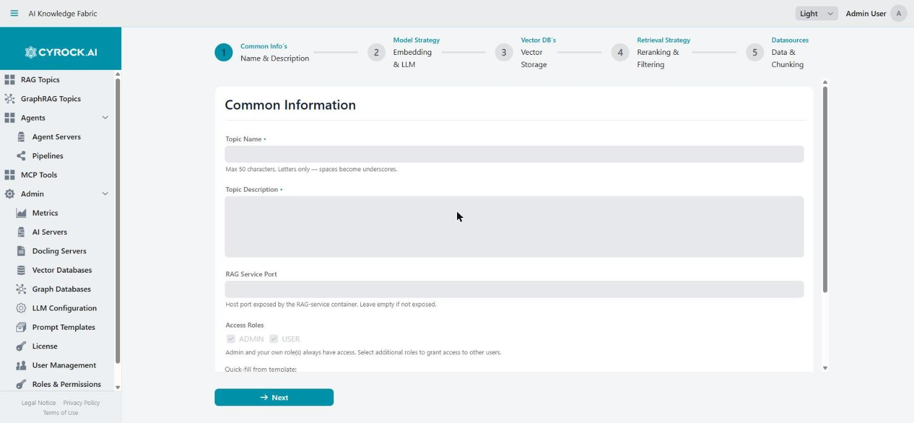
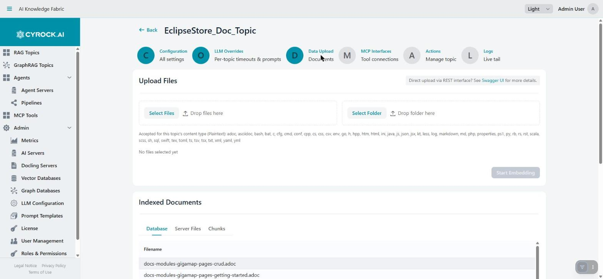
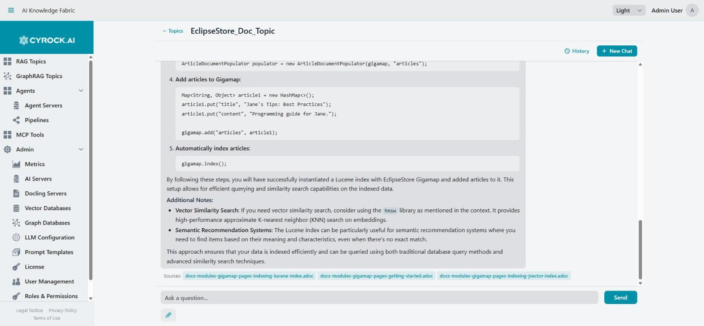

# Getting Started — from nothing to a working chatbot

This is the complete path: install the platform, give it a model, create a Topic, feed it documents,
and ask it a question. Every step links to the detailed page for that subject — read this one to know
*what* to do and in *which order*, and follow a link whenever you need the full field-by-field
explanation.

**What you get at the end:** one running RAG Topic that answers questions from your own documents and
cites the files it used.

**Time:** roughly 30–60 minutes, most of it spent downloading a language model.

| | Step | Result |
|---|---|---|
| 1 | [Install the frontend](#1-install-the-frontend-with-docker-compose) | The web UI on `http://localhost:8080` |
| 2 | [Prepare for a Topic](#2-prepare-for-a-topic) | A model provider, a Docling server, optionally a vector DB |
| 3 | [Create the Topic](#3-create-the-topic) | A Topic in status `RUNNING` |
| 4 | [Upload documents](#4-upload-documents) | Your files indexed and retrievable |
| 5 | [Use the chat](#5-use-the-chat) | Grounded answers with source citations |

> **New to the concepts?** [What the platform does](overview.md) explains Topics, Agents, and
> Pipelines in two minutes. This guide only covers Topics — the RAG chatbot side.

---

## 1. Install the frontend with Docker Compose

The platform ships as two containers: the management frontend and a PostgreSQL configuration store.
Everything else — Topic containers, Docling, Ollama, vector databases — is created later **by the
application itself**, which is why it needs the Docker socket.

1. Create an installation directory and put `docker-compose.yml` in it.
2. Create an `.env` next to it. Set at least `DB_PASSWORD`, `JWT_SECRET` (32+ characters) and
   `METRICS_API_KEY` before the first start.
3. `docker compose up -d`, then wait for the images to pull (one to three minutes).
4. Open `http://<your-host>:8080` and log in with **`admin` / `admin`**.
5. **Change the admin password immediately** under **Profile → Change Password**.

> **On plain Linux Docker** (not Docker Desktop), set `RAG_AI_SERVER_HOST`, `RAG_MCP_HOST` and
> `RAG_DOCLING_HOST` to `172.17.0.1` in `.env` now. `host.docker.internal` does not resolve there, and
> the symptom appears much later — a Topic that starts fine but cannot reach any model.

**Check:** you are logged in and see the Topic list.

📖 **Detail:** [Docker Compose installation](../2.0-Installation/docker-compose-installation.md) —
prerequisites, every environment variable, reverse proxy, backup, upgrades

---

## 2. Prepare for a Topic

A Topic cannot be created without a **chat model** and an **embedding model**. The rest of this step
is about having those ready — plus Docling if your documents are PDFs or Office files.

### 2a. Install LM Studio for the models

LM Studio is the quickest fully local option: no API key, no cost, no data leaving your machine. Skip
this if you intend to use a cloud provider instead (see [2b](#2b-connect-the-ai-server)).

1. Download and install **[LM Studio](https://lmstudio.ai/)**. A 7B model needs roughly 6–8 GB of
   free RAM or VRAM.
2. In the **Discover** tab, download two models:

   | Model | Role |
   |---|---|
   | `qwen2.5-coder-7b-instruct` | Chat model — writes the answers |
   | `text-embedding-nomic-embed-text-v1.5` | Embedding model — turns documents into vectors (768 dimensions) |

3. In the **Developer** tab, switch the server to **Running** (port `1234`) and enable
   **Serve on Local Network**.

> **"Serve on Local Network" is not optional.** By default LM Studio binds to `localhost` only, and a
> Topic container cannot reach that — the single most common reason a model never shows up.

**Check:** `curl http://localhost:1234/v1/models` lists both models.

📖 **Detail:** [Getting started with a local model](../3.0-Configuration/3.1-AI-Server/Getting_Started_Local_AIModel.md) —
installation, quantisation choice, the `lms` CLI, headless mode

### 2b. Connect the AI server

Register the endpoint so its models appear in the Topic wizard: **Admin → AI Servers → Add AI Server**.

| Field | LM Studio | Cloud provider (e.g. Anthropic) |
|---|---|---|
| **Server Type** | `External (existing instance)` | `External (existing instance)` |
| **Provider** | `OpenAI-compatible` | `Anthropic` / `OpenAI` |
| **Host** | `host.docker.internal` · `172.17.0.1` on plain Linux Docker · `localhost` if the app runs outside Docker | The provider's host |
| **Port** | `1234` | As documented by the provider |
| **API Key** | *(empty)* | Required |

> **Never put `http://` or `/v1` in the Host field.** The platform builds the URL itself and appends
> `/v1` for OpenAI-compatible providers — entering it manually produces `/v1/v1/embeddings`, and
> embedding silently returns nothing.

There is a third option: **Managed (deployed by this app)** starts an **Ollama** container for you.
Use it when you want the platform to own the model server's lifecycle; it is locked to Ollama.

**Check:** open the new server, go to the **Models** tab. Both models are listed. An empty list means
the endpoint is not reachable — the *Error* status in the list means the same thing.

📖 **Detail:** [Connect LM Studio](../3.0-Configuration/3.1-AI-Server/Connect%20LM%20Studio%20AI%20Server.md) ·
[Connect Claude (Anthropic)](../3.0-Configuration/3.1-AI-Server/Connect%20External%20Claude%20AI%20Sever.md)

### 2c. Connect or install the Docling server

Docling converts PDF, DOCX, PPTX and XLSX into clean text before embedding. **Without it, a PDF cannot
be indexed at all** — and the Topic wizard makes it mandatory as soon as you pick a binary datasource
type.

Go to **Admin → Docling Servers**. A managed server named **`Local Docling`** is already seeded on
first start, so usually there is nothing to create:

| You want | Do this |
|---|---|
| The platform to run Docling for you | Select `Local Docling` and press **Start**. The platform pulls `docling-serve-cpu` and starts the container |
| To use a Docling instance you already run | **Add Docling Server** → Server Type `External`, then Host and Port (default `5001`) |

The first start pulls a multi-GB image; the status cell names the current phase (*Downloading the
Docling image (several GB)* → *Starting the container* → *Waiting for the Docling server to answer*)
together with the elapsed time. A **managed** server has no Host/Port fields — the URL is assigned
when it starts.

> **Plain text only?** Docling is not needed. You can skip this and pick datasource type *Plaintext*
> in the wizard.

**Check:** the server's status is `RUNNING` (managed) or reachable (external).

> Long or scanned PDFs can exceed the 5-minute default conversion timeout. Raise **Docling Timeout**
> under [Admin → LLM Configuration](../3.0-Configuration/3.3-Global%20LLM%20configuration/Global-LLM-Configuration-and-Prompt-Templates.md#timeouts),
> globally or per Topic.

### 2d. Connect a vector database *(optional)*

**Skip this for your first Topic.** Left empty, a Topic gets its own embedded EclipseStore vector
database in a private volume, with zero configuration. That is a perfectly good production answer for
a single Topic of moderate size.

Register an external database (**Admin → Vector Databases**) when you already run one, need capacity
or resilience beyond a local volume, or want several Topics to share one backend. Qdrant, Milvus,
Weaviate and CYROCK.DB are supported.

> **The Qdrant trap:** the port is **6334** (gRPC), not the 6333 its dashboard and docs show. The
> platform reaches Qdrant and Milvus over gRPC, Weaviate and CYROCK.DB over HTTP. Use **Test
> Connection** in the dialog — it probes with the protocol that type actually uses.

📖 **Detail:** [Connect a Vector DB](../3.0-Configuration/3.2-Vector-DB%C2%B4s/Connect-Vector-DB.md) —
supported types, TLS, the connection test, collection naming, sharing one instance

### 2e. Check the LLM settings

One look at **Admin → LLM Configuration** before you build anything, because two of these bite later:

| Setting | Why look now |
|---|---|
| **Timeouts** (chat, embedding, picture description, Docling) | The defaults assume a cloud API. **Local models on CPU are far slower — 10 minutes or more is realistic for a 7B model.** A too-tight timeout surfaces as a failed chat, not a slow one |
| **System Prompt** | The global template every Topic's own prompt is inserted into, at `{{USER_EDITABLE_PROMPT}}`. The seeded default may still contain a literal `[YOUR APP NAME]` — replace it |
| **No-Answer Response** | What the chatbot says when retrieval finds nothing. Worth phrasing in your own voice |

Everything here is a **default**; each Topic can override all of it on its **LLM Overrides** tab.

📖 **Detail:** [Global LLM configuration & prompt templates](../3.0-Configuration/3.3-Global%20LLM%20configuration/Global-LLM-Configuration-and-Prompt-Templates.md)

---

## 3. Create the Topic

**Topics → New Topic** opens a five-step wizard. **Next** validates each step before advancing.

### 3a. The wizard, step by step

**Step 1 — Common Information**

Name (letters only, spaces become underscores), description, the **User System Prompt** that gives the
Topic its character, a free **RAG Service Port** on the host (8081, 8082, …), and the **Roles** allowed
to use it. The prompt is inserted into the global template, so write only what is specific to this
Topic — *"You are an HR assistant. Answer only from the policy documents."*

**Step 2 — Models** · *the step that blocks progress*

Pick the **Datasource type** first, because it reshapes the rest of the step: `Plaintext + Binary` and
`Mixed` make **Docling mandatory**, `Images` and `Mixed` add the vision-model section. Then select the
**embedding model** (it asks for the output dimension — keep the pre-filled native size) and the
**chat model**.

> If **Next** appears to do nothing here, one of the two models is not selected. Scroll to the bottom
> of the step — both selectors and their inline errors are down there.

> **The embedding model is the one choice you cannot revise painlessly.** Vectors from one model are
> meaningless to another, so changing it later invalidates everything indexed and forces a full
> re-ingestion.

**Step 3 — Vector Storage** — one dropdown. Leave it empty to use the embedded store (see
[2d](#2d-connect-a-vector-database-optional)).

**Step 4 — Retrieval Strategy** — everything is pre-filled with working defaults (`HYBRID`, Top-K `3`,
reranking `NONE`, minimum similarity `0.6`); you can pass straight through. This step also holds
**Chat Attachments**: which file types users may attach to a message, plus the *Chat LLM is
vision-capable* checkbox you tick to assert your model really can see images.

**Step 5 — Data Source** — source type, storage mode, and the chunking settings covered in
[4a](#4a-chunking-of-the-documents). The primary button reads **Save** instead of **Next** — that is
how you know you are on the last step.

**After saving**, the Topic is in status `CREATED`. Press **Start**: `STARTING` → `RUNNING`. A first
start that includes an Ollama sidecar downloads the model and can take a long time.

**Check:** the Topic shows `RUNNING` in the list.

📖 **Detail:** [Creation step by step](../4.0-RAG%20Topics/4.2-Creation/Creation-Step-by-Step.md) —
every field of all five steps, with the validation rules ·
[Topic overview](../4.0-RAG%20Topics/4.1-Overview/Overview.md) — what actually runs per Topic

---

## 4. Upload documents

Open the Topic (click its row) → **Data Upload** tab. Requires `TOPIC_UPLOAD`.

1. **Select Files** (or **Select Folder**, up to 500 files at once), or drop them onto the zone.
2. Press **Start Embedding**.

> **Uploading is not indexing.** Selecting files only stages them — nothing is embedded until you
> press **Start Embedding**. This is the single most common "why does it not know my document"
> moment.

Files are processed one by one with a progress line. The batch is tracked server-side, so you can
navigate away and come back; closing the browser does not cancel it. If something fails, an amber
banner explains why and **↻ Retry upload** *resumes* rather than restarting.

**Check:** open **Indexed Documents → Chunks**. Your document's text should be there, readable.

### 4a. Chunking of the documents

Documents are not embedded whole — they are split into overlapping **chunks**, and a chunk is the unit
that gets retrieved and handed to the model. The settings live in **wizard step 5** (and on the
Topic's Configuration tab afterwards):

| Field | Default | What it does |
|---|---|---|
| **Chunk Size** | `512` | Tokens per chunk. Smaller = more precise retrieval but more fragmented context; larger = more context per hit but more noise and tokens |
| **Chunk Overlap** | `50` | Tokens repeated between neighbouring chunks, so a sentence spanning a boundary is not lost |
| **Chunking Strategy** | `RECURSIVE` | See below |
| **Storage Mode** | `EMBEDDED` | Stores the file content alongside its vectors. This is the only mode the upload UI can drive — `EXTERNAL` (store only a path or URL) is reachable through the rag-service's REST endpoint alone and is therefore not offered in the wizard |

**The two chunking strategies:**

| Strategy | What happens | Cost |
|---|---|---|
| `RECURSIVE` | Splits along paragraph, then sentence, then word boundaries until the chunk size is reached. Fenced code blocks are kept intact | None beyond embedding |
| `SEMANTIC` | The same split, **plus one LLM call per chunk** that prepends a sentence placing that chunk in the whole document ("contextual retrieval") | One chat-model call **per chunk** — a 200-chunk PDF means 200 calls |

`SEMANTIC` is worth it when a chunk means little on its own — a table row, a numbered clause, a
paragraph that says "it must not exceed this value" without naming what *it* is. Despite the name it
does not split on semantic similarity; it improves what each chunk *says about itself*.

> Ingestion with `SEMANTIC` takes far longer and runs on the chat model, so it is bound by the **Chat
> Timeout**. Try it on a handful of documents before turning it on for a large corpus.

Chunk size and overlap are fixed at creation — changing them would leave old and new embeddings
inconsistent, so create a new Topic instead. The **strategy** can be changed later on the Topic's
**Configuration** tab: it travels with each upload rather than with the container, so it applies from
the next upload on **without a restart**. Documents already indexed keep the chunking they were given;
re-upload them to convert.

**The Chunks tab is the most useful diagnostic in the product.** It shows exactly what the model can
retrieve: garbled text means the conversion failed (usually Docling), chunks cut mid-sentence explain
incoherent answers, and a document missing entirely means ingestion failed silently rather than
retrieval being at fault.

📖 **Detail:** [Configuration and functions](../4.0-RAG%20Topics/4.3-Configuration/Configuration.md#3-data-upload) —
the upload tab, the three inspection tabs, and what a Database/Server Files mismatch means

---

## 5. Use the chat

Click the Topic name in the list to open the chat. Requires `TOPIC_CHAT` and a `RUNNING` Topic.

### 5a. Prompt input

Type into the input bar and press **Enter** or **Send**. While an answer is being generated the input
is disabled and a **Stop** button appears — or press **Esc**. A local model taking a minute or more is
normal; if it aborts itself, the Chat Timeout is too low.

Under each answer, a **Sources:** row lists the documents the passages came from, one badge per file.
That row is what makes an answer verifiable — if it looks wrong, open the cited file and check. No
sources listed means the model answered without retrieval.

> Source badges are download links that carry a one-off key, valid for about **10 minutes**. After
> that the badge turns grey and clicking it says the link expired; ask the question again for a fresh
> one. Sources on an old answer reopened from **History** are always in that state.

Conversations are persistent and per user: **+ New Chat** starts a fresh context, **History** reopens
an earlier one. Deleting a conversation deletes its messages with it.

### 5b. File attachments

The **📎 paperclip** below the input attaches files to a *single* question. You can also drag files
onto the input field, and pasting more than 300 characters turns the text into an attachment chip
instead of flooding the field.

| Type | Requirement |
|---|---|
| Plain text (txt, md, json, yaml, csv, source code) | None |
| Binary documents (PDF, DOCX, XLSX, PPTX) | Docling, plus the type enabled in wizard step 4 |
| Images (JPG, PNG, GIF, WEBP, …) | A vision-capable chat model, and the *vision-capable* checkbox ticked |

> **Attachments are ephemeral.** They are folded into the context for that one reply and **never
> added to the knowledge base**. To add a document permanently, upload it on the Data Upload tab
> ([step 4](#4-upload-documents)). A rejected attachment usually means the type was not enabled in
> wizard step 4.

📖 **Detail:** [Chat window](../4.0-RAG%20Topics/4.4-Chat/Chat-Window.md) — layout, sessions, sources,
attachments, error handling, and how to get better answers

---

## First-run troubleshooting

The five things that most often go wrong on a first install:

| Symptom | Cause and fix |
|---|---|
| Topic stays `STARTING`, then `ERROR` | The app cannot reach the Docker daemon, or the chosen RAG Service Port is already taken |
| Model picker in the wizard is empty | The AI server is unreachable. LM Studio: **Serve on Local Network** is off. Check the server's Models tab |
| Topic runs, but chat fails to connect | Host-alias problem. On plain Linux Docker set `RAG_AI_SERVER_HOST` / `RAG_MCP_HOST` / `RAG_DOCLING_HOST` to `172.17.0.1` |
| Upload succeeds, but answers ignore the document | Look at the **Chunks** tab. Nothing there = ingestion failed (check the Logs tab); garbled text = Docling conversion failed |
| "Free tier limit reached" | Without a license key the limits are 3 Topics, 2 Agents, 10 Pipelines — see [License](../3.0-Configuration/3.4-License/License.md) |

Every Topic has a **Logs** tab with a live tail of its rag-service. When the UI message is not
specific enough, the log names the downstream call that actually failed.

---

## Where to go next

| Next | Page |
|---|---|
| Tune retrieval quality, timeouts, prompts per Topic | [Configuration and functions](../4.0-RAG%20Topics/4.3-Configuration/Configuration.md) |
| Drive upload and chat from a script | [REST API](../4.0-RAG%20Topics/4.5-REST-API/REST-API.md) |
| Give the Topic external tools | [Configuration → MCP Interfaces](../4.0-RAG%20Topics/4.3-Configuration/Configuration.md#4-mcp-interfaces) |
| Create real users instead of `admin` | [User management](../3.0-Configuration/3.5-Users-Roles-and-Authentication/User-Management.md) · [Roles & permissions](../3.0-Configuration/3.5-Users-Roles-and-Authentication/Roles-and-Permissions.md) |
| Build multi-step agents instead of a chatbot | [Agents & Pipelines overview](../5.0-Agents%20and%20Pipelines/5.1-Overview/Overview.md) |

---

## Related

- [What the platform does](overview.md) — Topics, Agents, Pipelines and how they relate
- [Feature list](AI-Knowledge-Fabric-Features.md) — everything the platform supports
- [RAG Topics overview](../4.0-RAG%20Topics/4.1-Overview/Overview.md) — the architecture behind a Topic
