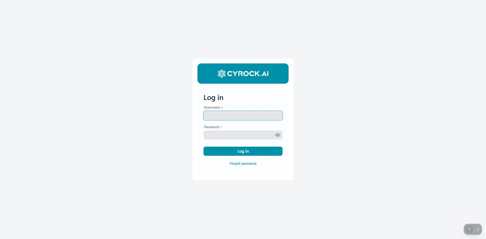

# Installing AI Knowledge Fabric with Docker Compose

This guide describes how to install and run the AI Knowledge Fabric management frontend on a single
host using Docker Compose. This is the recommended setup for evaluations, single-server
installations, and small team deployments.

For multi-node / cluster installations, see the Kubernetes deployment guide instead.

---

## 1. How the installation works

The Compose file starts **two containers**:

| Container | Image | Purpose |
|---|---|---|
| `aiknowledgefabric-app` | `cyrockai/knowledge-fabric-frontend` | The management frontend — web UI, REST API, container orchestration |
| `aiknowledgefabric-db` | `postgres:16-alpine` | Configuration store (topics, agents, pipelines, users, roles, chat history) |

Everything else is created **at runtime, by the application itself**. When you start a Topic or an
Agent in the web UI, the management app generates a Compose file for it and starts the required
containers (RAG service, vector database, Ollama, Docling, agent server) directly on the same Docker
host. This is why the app container needs access to the Docker socket — see
[Why the Docker socket is mounted](#5-why-the-docker-socket-is-mounted).

```
                    ┌─────────────────────────────────────────┐
  Browser ─────────►│  aiknowledgefabric-app        :8080     │
                    │  (management frontend)                  │
                    └───┬──────────────────────────┬──────────┘
                        │                          │
                        │ JDBC                     │ /var/run/docker.sock
                        ▼                          ▼
            ┌───────────────────────┐   ┌──────────────────────────────────┐
            │ aiknowledgefabric-db  │   │  Containers created on demand:   │
            │ (PostgreSQL)          │   │  topic stacks, agents, Ollama,   │
            └───────────────────────┘   │  Docling, vector databases       │
                                        └──────────────────────────────────┘
```

---

## 2. Prerequisites

| Requirement | Notes |
|---|---|
| **Docker Engine 24+** with the **Compose v2 plugin** | Verify with `docker compose version` |
| **Linux, macOS, or Windows** | On Windows/macOS use Docker Desktop; on Windows, WSL 2 backend is recommended |
| **Free port 8080** | Configurable — see [Configuration](#4-configuration) |
| **Free disk space** | At least 20 GB. Model files (Ollama) and vector data grow quickly |
| **RAM** | Minimum 4 GB for the management app itself. Add 8 GB or more if you plan to run local LLMs via Ollama on the same host |
| **Internet access** | Required to pull images from Docker Hub, unless you mirror them into a private registry |

> **Note:** No Java, Maven, or Node.js installation is required. The images are prebuilt.

---

## 3. Installation

### Step 1 — Create an installation directory

```bash
mkdir -p /opt/aiknowledgefabric
cd /opt/aiknowledgefabric
```

### Step 2 — Download the Compose file

Download `docker-compose.yml` into that directory:

**Download:** [`docker-compose.yml`](../../docker-compose.yml)

```bash
curl -o docker-compose.yml \
  https://raw.githubusercontent.com/cyrock-ai/early-access/main/knowledge-fabric/docker-compose.yml
```

Both images it references are published on Docker Hub, so there is nothing to clone and nothing to
build — this file is the only thing you need on the host.

### Step 3 — Create an `.env` file (recommended)

Create an `.env` file next to `docker-compose.yml`. Docker Compose picks it up automatically.
A minimal, production-sensible starting point:

```dotenv
# Port the web UI is served on
APP_PORT=8080

# PostgreSQL password — change this before the first start
DB_PASSWORD=<choose-a-strong-password>

# HMAC signing secret for issued API tokens — at least 32 characters
JWT_SECRET=<choose-a-random-string-of-at-least-32-characters>

# Shared secret that topic/agent containers use to report usage metrics back to the app
METRICS_API_KEY=<choose-a-random-string>

# License key (optional — without it the free-tier limits apply)
CYROCK_LICENSE_KEY=
```

> **Important:** `DB_PASSWORD` is only applied to the database on the **first** start, when the
> PostgreSQL data volume is created. Changing it later requires changing the password inside
> PostgreSQL as well, or recreating the volume (which deletes all data).

### Step 4 — Start the stack

```bash
docker compose up -d
```

The first start pulls both images and initialises the database schema. This typically takes one to
three minutes.

### Step 5 — Check that it is running

```bash
docker compose ps
docker compose logs -f app
```

Wait for the Spring Boot startup line in the log, then open:

```
http://<your-host>:8080
```

### Step 6 — First login

<a href="../../assets/screenshots/login.jpg"></a>

| Field | Value |
|---|---|
| Username | `admin` |
| Password | `admin` |

**Change this password immediately** under **Profile → Change Password**.

> If the form shows an SSO button instead of, or next to, these fields, the instance has already been
> switched to OIDC — see [OIDC Settings](../3.0-Configuration/3.5-Users-Roles-and-Authentication/OIDC-Settings.md).

### Step 7 — Post-installation checks

1. **Admin → AI Servers** — register at least one model provider (a local Ollama server or an
   external endpoint such as OpenAI or Anthropic).
2. **Admin → Users** — create real user accounts and assign roles.
3. **Admin → License** — paste your license key if you have one.
4. Create your first Topic under **Topics** to verify that container orchestration works end to end.

---

## 4. Configuration

All configuration is done through environment variables. Set them in `.env` (or directly in the
`environment:` block of the `app` service).

### Core settings

| Variable | Default | Description |
|---|---|---|
| `APP_PORT` | `8080` | Host port the web UI is published on |
| `DB_PASSWORD` | `admin` | PostgreSQL password (used by both containers) |
| `JWT_SECRET` | *(insecure default)* | HMAC-SHA256 secret for issued API tokens. **Must be at least 32 characters — always override in production** |
| `JWT_EXPIRY_HOURS` | `8` | Validity of issued API tokens |
| `AUTH_MODE` | `form` | `form`, `oidc`, or `both`. Only a fallback — the effective mode is managed in the UI once the app has started |
| `SESSION_COOKIE_NAME` | `KFSESSIONID` | Name of the login session cookie. Only change it if another application on the *same hostname* already uses this name — browsers scope cookies by host and ignore the port, so two apps sharing a cookie name log each other out |
| `CYROCK_LICENSE_KEY` | *(empty)* | License key. Without it, free-tier limits apply (3 topics, 2 agents, 10 pipelines) |
| `METRICS_API_KEY` | *(insecure default)* | Shared secret that topic/agent containers must send when reporting usage metrics |
| `METRICS_ENDPOINT` | `http://host.docker.internal:8080/api/metrics/event` | URL the topic/agent containers report metrics to |
| `MCP_GITHUB_TOKEN` | *(empty)* | Optional GitHub token to raise the rate limit of the MCP tool catalog browser |

### Deployed image versions

The frontend deploys additional images at runtime. By default they use a **floating major tag** that
matches the frontend's own major version, so they stay up to date automatically.

| Variable | Default | Description |
|---|---|---|
| `RAG_SERVICE_IMAGE` | `cyrockai/knowledge-fabric-topic` | Image used for Topic (RAG) containers |
| `RAG_SERVICE_IMAGE_VERSION` | `0` | Tag for the Topic image |
| `RAG_SERVICE_PULL_POLICY` | `Always` | `Always` or `Never`. Use `Never` to keep a locally built image |
| `AGENT_SERVER_IMAGE` | `cyrockai/knowledge-fabric-agent` | Image used for Agent containers |
| `AGENT_SERVER_IMAGE_VERSION` | `0` | Tag for the Agent image |
| `AGENT_SERVER_PULL_POLICY` | `Always` | `Always` or `Never` |
| `VECTOR_DB_IMAGE` | `pgvector/pgvector:pg16` | Image used when a Topic has no external vector database configured |
| `DOCLING_SERVER_IMAGE` | `ghcr.io/docling-project/docling-serve-cpu:v1.19.0` | Image used for managed Docling servers |

> **Compatibility rule:** the frontend's **major** version must match the major version of the
> Topic and Agent images it deploys. Minor and patch versions may differ freely.

### Host networking variables (important on plain Linux Docker)

The Topic and Agent containers started by the app reach the host — and services on it — through a
host alias. On Docker Desktop (Windows/macOS) `host.docker.internal` works out of the box. On
**plain Linux Docker** it does not resolve inside the generated Topic containers, so set these to the
Docker bridge gateway address, usually `172.17.0.1`:

```dotenv
RAG_MCP_HOST=172.17.0.1
RAG_AI_SERVER_HOST=172.17.0.1
RAG_DOCLING_HOST=172.17.0.1
METRICS_ENDPOINT=http://172.17.0.1:8080/api/metrics/event
```

| Variable | Default | Used for |
|---|---|---|
| `RAG_SERVICE_HOST` | `host.docker.internal` *(set in the Compose file)* | How the **app** reaches Topic containers |
| `AGENT_SERVICE_HOST` | `localhost` | How the **app** reaches Agent containers |
| `DOCLING_SERVICE_HOST` | `host.docker.internal` *(set in the Compose file)* | How the **app** reaches Docling containers |
| `RAG_MCP_HOST` | `host.docker.internal` | How one Topic container reaches **another** Topic container (MCP tool calls) |
| `RAG_AI_SERVER_HOST` | `host.docker.internal` | How a Topic container reaches an AI server (Ollama / OpenAI-compatible) on the host |
| `RAG_DOCLING_HOST` | `host.docker.internal` | How a Topic container reaches a Docling server on the host |

### Ports used by Topics and Agents

Each Topic and each Agent is published on **its own host port**, which you choose when creating it in
the UI. Those ports must be free on the host and, if users or other services need to call the Topic
or Agent APIs directly, open in the firewall. The web UI itself only needs `APP_PORT`.

---

## 5. Why the Docker socket is mounted

The `app` service mounts `/var/run/docker.sock`. This is required: the management frontend creates
and controls the container stacks for Topics, Agents, Ollama, Docling, and vector databases on the
Docker host. Without the socket, Start/Stop/Delete operations fail and Topics remain in `STARTING`
and then move to `ERROR`.

**Security implication:** access to the Docker socket is equivalent to root access on the host.
Therefore:

- Run this stack on a host you control, not on shared multi-tenant infrastructure.
- Do not expose port 8080 directly to the internet — put a reverse proxy with TLS in front of it
  (see [Running behind a reverse proxy](#7-running-behind-a-reverse-proxy)).
- Restrict who receives accounts with permissions to start or delete resources.

---

## 6. Data persistence

Two named volumes are created:

| Volume | Contents | Losing it means |
|---|---|---|
| `postgres-data` | All configuration: topics, agents, pipelines, users, roles, chat history, license | Complete loss of configuration |
| `compose-files` | Generated Compose files for each Topic and Agent | Running stacks can no longer be stopped or deleted through the UI |

Vector data and downloaded Ollama models live in **separate volumes created per Topic** by the
application, not in the volumes above.

### Backup

```bash
# Configuration database
docker exec aiknowledgefabric-db pg_dump -U admin AIKnowledgeFabric > aikf-backup.sql

# Restore
cat aikf-backup.sql | docker exec -i aiknowledgefabric-db psql -U admin -d AIKnowledgeFabric
```

Back up the database while the app is running is fine, but take the backup **after** stopping
long-running ingestion jobs to get a consistent snapshot.

---

## 7. Running behind a reverse proxy

The UI uses WebSockets (Vaadin server push), so the proxy must forward Upgrade headers. Example
Nginx configuration:

```nginx
server {
    listen 443 ssl;
    server_name knowledgefabric.example.com;

    ssl_certificate     /etc/ssl/certs/knowledgefabric.crt;
    ssl_certificate_key /etc/ssl/private/knowledgefabric.key;

    client_max_body_size 512M;   # document uploads

    location / {
        proxy_pass http://127.0.0.1:8080;
        proxy_http_version 1.1;
        proxy_set_header Upgrade    $http_upgrade;
        proxy_set_header Connection "upgrade";
        proxy_set_header Host       $host;
        proxy_set_header X-Real-IP  $remote_addr;
        proxy_set_header X-Forwarded-For   $proxy_add_x_forwarded_for;
        proxy_set_header X-Forwarded-Proto $scheme;
        proxy_read_timeout 300s;   # long-running chat / ingestion requests
    }
}
```

Then bind the app to loopback only by changing the port mapping in `docker-compose.yml`:

```yaml
ports:
  - "127.0.0.1:${APP_PORT:-8080}:8080"
```

---

## 8. Day-to-day operations

```bash
# View logs
docker compose logs -f app

# Restart just the application
docker compose restart app

# Stop everything (data is kept)
docker compose down

# Start again
docker compose up -d
```

> **Note:** `docker compose down` stops only the management app and the database. Running Topic and
> Agent containers are **not** stopped by it, because they are separate Compose projects. Stop them
> from the UI first if you want a clean shutdown.

### Updating

```bash
docker compose pull
docker compose up -d
```

Because the Topic and Agent images use `pull_policy: always`, they refresh on the next start of each
Topic/Agent — restart your Topics and Agents from the UI after a frontend update so that all
components run matching versions.

To pin exact versions instead of the floating tag, set `RAG_SERVICE_IMAGE_VERSION` and
`AGENT_SERVER_IMAGE_VERSION` to concrete values in `.env`, and edit the `image:` tag of the `app`
service in `docker-compose.yml` directly.

### Uninstalling

```bash
# Stop all Topics and Agents from the UI first, then:
docker compose down -v      # -v also deletes postgres-data and compose-files — irreversible
```

---

## 9. Troubleshooting

| Symptom | Cause and fix |
|---|---|
| UI not reachable on port 8080 | Port already in use, or the app is still starting. Check `docker compose logs app` and `docker compose ps` |
| App container restarts in a loop with JDBC errors | Database not ready or wrong `DB_PASSWORD`. If you changed the password after the first start, the existing volume still has the old one |
| Topics stay in `STARTING` and then go to `ERROR` | The app cannot reach the Docker daemon. Verify that `/var/run/docker.sock` is mounted and readable by the container user |
| Topic starts, but chat returns a connection error | Host alias problem. On plain Linux Docker, set `RAG_AI_SERVER_HOST` / `RAG_MCP_HOST` / `RAG_DOCLING_HOST` to `172.17.0.1` |
| Ollama Topics take very long to start | The Ollama sidecar downloads the model on first start. Subsequent starts reuse the cached volume |
| "Free tier limit reached" when creating a resource | No license key configured. Set `CYROCK_LICENSE_KEY` or add the key under **Admin → License** |
| Usage metrics dashboard shows demo data only | `METRICS_API_KEY` or `METRICS_ENDPOINT` mismatch — the containers cannot report events back to the app |
| Cannot log in after enabling SSO | The `AUTH_MODE` variable is only a fallback. The effective mode lives in the database — restore access by setting the mode back to `both` in the `auth_config` table |
| Logged out whenever another app's tab is used | Two applications on the same hostname are using the same session cookie name (browsers ignore the port when matching cookies). Give this app a unique `SESSION_COOKIE_NAME` |

To collect information for a support request:

```bash
docker compose logs --no-color > aikf-logs.txt
docker compose ps -a >> aikf-logs.txt
docker version >> aikf-logs.txt
```

---

## 10. Reference: the Compose file

The file you downloaded in Step 2 is
[`knowledge-fabric/docker-compose.yml`](../../docker-compose.yml) in this repository — read it there
rather than from a copy pasted into this page, so the two cannot drift apart.

Two lines in it are worth understanding before you change anything:

- `pull_policy: always` on the `app` service. The image tag is a floating major version, so the tag
  alone would happily resolve to a stale cached layer; pulling on every start is what keeps it
  current. Remove it only if you are deliberately pinning a local build.
- The `/var/run/docker.sock` bind mount, which is what lets the app orchestrate Topic and Agent
  stacks — see [Why the Docker socket is mounted](#5-why-the-docker-socket-is-mounted) for what that
  implies for where you run this.

Everything else is either a named volume, a health check, or one of the environment variables covered
in [Configuration](#4-configuration).

---

## Next steps

- **[Getting Started](../1.0-Overview/Getting-Started.md)** — continues straight from here: model
  provider, Docling, first Topic, upload, chat
- **3.0 Configuration** — configuring AI servers, models, vector databases, users, and roles
- **4.0 RAG Topics** — creating your first document-grounded chatbot
- **5.0 Agents and Pipelines** — building agent workflows in the Pipeline Designer
