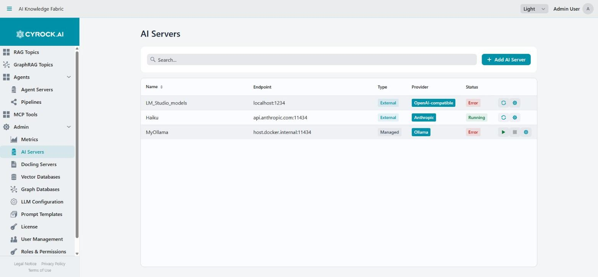

# Getting started local model

A short guide to running a **local LLM and a local embedding model with LM Studio** and registering
them in AI Knowledge Fabric. This gives you a fully local setup — no cloud API key, no usage costs,
no data leaving your machine.

Registered servers appear under **Admin → AI Servers**, which is where this guide ends up:

<a href="../../../assets/screenshots/ai-servers-list.jpg"></a>

The **Type** column is the important distinction: `Managed` servers are started and stopped by the
platform (note the play/stop icons), while `External` ones are only pinged for reachability — the
`Error` status on an external entry means unreachable, not broken configuration.

We use two models:

| Model | Used for |
|---|---|
| `qwen2.5-coder-7b-instruct` | Chat / generation model (the LLM a Topic or Agent talks to) |
| `text-embedding-nomic-embed-text-v1.5` | Embedding model (turns your documents into vectors, 768 dimensions) |

---

## 1. Install LM Studio

1. Download LM Studio for Windows, macOS (Apple Silicon), or Linux from
   **[lmstudio.ai](https://lmstudio.ai/)**.
2. Run the installer and start LM Studio.

Check the hardware requirements first — a 7B model needs roughly 6–8 GB of free RAM or VRAM:
📖 [System Requirements](https://lmstudio.ai/docs/app/system-requirements)

---

## 2. Download the two models

1. Open the **Discover** tab (magnifying glass icon in the left sidebar).
2. Search for `qwen2.5-coder-7b-instruct`, pick a quantisation (**Q4_K_M** is a good
   speed/quality compromise) and click **Download**.
3. Search for `text-embedding-nomic-embed-text-v1.5` and download it as well. Embedding models are
   small (~80 MB) and fast.

📖 [Download an LLM](https://lmstudio.ai/docs/app/basics/download-model)

> **Optional — via CLI:** the same thing from a terminal:
> ```bash
> lms get qwen2.5-coder-7b-instruct
> lms get text-embedding-nomic-embed-text-v1.5
> ```
> 📖 [`lms` CLI reference](https://lmstudio.ai/docs/cli)

---

## 3. Enable the local server

1. Switch to the **Developer** tab (terminal icon in the left sidebar).
2. Toggle the **status switch at the top left to Running**. The server listens on
   **port 1234** by default.
3. Enable **Serve on Local Network** in the server settings. This is **required** — by default
   LM Studio only binds to `localhost`, which containers on your machine cannot reach.
4. Load both models so they are served: select them under **Loaded models**, or leave
   **Just-In-Time (JIT) loading** enabled so LM Studio loads a model automatically on the first
   request.

Verify that both models are being served:

```bash
curl http://localhost:1234/v1/models
```

The response must list both `qwen2.5-coder-7b-instruct` and
`text-embedding-nomic-embed-text-v1.5`.

📖 [LM Studio as a local LLM API server](https://lmstudio.ai/docs/app/api) ·
[OpenAI compatibility endpoints](https://lmstudio.ai/docs/app/api/endpoints/openai) ·
[Serve on Local Network](https://lmstudio.ai/docs/developer/core/server/serve-on-network)

> **Optional — via CLI:** `lms server start`
> For a server without the desktop app, see
> [Headless mode](https://lmstudio.ai/docs/developer/core/headless).

---

## 4. Register LM Studio in AI Knowledge Fabric

Go to **Admin → AI Servers → Add AI Server** and fill in:

| Field | Value |
|---|---|
| **Server Type** | `External (existing instance)` |
| **Provider** | `OpenAI-compatible` |
| **Name** | e.g. `LM_Studio` |
| **Host** | `host.docker.internal` (Docker Desktop) · `172.17.0.1` (plain Linux Docker) · `localhost` if the management app runs outside Docker |
| **Port** | `1234` |
| **Default Model ID** | `qwen2.5-coder-7b-instruct` |

Then **Save**.

> **Do not add `/v1` to the host field.** AI Knowledge Fabric appends the `/v1` path prefix
> automatically for OpenAI-compatible providers.

**Host field, in short:** the value has to be reachable *from inside the Topic containers*, not from
your browser. `localhost` inside a container points at the container itself, which is why the
Docker-host alias is needed.

Open the new server's detail page — the **Models** tab lists the models LM Studio reports, and the
status indicator shows whether the endpoint is reachable. If the list is empty, LM Studio is not
serving on the network (revisit step 3).

---

## 5. Use the models in a Topic

Create a Topic under **Topics → New Topic** and select in the wizard:

- **Chat model:** `LM_Studio` → `qwen2.5-coder-7b-instruct`
- **Embedding model:** `LM_Studio` → `text-embedding-nomic-embed-text-v1.5`

Notes:

- Set a **timeout** value that suits local inference. Local models on CPU are considerably slower
  than a cloud API — 5 minutes or more is realistic for a 7B model without a GPU.
- Keep the embedding model **stable**. Changing it later invalidates all existing vectors in the
  Topic, and the documents have to be re-ingested.
- `qwen2.5-coder-7b-instruct` supports tool calling, so it also works for Agents and for
  MCP tool usage — but a 7B model is noticeably weaker at multi-step tool decisions than a large
  cloud model. For pure document Q&A it is a good fit.

---

## Troubleshooting

| Symptom | Fix |
|---|---|
| AI server shows as unreachable | LM Studio server not running, or **Serve on Local Network** is off |
| Model list is empty | Same as above, or no model is loaded and JIT loading is disabled |
| Topic chat times out | Raise the timeout; check the LM Studio server log for the incoming request |
| Chat works, upload/embedding fails | Embedding model not loaded in LM Studio, or the wrong model was selected as the embedding model |
| Very slow responses | Model running on CPU. Enable GPU offload in LM Studio, or use a smaller quantisation |

---

## Links

- [LM Studio download](https://lmstudio.ai/)
- [LM Studio documentation](https://lmstudio.ai/docs/app)
- [Download an LLM](https://lmstudio.ai/docs/app/basics/download-model)
- [Local API server](https://lmstudio.ai/docs/app/api)
- [OpenAI compatibility endpoints](https://lmstudio.ai/docs/app/api/endpoints/openai)
- [Serve on Local Network](https://lmstudio.ai/docs/developer/core/server/serve-on-network)
- [`lms` CLI](https://lmstudio.ai/docs/cli)
- [Headless mode](https://lmstudio.ai/docs/developer/core/headless)
