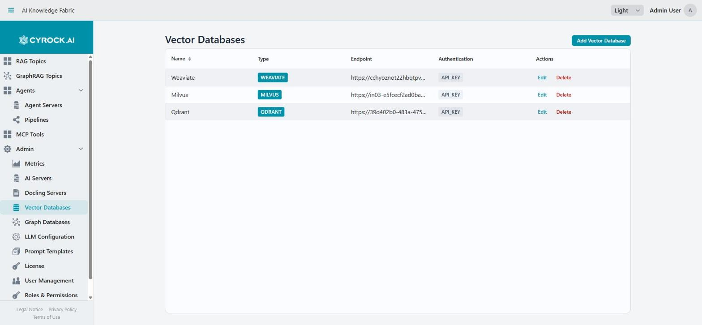
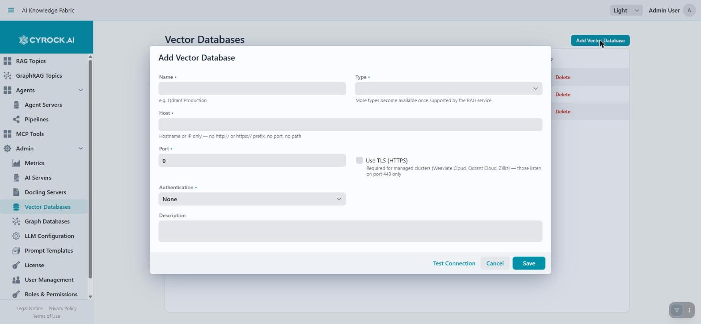

# Connect Vector DB

This guide describes how to register an externally hosted **vector database** in AI Knowledge
Fabric, so Topics can store their embeddings there instead of in the built-in embedded store.

---

## 1. Do you even need one?

**No — a vector database is optional.** If you leave the selection empty when creating a Topic, the
platform automatically attaches an **embedded EclipseStore** vector database to that Topic. It needs
no configuration, no extra container, and no credentials.

| | Embedded EclipseStore (default) | External vector database |
|---|---|---|
| Setup effort | None | Register the server, manage credentials |
| Storage location | A dedicated volume per Topic (Docker volume `eclipse-store-<topicId>`, or a PVC of the same name in Kubernetes) | Your own or a hosted database instance |
| Shared across Topics | No — one store per Topic | Yes — several Topics can share one instance |
| Operated by | The platform | You (or your cloud provider) |
| Good for | Evaluations, small and medium document sets, self-contained Topics | Large document volumes, existing infrastructure, central operations, backup/HA requirements |

Register an external database when you already run one, need capacity or resilience beyond a local
volume, or want several Topics to share one storage backend.

---

## 2. Supported types

| Type | Protocol | Default port | Default authentication | Notes |
|---|---|---|---|---|
| **QDRANT** | gRPC | `6334` | API Key | **The gRPC port, not the REST port `6333`** — see [Qdrant is gRPC](#qdrant-is-grpc-not-rest) |
| **MILVUS** | gRPC | `19530` | Username / Password | Milvus uses native RBAC |
| **WEAVIATE** | HTTP | `8080` | API Key | The HTTP port. Weaviate has stricter naming rules — see [Collection naming](#5-collection-naming-sharing-one-instance) |
| **CYROCK_DB** | HTTP | `9092` | API Key | Requires an additional **Project ID** |

The port and authentication values above are **pre-filled when you pick a type** for a *new* entry,
and **Use TLS** starts switched off. Override them if your instance differs (a self-hosted instance
frequently runs without authentication).

The dialog names the protocol under the **Port** field once a type is picked, and the **Endpoint**
column of the list shows it as a scheme (`grpc://`, `grpcs://`, `http://`, `https://`), so a
mismatched port is visible without opening the entry.

> The type list grows as the RAG service adds support. A type not listed here is not selectable.

### Qdrant is gRPC, not REST

**Qdrant listens on two ports and only one of them works here.** A default Qdrant serves its REST
API on **`6333`** and its gRPC API on **`6334`**. The platform — both the **Test Connection** button
and the Topic containers at runtime — connects over **gRPC only**, so the **Port** field must hold
the **gRPC** port.

`6333` is the number Qdrant's own documentation, dashboard URL and most tutorials show first, so it
is the one people reach for. Entering it produces a warning in the dialog and a **Test Connection**
failure that names the mistake explicitly:

> Port 6333 is Qdrant's REST port — this app and the RAG service both use gRPC, which listens on
> 6334 by default.

If your instance publishes gRPC somewhere else (a reverse proxy, a Kubernetes Service, a remapped
Docker port), enter that port instead — the warning is advisory and does not block saving.

> **Self-hosting note:** the official `qdrant/qdrant` image only publishes gRPC when the port is
> mapped. `docker run -p 6333:6333 qdrant/qdrant` leaves gRPC unreachable; add `-p 6334:6334`.

### Managed clusters and TLS

**The pre-filled ports above are the self-hosted defaults.** For Weaviate Cloud and Zilliz they are
wrong: each publishes a single TLS endpoint on port **443** and the provider's firewall silently
drops traffic on any other port — so leaving the default in place produces a *timeout*, not a
refusal, which reads like a network problem rather than a configuration mistake.

**Qdrant Cloud is the exception:** it keeps Qdrant's own port split, so a managed cluster is gRPC on
**`6334`** — the same port as a self-hosted instance — with **Use TLS** enabled. Do not change it to
443.

For a managed cluster, set:

| Field | Weaviate Cloud / Zilliz | Qdrant Cloud |
|---|---|---|
| **Host** | The cluster hostname, e.g. `abc123.c0.eu-central-1.aws.weaviate.cloud` — no `https://`, no port | The cluster hostname, e.g. `abc123.eu-central-1-0.aws.cloud.qdrant.io` |
| **Port** | `443` | `6334` |
| **Use TLS** | Enabled | Enabled |
| **Authentication** | `API Key`, with the cluster's key | `API Key`, with the cluster's key |

Ticking **Use TLS** moves the port to `443` for you as long as it still holds one of the self-hosted
defaults above; if you had already typed a port, it is left alone. **For Qdrant the port is never
moved**, because the correct value is the same either way.

> Pasting a Qdrant Cloud URL from the console fills in the host and switches **Use TLS** on, but the
> console shows the **REST** endpoint (`…:6333`), so the port it fills in has to be corrected to
> `6334`. The dialog warns you when that happens.

---

## 3. Register the database

Navigate to **Admin → Vector Databases** and click **Add Vector Database**.

> Viewing this screen requires the `SERVER_VIEW` permission; **Add**, **Edit**, and **Delete**
> require `SERVER_MANAGE`. If the buttons are missing, ask an administrator to check your role.

The **Endpoint** column shows the protocol and TLS setting it will actually connect with
(`grpc://`, `grpcs://`, `http://`, `https://`), so an entry reading `http://` on a managed cluster —
or `grpc://…:6333` on a Qdrant instance — is visibly wrong before you ever run a test.

### Fill in the dialog

| Field | Required | Notes |
|---|---|---|
| **Name** | Yes | Free-form display name, e.g. `Qdrant Production`. Shown in the Topic wizard |
| **Type** | Yes | One of the four types above. Changing it re-applies the port/auth defaults |
| **Host** | Yes | Hostname or IP only — **no protocol, no port, no path**. Pasting a full URL is fine; it is split into the Host/Port/Use TLS fields automatically. See [Choosing the Host value](#choosing-the-host-value) |
| **Port** | Yes | Pre-filled with the *self-hosted* default per type. The label states the protocol (`Port (gRPC)` for Qdrant and Milvus). Qdrant needs its **gRPC** port — see [Qdrant is gRPC](#qdrant-is-grpc-not-rest). Weaviate Cloud and Zilliz need `443` — see [Managed clusters](#managed-clusters-and-tls) |
| **Use TLS** | No | Off by default. Enable it for any endpoint that requires TLS, which includes every managed cluster. Enabling it sets the port to `443` if the port is still at its type default — except for Qdrant, whose port is the same either way |
| **Authentication** | Yes | `None`, `API Key`, or `Username / Password`. The credential fields below appear accordingly |
| **API Key** | If `API Key` | Stored in the platform and delivered to the Topic containers |
| **Username** / **Password** | If `Username / Password` | Milvus RBAC credentials |
| **Project ID** | If type is `CYROCK_DB` | The CYROCK.DB project the collections are created under. Validation rejects an empty value for this type |
| **Description** | No | Free-form note for your own documentation |

Click **Save**.

### Choosing the Host value

The host must be reachable **from inside the Topic containers**, not from your browser. Unlike AI
Server hosts, the value is passed through to the containers **verbatim** — the platform performs no
host rewriting here:

| Where the database runs | Host value |
|---|---|
| On the Docker host, Docker Desktop (Windows/macOS) | `host.docker.internal` |
| On the Docker host, plain Linux Docker | `172.17.0.1` |
| As another container on the same Docker network | That container's service name |
| On another server or in the cloud | Its hostname or IP, e.g. `vectors.internal.example.com` |
| In Kubernetes, in the same cluster | The Service DNS name, e.g. `qdrant.default.svc.cluster.local` |

> **`localhost` almost never works.** Inside a Topic container, `localhost` refers to that container
> itself, not to your machine.

Enter only the bare host — never a `https://` prefix. TLS comes from the **Use TLS** checkbox
instead, and is passed on to the Topic containers as part of the vector-store configuration. A
hosted endpoint that mandates TLS on a non-standard *path* is still not usable, since only host,
port, and the TLS flag are configurable.

**Pasting the full endpoint URL is fine.** Provider consoles show you something like
`https://abc123.c0.eu-central-1.aws.weaviate.cloud:443/v1`, and that is what most people paste. The
field takes it apart for you: the hostname stays, the port moves to **Port**, `https` switches **Use
TLS** on, and the path is dropped. A notification names each change so nothing happens silently.

> For Qdrant, check the port afterwards. Console URLs point at the **REST** API (`:6333`), which is
> not the port used here — see [Qdrant is gRPC](#qdrant-is-grpc-not-rest).

Anything it cannot untangle is rejected on **Save** with a message naming the specific problem — a
leftover scheme, a path, a space, or a port that belongs in the **Port** field. This matters because
the host reaches the Topic containers verbatim: a value like `https://myhost` would be assembled into
`http://https://myhost:8080` and could never connect.

> An IPv6 address must be bracketed (`[::1]`), otherwise its colons are indistinguishable from a port.

---

## 4. Test the connection

The dialog has a **Test Connection** button. Use it before saving. **Each type is probed with the
same protocol the Topic containers use for it**, so a passing test means the port is usable — an
HTTP probe against Qdrant's REST port would pass for a configuration that can never work. How deep
the check goes still varies, because not every type exposes something to probe:

| Type | What is tested |
|---|---|
| **QDRANT** | A gRPC `HealthCheck` call through the official Qdrant client — the same connection the RAG service opens. Validates host, gRPC port, TLS setting **and** the API key, and reads back the server version |
| **WEAVIATE** | A real HTTP(S) request against `/v1/meta`, using the scheme from **Use TLS** and sending the API key. Validates host, port, TLS setting **and** the API key |
| **MILVUS**, **CYROCK_DB** | A plain TCP handshake only. Neither exposes a probe endpoint this app can call, so credentials are first verified when a Topic starts |

The timeout is 5 seconds. For Milvus and CYROCK.DB the success message says `TCP only` to make the
weaker guarantee explicit — any process accepting connections on that port passes.

| Message | Meaning |
|---|---|
| `Connected to <host>:<port> over gRPC (Qdrant <version>) — API key accepted.` | Qdrant answered on the gRPC port and accepted the key. This configuration will work |
| `Connected to <host>:<port> — API key accepted.` | Weaviate answered and accepted the key |
| `Connected to <host>:<port>.` | The server answered; `Authentication: None`, so no key was checked |
| `Reachable at <host>:<port> (TCP only …)` | Milvus / CYROCK.DB: network path is fine, credentials still unverified |
| `… authentication was rejected …` | Host, port, and TLS are right — the **API key** is wrong |
| `Cannot reach <host>:<port> over gRPC … Port 6333 is Qdrant's REST port …` | The REST port was entered. Change it to `6334` — see [Qdrant is gRPC](#qdrant-is-grpc-not-rest) |
| `Cannot reach <host>:<port> over gRPC …` | Qdrant: nothing answered a gRPC call there. Check the port and the TLS setting |
| `… does not speak the Qdrant gRPC API.` | Something answered on that port, but it is not Qdrant's gRPC service |
| `… does not look like a <TYPE> endpoint (HTTP 404)` | Weaviate: something answered, but not that database. Check host and port |
| `Cannot resolve hostname '<host>'` | DNS failure — check the Host field |
| `Connection refused at <host>:<port>` | Host resolves, but nothing is listening there |
| `Connection to <host>:<port> timed out.` | No response within 5 s. On a managed cluster hostname the message names the port and TLS setting that provider requires |
| `TLS handshake with <host>:<port> failed: …` | **Use TLS** is on but the endpoint is not TLS (or presents an untrusted certificate) |

---

## 5. Collection naming: sharing one instance

**Several Topics can share one vector database instance without colliding.** Each Topic gets its own
collection, named from its UUID:

| Type | Collection / class name |
|---|---|
| Qdrant, Milvus, CYROCK_DB | `topic_<topicUUID without hyphens>` |
| Weaviate | `Topic_<topicUUID without hyphens>` — Weaviate requires an uppercase initial letter and forbids hyphens |

The name is generated automatically and cannot be configured. Two implications:

- You do **not** need one database instance per Topic — register it once and select it in as many
  Topics as you like.
- Collections are **not** cleaned up by name lookup on your side. When you delete a Topic, its
  collection in an external database may remain — check your instance if storage matters.

---

## 6. Use the database in a Topic

In the **Topic creation wizard**, step **Vector Storage**:

1. Open the **Choose your Vector Database** dropdown. Entries appear as `Name (TYPE)`.
2. Select your database. A summary line confirms the choice, including the protocol:
   `QDRANT · grpc://vectors.example.com:6334 · Authentication: API Key`.
3. Leave the field empty (or use the clear button) to fall back to the embedded EclipseStore. The
   hint below the field confirms this.

Selecting the database is enough — host, port, credentials, and the collection name are passed to the
Topic container automatically when it starts.

> **Choose before the first ingestion, and then keep it.** Switching a Topic to a different vector
> database points it at an empty collection: the previously ingested documents are not migrated and
> the Topic answers as if it had no knowledge. Re-ingest the documents after such a change.

---

## 7. Editing and deleting

| Action | Effect |
|---|---|
| **Edit** | Changes take effect the next time a Topic **starts**. A running Topic keeps using the configuration it was started with — restart it to apply |
| **Delete** | Only removes the registration in this platform. The database itself and its data are untouched. **Topics referencing it are affected** — the confirmation dialog says so explicitly. Check which Topics use the database before deleting |

---

## 8. Kubernetes remark

Vector database credentials are written into the generated pod specification as **literal values**.
They are *not* translated into a `SecretKeyRef` against the shared API-keys Secret — that mechanism
applies to AI Server keys only. If your policy forbids plaintext credentials in pod specs, use
`Authentication: None` in combination with network-level access control (NetworkPolicy, service mesh,
or an in-cluster instance not exposed outside the namespace).

Independently of this: Topics **without** an external vector database get a `PersistentVolumeClaim`
named `eclipse-store-<topicId>`, sized by the `kubernetes.eclipse-store.size` property (default
`1Gi`). If a Topic's document volume outgrows that, either raise the property before creating the
Topic or move the Topic to an external vector database.

---

## 9. Troubleshooting

| Symptom | Cause and fix |
|---|---|
| Save rejected: "Enter the hostname only, without the http:// or https:// prefix" | A scheme is left in the Host field. Remove it and use **Use TLS** instead — normally the field strips this for you, so check for stray characters around it |
| Save rejected: "put the port in the Port field" | The Host field still carries `:<port>`. Move it to **Port**; bracket an IPv6 address as `[::1]` |
| Test Connection: "Cannot resolve hostname" | Wrong Host value. Do not use `localhost` — see [Choosing the Host value](#choosing-the-host-value) |
| Test Connection: "Connection refused" | Wrong port, or the database is not running. Check the default port for your type |
| Qdrant: "Cannot reach … over gRPC. Port 6333 is Qdrant's REST port" | The REST port was entered — often by pasting the URL from Qdrant's dashboard or Cloud console. Set **Port** to `6334` (or wherever your instance exposes gRPC) |
| Qdrant: "Cannot reach … over gRPC" on port `6334`, while the dashboard on `6333` works | The gRPC port is not published. With Docker, add `-p 6334:6334`; behind a reverse proxy, confirm it forwards HTTP/2 |
| Test Connection: timed out, host ends in `weaviate.cloud` / `zillizcloud.com` | The self-hosted default port was left in place. Set **Port** to `443` and enable **Use TLS** — see [Managed clusters](#managed-clusters-and-tls) |
| Test Connection: timed out on port 443 | **Use TLS** is off, so the app sent plaintext to a TLS port and the server never answered. Enable **Use TLS** |
| Test Connection: "authentication was rejected" | Host, port, and TLS are correct; the API key is not. Regenerate or re-copy it from your provider's console |
| Test Connection: "TLS handshake … failed" | **Use TLS** is on for an endpoint that only speaks plaintext (typical for a self-hosted instance), or the certificate is not trusted by the management app's JVM. Switch **Use TLS** off for plaintext endpoints |
| Test Connection succeeds, but the Topic fails to start | For Milvus and CYROCK.DB the test is TCP-only, so credentials are not part of it. Check the API key / username / password, and read the Topic's log on the **Actions** tab |
| Topic fails to start against a managed cluster, although Test Connection passed | The Topic was started **before** the TLS setting was corrected. A running Topic keeps its startup configuration — restart it |
| Topic starts, but every answer says nothing was found | The Topic points at an empty collection — either nothing has been ingested yet, or the vector database was changed after ingestion. Re-upload the documents |
| Weaviate rejects the collection | Weaviate's naming rules. The platform already generates a compliant `Topic_…` class name; if it still fails, check the Weaviate version's own restrictions |
| CYROCK_DB: "Project ID is required" | The Project ID field is mandatory for this type and must not be blank |
| Documents were ingested, but the external database stays empty | The Topic is probably using the embedded EclipseStore — no database was selected in the wizard. Check **Topic detail → Configuration** |
| Storage in the external database keeps growing after deleting Topics | Collections of deleted Topics may remain. Clean them up in your database using the `topic_…` / `Topic_…` naming scheme |

---

## Related

- [Getting started local model](../3.1-AI-Server/Getting_Started_Local_AIModel.md) — the local embedding model that fills this database
- [Connect an AI Server for LM Studio models](../3.1-AI-Server/Connect%20LM%20Studio%20AI%20Server.md)
- [Connect an external Claude AI Server](../3.1-AI-Server/Connect%20External%20Claude%20AI%20Sever.md)
- [Global LLM Configuration and Prompt Templates](../3.3-Global%20LLM%20configuration/Global-LLM-Configuration-and-Prompt-Templates.md)
