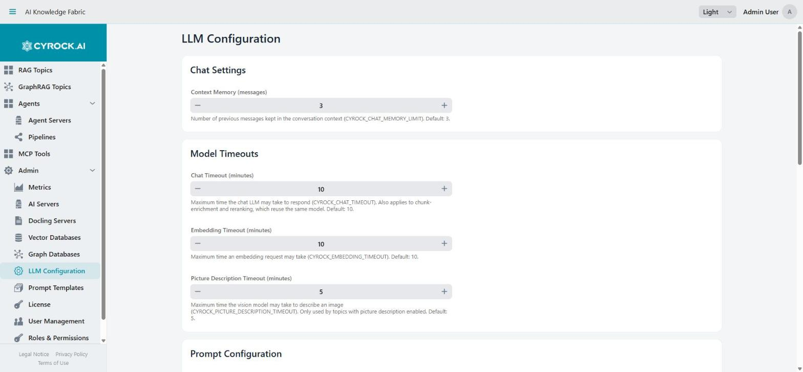

# Global LLM Configuration and Prompt Templates

Two screens in the **Admin** section define the platform-wide defaults for how every Topic talks to
its language model:

| Screen | Path | What it holds |
|---|---|---|
| **LLM Configuration** | `/admin/llm-config` | Global defaults: context memory, model timeouts, the base system prompt, the RAG context template, the no-answer response |
| **Prompt Templates** | `/admin/prompt-templates` | Reusable prompt snippets offered as one-click quick-fills when creating a Topic |

Both require the `CONFIG_VIEW` permission to open and `CONFIG_MANAGE` to change anything. Without
`CONFIG_MANAGE` all fields are read-only and the Save / Create / Edit / Delete buttons are hidden.

<a href="../../../assets/screenshots/llm-configuration.jpg"></a>

Each field names the environment variable it maps to and its default, so you can see what a Topic
container will receive. Values set here apply to every Topic unless that Topic overrides them on its
own **LLM Overrides** tab.

---

# Part 1 — LLM Configuration

This screen edits **one single configuration record** that applies to the whole installation. There
is no list and nothing to create: you open it, change values, and save.

The hint next to the Save button states the essential rule:

> *Changes apply to all topics that do not override these defaults.*

Every field on this screen can be overridden per Topic — see
[Per-topic overrides](#per-topic-overrides).

## Chat Settings

| Field | Range | Default | Effect |
|---|---|---|---|
| **Context Memory (messages)** | 1–100 | `3` | How many previous messages are kept in the conversation context |

A higher value gives the model more conversational memory but sends more tokens with every request —
which costs more on a cloud provider and slows down a local model. Raise it when users complain that
the chatbot forgets what was said two questions ago; lower it for cost or latency.

## Timeouts

Every remote call a Topic makes always has a timeout — either the one you set here, or the
pre-filled default. Fields accept 1–120 minutes.

| Field | Default | Applies to |
|---|---|---|
| **Chat Timeout (minutes)** | `10` | The chat LLM — **and** chunk enrichment and reranking, which reuse the same model and therefore the same timeout |
| **Embedding Timeout (minutes)** | `10` | Embedding requests during document ingestion and at query time |
| **Picture Description Timeout (minutes)** | `5` | The vision model. Only used by Topics with picture description enabled |
| **Docling Timeout (minutes)** | `5` | Converting one document in Docling. Only used by Topics with a Docling server |

There are deliberately **no separate fields for chunk enrichment and reranking**: those calls reuse
the chat model — the same server and the same model, with no separate selection anywhere in the UI —
so they follow the Chat Timeout.

Practical guidance: cloud providers respond in seconds, so the defaults are generous. Local models on
CPU are far slower — a 7B model producing a long answer can genuinely need several minutes, and a
timeout that is too tight surfaces as a failed chat rather than a slow one.

## Prompt Configuration

Three text areas that shape every answer:

### System Prompt

The base instructions prepended to every request — the AI's persona, tone, and operating rules. The
seeded default covers role definition, prompt-injection resistance, factual accuracy, Markdown
formatting, language consistency, and safety.

**It contains the placeholder `{{USER_EDITABLE_PROMPT}}`, and that placeholder is load-bearing.** See
[How the system prompt is assembled](#how-the-system-prompt-is-assembled) — deleting it silently
disables every per-Topic prompt and every prompt template in the installation.

### RAG Context Template

The template that injects retrieved document excerpts into the prompt. Use **`{context}`** as the
placeholder for the retrieved chunks.

The seeded default introduces the excerpts, delimits them with `--- RETRIEVED CONTEXT ---` markers,
and instructs the model to answer primarily from them, to flag when it supplements from general
knowledge, to reference specific parts where applicable, and to say so plainly when the context is
insufficient rather than speculating.

This is the most effective lever on grounding behaviour. If answers drift away from the uploaded
documents, tighten the instructions here rather than editing the system prompt.

### No-Answer Response

The text returned when no relevant context was found in the vector database. The seeded default
apologises and suggests rephrasing the question, uploading more documents, or contacting an
administrator.

Customise it to your organisation's tone and to point users at the right internal contact.

---

## How the system prompt is assembled

This is the single most misunderstood part of the configuration. A Topic's effective system prompt is
**assembled from two sources**:

```
┌─ Admin → LLM Configuration ──────────────────┐
│  System Prompt (global)                      │
│                                              │
│    Role & Identity: …                        │
│    --- START USER SETTINGS ---               │
│    {{USER_EDITABLE_PROMPT}}   ←──────────┐   │
│    --- END USER SETTINGS ---             │   │
│    Operating Rules & Safety: …           │   │
└──────────────────────────────────────────┼───┘
                                           │ substituted
┌─ Topic wizard / Topic detail ────────────┼───┐
│  User System Prompt (per Topic)  ────────┘   │
│  "You are an HR policy assistant…"           │
└──────────────────────────────────────────────┘
                     ↓
      Delivered to the Topic container as an
      environment variable, at container start
```

Three consequences worth committing to memory:

1. **Removing `{{USER_EDITABLE_PROMPT}}` breaks per-Topic prompts silently.** There is no warning and
   no error — every Topic's own prompt is simply never inserted, and prompt templates become
   decorative. If Topics stop behaving according to their individual prompts, check this placeholder
   first.
2. **The assembled prompt is delivered as an environment variable when the container starts** — for
   every provider (Ollama, OpenAI-compatible, OpenAI, Anthropic) alike. It is not sent again with
   each individual chat request.
3. **Therefore changes take effect only after a restart.** Saving on this screen does not affect a
   running Topic. Stop and start the affected Topics from their **Actions** tab to apply new values.

---

## Per-topic overrides

Every field on this screen is a *default*. Each Topic can override all seven values individually
under **Topic detail → Configuration**:

| Global field | Overridable per Topic |
|---|---|
| Context Memory | Yes |
| Chat Timeout | Yes |
| Embedding Timeout | Yes |
| Picture Description Timeout | Yes |
| Docling Timeout | Yes |
| System Prompt | Yes — replaces the global template entirely for that Topic |
| RAG Context Template | Yes |
| No-Answer Response | Yes |

An empty override falls back to the global value. This means editing a global value only affects
Topics that have *not* overridden it — a Topic with an override is unaffected no matter what you
change here.

> **A per-Topic System Prompt override replaces the whole template**, including the
> `{{USER_EDITABLE_PROMPT}}` placeholder — so an override without the placeholder discards that
> Topic's own user prompt. If you override the template for a Topic, keep the placeholder unless you
> deliberately want the user prompt ignored.

---

# Part 2 — Prompt Templates

The **Prompt Templates** screen (heading: *System Prompt Templates*) manages a library of reusable
prompt snippets. They exist purely for convenience: they pre-fill the **User System Prompt** field
when someone creates a Topic, so users do not start from an empty box or paste the same wording
repeatedly.

## What a template is — and is not

| | |
|---|---|
| **Is** | A named block of text, offered as a one-click quick-fill button in the Topic wizard |
| **Is not** | A live link. A Topic does not reference the template it was filled from |

**Templates are copied, not linked.** Clicking a template button writes its text into the Topic's
prompt field, and the Topic keeps that copy. Editing the template afterwards has **no effect on
Topics already created from it** — you would have to update each Topic's prompt yourself.

## The grid

| Column | Contents |
|---|---|
| **Title** | The label shown on the quick-fill button |
| **Content** | The full prompt text, wrapped across lines |
| **Actions** | ✏️ Edit · 🗑️ Delete (visible only with `CONFIG_MANAGE`) |

> ⚠️ **Delete happens immediately, with no confirmation dialog.** Clicking the trash icon removes the
> template at once — only a notification appears afterwards. There is no undo, so copy the content
> out first if you might want it back.

## Creating and editing

Click **Create Template**, or the edit icon on an existing row:

| Field | Required | Notes |
|---|---|---|
| **Title** | Yes | Becomes the button label in the Topic wizard. An emoji prefix makes buttons easy to scan, e.g. `🛠️ Precise Analyst`. Saving with an empty title is rejected |
| **Content** | No, but pointless when empty | The prompt text inserted into `{{USER_EDITABLE_PROMPT}}` |

Write the content as instructions addressed to the AI — persona, tone, output format, and what to
avoid. It is inserted into the global template's user-settings block, so it does not need to repeat
the safety and formatting rules the global prompt already covers.

## The seeded default templates

A fresh installation is seeded with three examples:

| Title | Character |
|---|---|
| **🛠️ Precise Analyst** | Objective and technical. Short, strictly fact-based answers, no filler openers, in-depth analysis of code and data, lists and tables for clarity |
| **💡 Creative Partner** | Inspiring, friendly, informal. Develops ideas further and offers at least three perspectives; vivid language and emojis |
| **🎓 Patient Teacher** | Explains complex topics as if to a complete beginner. Analogies and everyday examples, no unexplained jargon, patient and encouraging |

Treat them as starting points — edit or delete them freely and replace them with templates matching
your own use cases (e.g. one per department or document type).

> Seeding only runs when the template table is **empty**. If you delete all templates and restart the
> application, the three defaults come back. Deleting only some of them is permanent.

## Where templates appear

Templates surface as a **Quick-fill from template:** row of buttons above the User System Prompt
field, in:

- The **Topic creation wizard**, step *Common Information*
- The **GraphRAG Topic creation wizard**, equivalent step

Clicking a button **replaces** the entire content of the prompt field — it does not append. Anything
already typed there is lost, so pick the template first and then edit.

If no templates exist, the quick-fill row is hidden entirely and users simply type their prompt.

---

## Recommended workflow

1. **Set the global defaults once**, on the LLM Configuration screen: adapt the System Prompt to your
   organisation (replace the `[YOUR APP NAME]` placeholder in the seeded default), set the
   No-Answer Response to your tone, and raise the timeouts if you run local models.
2. **Keep `{{USER_EDITABLE_PROMPT}}` in the System Prompt** and `{context}` in the RAG Context
   Template.
3. **Curate the templates** to cover the roles your users actually need, so Topic creators pick a
   role instead of writing prompts from scratch.
4. **Restart affected Topics** after changing global values — nothing propagates to a running
   container.

---

## Troubleshooting

| Symptom | Cause and fix |
|---|---|
| Changed a global value, nothing changed in the chat | The value is delivered at container start. Restart the Topic from its **Actions** tab |
| A Topic ignores its own prompt entirely | `{{USER_EDITABLE_PROMPT}}` is missing from the global System Prompt, or from that Topic's System Prompt override |
| Only some Topics picked up a global change | The others have a per-Topic override. Clear the override under **Topic detail → Configuration** to fall back to the global value |
| Retrieved documents seem to be ignored | Tighten the instructions in the RAG Context Template; make sure `{context}` is still present |
| Chat fails after a long wait, local model | Chat Timeout too low for local inference. Raise it globally, or per Topic |
| Document upload fails with a timeout | Embedding Timeout too low for the document size and the embedding model's speed |
| Image-heavy documents fail | Picture Description Timeout too low — vision models are slow. Only relevant for Topics with picture description enabled |
| Upload of a long or scanned PDF fails, Docling enabled | Docling Timeout too low. OCR on a CPU-only Docling is slow; raise it globally or per Topic |
| The quick-fill row is missing in the wizard | No templates exist. Create one under **Admin → Prompt Templates** |
| Editing a template did not change existing Topics | By design — templates are copied at creation time, not linked. Update the Topic's prompt directly |
| The Save / Create / Edit / Delete buttons are missing | Your role lacks `CONFIG_MANAGE`. Ask an administrator |
| The AI introduces itself with a placeholder name | The seeded System Prompt contains a literal `[YOUR APP NAME]` — replace it with your own product name |

---

## Related

- [Connect an AI Server for LM Studio models](../3.1-AI-Server/Connect%20LM%20Studio%20AI%20Server.md) — the model these settings apply to
- [Connect an external Claude AI Server](../3.1-AI-Server/Connect%20External%20Claude%20AI%20Sever.md)
- [Connect Vector DB](../3.2-Vector-DB%C2%B4s/Connect-Vector-DB.md) — where the RAG context comes from
