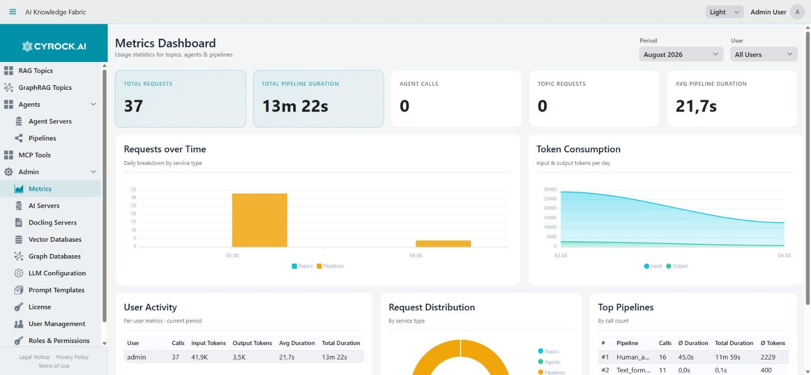

# Metrics

The **Metrics Dashboard** (**Admin → Metrics**, `/admin/metrics`) shows usage statistics for Topics,
Agents, and Pipelines: request counts, token consumption, durations, and per-user activity.

Access requires the `METRICS_VIEW` permission.

<a href="../../../assets/screenshots/metrics-dashboard.jpg"></a>

The **Period** and **User** selectors at the top filter everything below them. Tiles reading `0` are
genuine zeros for the selected period, not missing data — in the example above only Pipelines were
exercised, so Agent Calls and Topic Requests are empty.

---

## 1. Where the data comes from

The dashboard does **not** measure anything itself. Every running Topic and Agent container reports
each completed request back to the management application, which stores it and aggregates it here.

```
Topic container  ─┐
                  ├──►  POST /api/metrics/event(s)  ──►  metric_event table  ──►  Dashboard
Agent container  ─┘        header: X-Metrics-Key
```

Reporting therefore depends on two settings being consistent between the management app and the
containers it starts:

| Setting | Purpose |
|---|---|
| `METRICS_API_KEY` | Shared secret the containers must send in the `X-Metrics-Key` header. A mismatch means events are rejected |
| `METRICS_ENDPOINT` | The URL the containers post to. Must be reachable **from inside a container** — hence `host.docker.internal` (or `172.17.0.1` on plain Linux Docker), not `localhost` |

Both are described in the [installation guide](../../2.0-Installation/docker-compose-installation.md).
If either is wrong, the dashboard stays empty and shows demo data.

### Three event types

| Type | Recorded when |
|---|---|
| `TOPIC_CHAT` | A Topic answers a chat request |
| `AGENT_CALL` | An Agent handles a call |
| `PIPELINE_RUN` | A Pipeline executes |

Each event carries a timestamp, the Topic/Agent name, the pipeline name where applicable, the
username, the model used, input and output token counts, the context window size, and the duration in
milliseconds.

> Document ingestion and embedding are **not** reported. The dashboard covers chat, agent, and
> pipeline traffic only, so it is not a complete picture of token spend.

---

## 2. Demo mode

> ⚡ **Demo data — no real metric events recorded yet. Connect your topic or agent servers to see live
> metrics.**

When the event table is **completely empty**, the dashboard fills itself with **generated sample
data** and shows this banner. Every number, chart, and table row is fictional.

This exists so the screen can be evaluated before any traffic exists, but it is easy to
misread — **check for the banner before trusting any figure**. As soon as a single real event
arrives, demo mode switches off and only real data is shown.

Demo mode is keyed on the total event count, not on the selected period: once real events exist, a
month with no traffic shows an empty dashboard rather than demo data.

---

## 3. Filters

Two filters in the header, both applying to the whole dashboard:

| Filter | Options |
|---|---|
| **Period** | The current month and the previous 11 |
| **User** | *All Users*, or one of the usernames that appear in the data |

The period is always a **whole calendar month** — there is no free date range and no "last 7 days".
For a narrower view, read the daily bars in the *Requests over Time* chart.

---

## 4. KPI tiles

Five tiles, computed over the filtered events:

| Tile | Meaning |
|---|---|
| **Total Requests** | All events in the period — Topic chats, Agent calls, and Pipeline runs together |
| **Total Pipeline Duration** | Summed duration of all `PIPELINE_RUN` events |
| **Agent Calls** | Count of `AGENT_CALL` events |
| **Topic Requests** | Count of `TOPIC_CHAT` events |
| **Avg Pipeline Duration** | Mean duration of a `PIPELINE_RUN`, in seconds |

Note that the two duration tiles cover **pipeline runs only** — Topic chat and Agent call durations
are recorded per event and appear in the User Activity table, but not in these tiles. A `—` means no
pipeline runs with a duration were recorded in the period.

---

## 5. Charts and tables

| Panel | Contents |
|---|---|
| **Requests over Time** | Daily bars, broken down by service type. Shows which days carried load and from which surface |
| **Token Consumption** | Input and output tokens per day. The panel to watch for cloud-provider cost |
| **User Activity** | Per user: calls, input tokens, output tokens, average duration, total duration |
| **Request Distribution** | Donut chart splitting requests by service type |
| **Top Pipelines** | Ranked by call count, with average duration, total duration, and average tokens per run |

Days with no traffic are omitted from the charts rather than drawn as zero, so an axis may skip dates.

### Reading it for cost

For a cloud provider, **Token Consumption** and the token columns in **User Activity** are the
relevant figures — providers bill on tokens, and input and output are usually priced differently, which
is why they are reported separately. Multiply against your provider's rates for the models actually in
use; the dashboard itself has no notion of prices and shows no currency amounts.

### Reading it for performance

**Avg Pipeline Duration** and the duration columns show where time is spent. A local model on CPU
produces durations an order of magnitude above a cloud API — if durations approach your configured
timeouts, raise the timeouts under **Admin → LLM Configuration** or move that workload to a faster
model.

---

## 6. Troubleshooting

| Symptom | Cause and fix |
|---|---|
| Demo banner visible, numbers look implausible | No real events have ever arrived. Everything shown is generated sample data |
| Dashboard stays empty after real usage | `METRICS_API_KEY` mismatch, or `METRICS_ENDPOINT` unreachable from inside the containers. Check the management app's log for rejected-key warnings |
| `METRICS_ENDPOINT` uses `localhost` | Inside a container that points at the container itself. Use `host.docker.internal`, or `172.17.0.1` on plain Linux Docker |
| Events arrive but the **User** column is empty | The backend does not always know which user triggered a request — the username is optional in the event |
| Duration tiles show `—` | No `PIPELINE_RUN` events with a duration in the period. Topic and Agent durations are not counted in these tiles |
| Token columns are zero | The model or provider did not report token counts for those requests |
| A Topic's ingestion load is missing | Only chat, agent, and pipeline events are recorded — ingestion is not reported |
| Numbers changed after restarting a Topic | Events are historical records and are not deleted. Check whether the Period filter is on a different month |
| Cannot open the screen | Your role lacks `METRICS_VIEW` |
| Period filter offers no older months | The list is fixed to the current month plus the previous 11 |

---

## Related

- [Docker Compose installation](../../2.0-Installation/docker-compose-installation.md) — setting `METRICS_API_KEY` and `METRICS_ENDPOINT`
- [Global LLM Configuration and Prompt Templates](../3.3-Global%20LLM%20configuration/Global-LLM-Configuration-and-Prompt-Templates.md) — the timeouts these durations should stay below
- [Roles & Permissions](../3.5-Users-Roles-and-Authentication/Roles-and-Permissions.md) — the `METRICS_VIEW` permission
