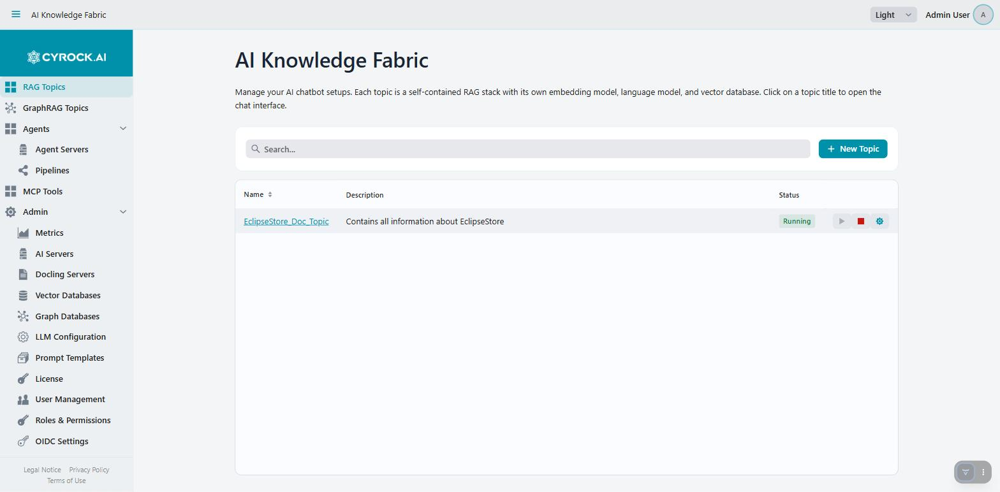

# RAG Topics — Overview

A **Topic** is a private AI chatbot that answers questions from *your* documents. It is the central
concept of AI Knowledge Fabric: you upload content, the platform indexes it, and a language model
answers questions grounded in that content instead of relying only on its training data.

<a href="../../../assets/screenshots/topic-list.jpg"></a>

Each row is one Topic. The status badge shows whether its stack is running, and the icons on the right
start, stop, and open the Topic's settings. A Topic's name becomes a link to its chat once it is
`Running`.

---

## 1. What problem it solves

A general-purpose language model knows nothing about your internal HR policies, your product manuals,
or last quarter's reports. Asked about them, it either refuses or invents an answer.

**RAG — Retrieval-Augmented Generation** — fixes this by searching your documents *first* and handing
the relevant passages to the model along with the question:

```
Question: "How many vacation days do I get after five years?"
      │
      ▼
1. The question is converted into a vector (embedding model)
      │
      ▼
2. The vector database returns the most similar passages
   → "…after five years of service, entitlement rises to 30 days…"
      │
      ▼
3. Question + passages go to the language model
      │
      ▼
Answer: "After five years you are entitled to 30 days."  + source: hr-policy.pdf
```

The practical consequences:

| | Plain chatbot | RAG Topic |
|---|---|---|
| Knows your documents | No | Yes |
| Cites sources | No | Yes — every answer lists the files it drew on |
| Answer when nothing is found | Invents something | Returns the configured no-answer response |
| Adding knowledge | Retraining | Uploading a file |
| Data location | The provider's | Your infrastructure (unless you deliberately choose a cloud model) |

---

## 2. Why you would want several Topics

Each Topic is **completely isolated** — its own documents, its own vector collection, its own model
choice, its own system prompt, its own access permissions. That isolation is the reason to create
more than one:

- **Separate subject areas.** An HR Topic that cannot accidentally answer from technical manuals gives
  markedly better answers than one Topic holding everything, because retrieval has less noise to sift.
- **Separate audiences.** Access is granted per Topic and per role, so a Topic containing salary data
  can be restricted to a single role.
- **Different models per purpose.** A public-facing FAQ can use a small local model; a demanding
  analysis Topic can use a large cloud model.
- **Different tone.** Each Topic has its own prompt, so one can be terse and factual and another
  patient and explanatory.

---

## 3. Architecture — what actually runs

This is where AI Knowledge Fabric differs from most chat products: the management application is not
the chatbot. **It generates and orchestrates containers.** Pressing *Start* on a Topic provisions real
infrastructure.

```
┌─────────────────────────────────────────────────────────────────┐
│  Management application (this web UI)                           │
│  · Stores the Topic's configuration in PostgreSQL               │
│  · Generates a Compose file / Kubernetes manifests              │
│  · Starts, stops, and deletes the stack                         │
│  · Proxies chat, upload, and MCP calls over HTTP                │
└────────────────┬────────────────────────────────────────────────┘
                 │ starts, per Topic
                 ▼
┌─────────────────────────────────────────────────────────────────┐
│  Topic stack — one per Topic                                    │
│                                                                 │
│   rag-service        always. Ingestion, retrieval, chat, MCP     │
│   vector database    only when no external one is configured     │
│                      (embedded EclipseStore, own volume)         │
│   Ollama             only when a model uses Ollama without an    │
│                      external server                             │
└─────────────────────────────────────────────────────────────────┘
                 │ reaches out to
                 ▼
   AI servers (LM Studio, Ollama, OpenAI, Anthropic) ·
   Docling servers · external vector databases · MCP tool servers
```

Three things follow from this design and explain most surprises:

1. **Configuration is delivered at container start.** Model choice, prompts, timeouts, and retrieval
   settings are passed as environment variables when the stack comes up — *not* per request. Changing
   a setting requires stopping and starting the Topic.
2. **Each Topic gets its own host port**, chosen at creation time, so its API is reachable directly —
   which is what makes the [REST interface](../4.5-REST-API/REST-API.md) possible.
3. **Docker (or Kubernetes) must be available.** Without it, a Topic goes `STARTING` → `ERROR`.

### Lifecycle states

| Status | Meaning |
|---|---|
| `CREATED` / `CONFIGURED` | Saved in the database, nothing running yet |
| `STARTING` | Containers are being pulled and started. First start with Ollama can take a long time — the model is downloaded |
| `RUNNING` | Ready for uploads and chat |
| `STOPPED` | Containers stopped. Configuration and indexed data are retained |
| `ERROR` | Start failed — most often Docker unreachable or a misconfigured server |

---

## 4. The building blocks you configure

| Block | Role | Configured under |
|---|---|---|
| **Embedding model** | Turns documents and questions into vectors. Determines retrieval quality | AI Servers |
| **Language model (LLM)** | Writes the answer from question + retrieved passages | AI Servers |
| **Vector database** | Stores the vectors. Embedded by default, or an external instance | Vector Databases |
| **Docling server** | Converts PDF/DOCX/PPTX into clean text before embedding | Docling Servers |
| **Vision model** | Describes images so their content becomes searchable | AI Servers |
| **Retrieval strategy** | How passages are found and ranked | Per Topic, step 4 of the wizard |
| **System prompt** | Persona, tone, and rules | Globally + per Topic |

> **The embedding model is the one irreversible choice.** Vectors created by one embedding model are
> meaningless to another. Changing it later invalidates everything indexed so far and forces a full
> re-ingestion — so decide before the first upload.

---

## 5. MCP — giving a Topic tools

**MCP (Model Context Protocol)** is a standard for connecting AI services to external tools. A
running Topic can be connected to MCP servers, after which its language model can *call* those tools
while answering rather than relying on retrieval alone.

Two uses:

| Use | What it achieves |
|---|---|
| **External tool servers** | Web search, ticket systems, APIs, file access — anything with an MCP server. The Topic can look things up live instead of only in its own documents |
| **Topic → Topic** | Every running Topic exposes an MCP endpoint itself, so one Topic can query another. This lets you keep knowledge bases separate but still answer questions that span them |

The Topic-to-Topic case is the one worth understanding: rather than duplicating documents into a
combined Topic, you connect a "front desk" Topic to specialised ones and let it delegate.

Two practical requirements:

- **The calling Topic's model must support tool calling.** A small model without that capability will
  simply ignore the connected tools. This is the most common reason MCP appears not to work.
- Connections are managed on the **MCP Interfaces** tab of a *running* Topic, and are registered with
  the rag-service live — no restart needed.

Browse available servers under **MCP Tools** in the main navigation.

---

## 6. What a Topic can ingest

| Content | Requirement |
|---|---|
| Plain text — `txt`, `md`, `json`, `yaml`, `csv`, source code | None |
| PDF, DOCX, PPTX | A **Docling server**, to convert them to text |
| Images | A **vision model**, to describe them |
| Structured data (tables, records) | Optional import strategy, with an optional narrator model |
| Audio / video | Selectable in the UI but **without real processing support today** — do not rely on it |

---

## 7. Typical workflow

1. **Prerequisites** — register at least one AI server with a chat model and an embedding model. Add a
   Docling server if you have PDFs, and a vector database if you don't want the embedded one.
2. **Create the Topic** — the five-step wizard covers name and prompt, models, vector storage,
   retrieval, and the data source.
   → [Creation step by step](../4.2-Creation/Creation-Step-by-Step.md)
3. **Start it** — the platform provisions the stack; wait for `RUNNING`.
4. **Upload documents** — on the Data Upload tab, and watch the embedding progress.
   → [Configuration and functions](../4.3-Configuration/Configuration.md)
5. **Chat** — click the Topic name in the list.
   → [Chat window](../4.4-Chat/Chat-Window.md)
6. **Optional** — connect MCP tools, grant roles access, or drive the Topic from a script.
   → [REST interface](../4.5-REST-API/REST-API.md)

---

## Related

- [Creation step by step](../4.2-Creation/Creation-Step-by-Step.md)
- [Configuration and functions](../4.3-Configuration/Configuration.md)
- [Chat window](../4.4-Chat/Chat-Window.md)
- [REST interface](../4.5-REST-API/REST-API.md)
- [Connect an AI Server](../../3.0-Configuration/3.1-AI-Server/Connect%20LM%20Studio%20AI%20Server.md)
- [Connect Vector DB](../../3.0-Configuration/3.2-Vector-DB%C2%B4s/Connect-Vector-DB.md)
- [Global LLM Configuration](../../3.0-Configuration/3.3-Global%20LLM%20configuration/Global-LLM-Configuration-and-Prompt-Templates.md)
