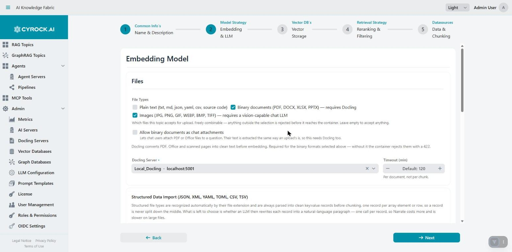
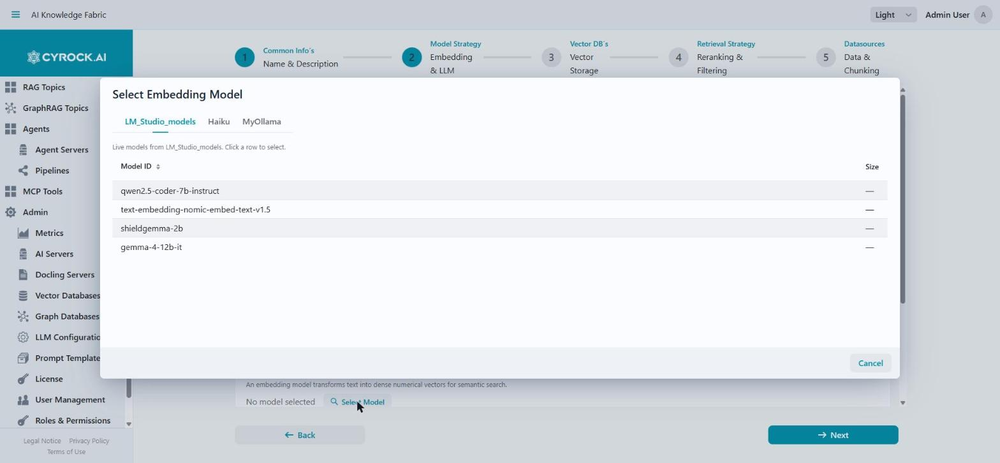
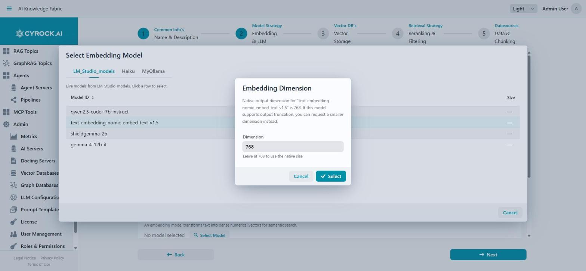
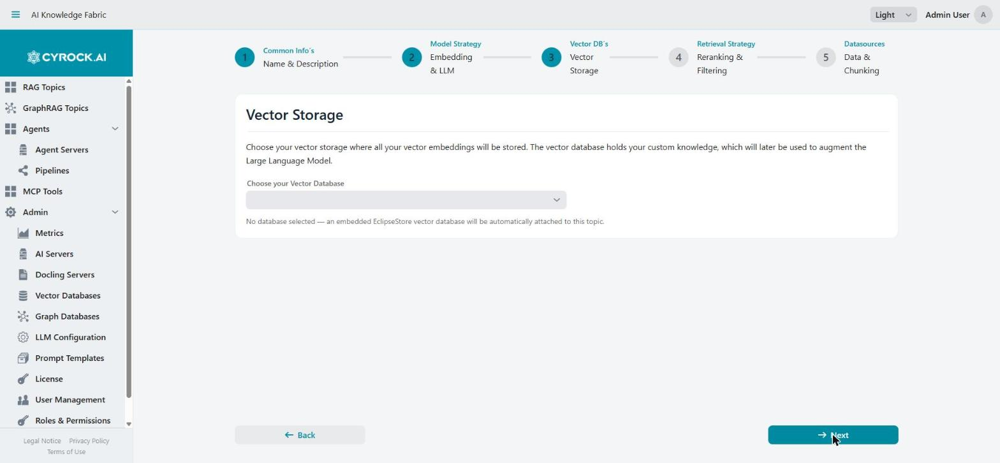
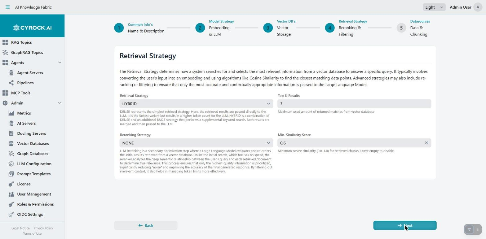
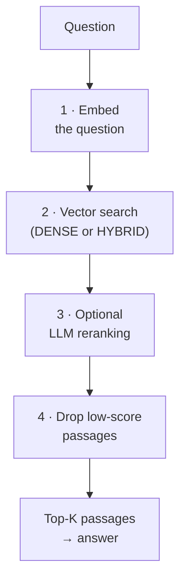
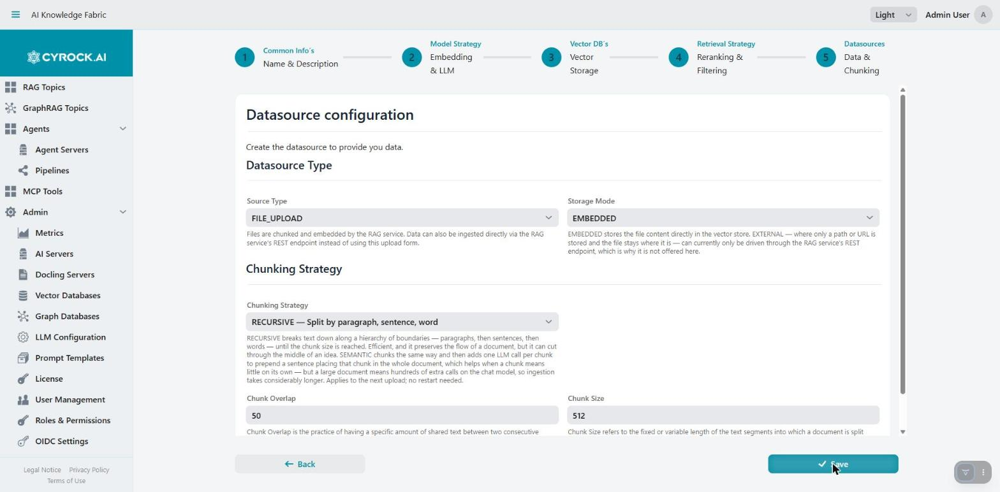
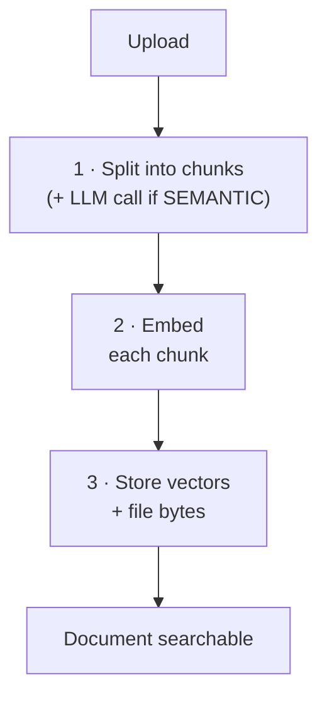

# Creating a RAG Topic — Step by Step

A Topic is created in a **five-step wizard** (**Topics → New Topic**, `/topicForms`). Requires the
`TOPIC_CREATE` permission.

The stepper at the top shows progress. **Next** validates the current step before advancing, and you
can only jump back to steps you have already completed — forward jumps stay locked so validation
cannot be skipped. On step 5 the button reads **Save**.

---

## Before you start

Have these ready, otherwise you will get stuck mid-wizard:

| Needed | Where it comes from |
|---|---|
| An AI server with a **chat model** | **Admin → AI Servers** |
| An AI server with an **embedding model** | Same — may be the same server or a different one |
| A **Docling server**, if you will upload PDF/DOCX/PPTX | **Admin → Docling Servers** |
| A **vector database**, if you don't want the embedded one | **Admin → Vector Databases** |
| A free **host port** for the Topic | Anything unused on the host |

Also check **Admin → License**: Topic creation is refused once the licensed (or free-tier, 3) limit
is reached.

---

## Step 1 — Common Information

The five steps are shown across the top throughout, so you can see where you are and what is still
ahead. **Next** moves forward; the step markers themselves are not clickable until the current step
validates.

| Field | Required | Notes |
|---|---|---|
| **Topic Name** | Yes | Max 50 characters, letters, digits, hyphens and underscores — spaces are converted to underscores automatically |
| **Topic Description** | No | Free text, shown in the Topic list |
| **User System Prompt** | No, but recommended | The Topic's persona and rules. Inserted into the global prompt template |
| **RAG Service Port** | No | Host port the Topic's API is exposed on. Leave empty if it should not be exposed |
| **Roles** | — | Which roles may access this Topic |

### The system prompt

This is where you give the Topic its character — *"You are an HR assistant. Answer only from the
policy documents. Cite the section you used."*

Above the field, **Quick-fill from template:** buttons offer the prompt templates defined under
**Admin → Prompt Templates**. Clicking one **replaces** the field's content, so pick a template first
and then edit.

Your text is inserted into the global template at the `{{USER_EDITABLE_PROMPT}}` placeholder — you do
not need to repeat general safety or formatting rules, only what is specific to this Topic. See
[Global LLM Configuration](../../3.0-Configuration/3.3-Global%20LLM%20configuration/Global-LLM-Configuration-and-Prompt-Templates.md).

### The RAG Service Port

The host port the Topic's `rag-service` listens on. It must be free, and it is what makes the
[REST interface](../4.5-REST-API/REST-API.md) reachable. Pick a scheme you can keep track of (8081,
8082, 8083…) — each Topic needs its own.

### Roles

Access is per Topic: only the roles you tick here will see it. This is the resource-level layer on top
of the `TOPIC_VIEW` permission — see
[Roles & Permissions](../../3.0-Configuration/3.5-Users-Roles-and-Authentication/Roles-and-Permissions.md).

---

## Step 2 — Models

The largest step. It adapts itself to the **File Types** you tick first, and now also carries the
Topic's chat attachment settings (moved here from what used to be step 4) since they depend directly on
Docling and the vision role configured in this same step.

**This is the step that blocks progress.** An embedding model *and* a language model must both be
chosen before **Next** does anything — and if neither is set, the button simply does nothing rather
than explaining why. Scroll to the bottom of the step to find both selectors and their messages.

Each **Select Model** button opens a picker with one tab per registered AI Server, listing the models
that server reports live:

> A server showing `Error` in the AI Servers list can still return models here — that status reflects
> the last reachability probe, not the current state. If the picker lists models, the server responds.

Choosing an **embedding** model additionally asks for its output dimension:

It is pre-filled with the model's native size. Leave it as is unless you deliberately want a smaller,
truncated vector — the dimension must match whatever the target collection was created with.

### Files

A **File Types** checkbox group — **Plain text**, **Binary documents (PDF, DOCX, PPTX)**, **Images** —
freely combinable, plus **Allow binary documents as chat attachments** right below it. Together they
decide which extensions the upload UI (and later, chat attachments) will accept, and whether Docling is
needed at all.

> Leaving every box unticked means *allow anything* — no upload filtering and no Docling requirement.
> Ticking the types that match your content gets you an earlier, clearer error instead of a failed
> ingestion.

### Docling

Shown as soon as **Binary documents** is ticked among the File Types, or **Allow binary documents as
chat attachments** is — either one can bring a PDF or Office file into the Topic, and both need
converting to text. A **Docling Server** picker plus a **Timeout (min)** field (per-document, not
per-chunk; empty inherits the global default from **Admin → LLM Configuration**). The step will not
validate without a server selected once this section is visible.

> If the timeout you set here is longer than the Docling server's own **Max Conversion Time** (**Admin
> → Docling Servers**), a warning says so: that server gives up first regardless of what you configure
> here.

### Structured import (optional)

For tabular or record-shaped content, an **Import Strategy** and an optional **narrator model**. The
narrator turns structured rows into prose so they embed and retrieve meaningfully. If you leave the
narrator unset, the chat LLM is used.

### Image handling

Covers images encountered **during ingestion** — a separate concern from letting users attach an image
to a chat message (below).

**Images found during ingestion**: `Ignore` or `Describe`. Ticking **Images** among the File Types
above forces this to `Describe` automatically, since images will then actually arrive and leaving them
ignored would silently embed files that contribute nothing.

`Describe` reveals the **Image Describer Model** picker plus a **Use the topic's Language Model**
checkbox and a **Picture Description Timeout** field. Unlike every other optional model role, this one
has **no fallback inside the container** — it reads a full endpoint or the feature is off — so
inheriting the Language Model only works if that model can actually read images and does **not** run on
an Anthropic server (the container speaks OpenAI's chat-completions shape for this call). The picker
keeps Anthropic servers out of its list for the same reason, and the step will not validate an
inherited pick against an Anthropic chat model.

Also here: **Allow images as chat attachments** — independent of the above. An attached image goes
straight to the Topic's **Language Model** itself (chosen further down this step), not to the Image
Describer Model; there is no separate "confirm the model can see images" checkbox any more — ticking
this box **is** the only signal, and nothing verifies it automatically.

### Embedding Model

**Select Model** opens a picker listing the models each registered AI server reports.

> **This is the one choice you cannot revise painlessly.** Vectors from one embedding model are
> meaningless to another, so changing it later invalidates everything indexed and forces a full
> re-ingestion. Decide now, and keep it.

For image-heavy sources a hint recommends a multimodal embedding model.

### Large Language Model

The model that writes the answers. Also chosen through a picker.

Two things to weigh:

- **Tool calling**, if you intend to connect MCP tools — a model without it silently ignores them.
- **Vision**, if you plan to tick **Allow images as chat attachments** above — that checkbox hands an
  attached image straight to this model, so it needs to actually be able to read images.

Both models must be selected before the step validates.

---

## Step 3 — Vector Storage

One dropdown: **Choose your Vector Database**, listing everything registered under
**Admin → Vector Databases** as `Name (TYPE)`. A summary line confirms your choice.

**Leaving it empty is a valid, common answer** — the Topic then gets an embedded EclipseStore vector
database in its own volume, with no configuration at all. The hint below the field confirms this.

Choose an external database when you already run one, need capacity or resilience beyond a local
volume, or want several Topics to share one backend. See
[Connect Vector DB](../../3.0-Configuration/3.2-Vector-DB%C2%B4s/Connect-Vector-DB.md).

> Like the embedding model, decide before the first upload — switching later points the Topic at an
> empty collection.

---

## Step 4 — Retrieval Strategy

How passages are found and ranked. Every field arrives pre-filled with a working default — `HYBRID`,
Top-K `3`, reranking `NONE`, minimum similarity `0.6` — so this step can be passed through untouched.

| Field | Options / range | Meaning |
|---|---|---|
| **Retrieval Strategy** | `DENSE` · `HYBRID` | `DENSE` is pure vector similarity — fastest. `HYBRID` adds a BM25 keyword search and fuses both result sets, which helps when exact terms, product codes, or names matter |
| **Top-K Results** | Integer | How many passages are retrieved and passed to the model. Higher means more context and more tokens |
| **Reranking Strategy** | `NONE` · `LLM` | `LLM` re-orders retrieved passages by true semantic relevance in a second pass. Better precision, one extra model call per question |
| **Min. Similarity Score** | 0.0–1.0, step 0.05 | Discards passages below this cosine similarity. Empty disables the filter |

What these four fields actually do to a question, in order:

Sensible starting point: `DENSE`, a modest Top-K, `NONE`, and no minimum score. Then tune:

- Answers miss content that is clearly in the documents → raise Top-K, or try `HYBRID`.
- Answers drag in irrelevant material → set a minimum score, or enable `LLM` reranking.
- Answers are slow or expensive → lower Top-K, and leave reranking off.

> Reranking reuses the **chat model** and therefore its timeout — it is not separately configurable.

> **Chat attachments moved to step 2.** Which file types users may attach to a chat message — Plain
> text, Binary documents, Images — is now configured on the **Models** step, next to the Files and
> Image Handling sections it depends on (a binary attachment needs Docling, an image attachment needs
> the Topic's Language Model to actually support vision). There is nothing attachment-related left on
> this step.

---

## Step 5 — Data Source

The final step defines where documents come from and how they are cut up. In practice this creates a
**file upload** source — the wizard always produces that type, and uploading happens later on the
Topic's Data Upload tab.

| Field | Default | Meaning |
|---|---|---|
| **Source Type** | `FILE_UPLOAD` | The only option; see the note below on `REST` |
| **Storage Mode** | `EMBEDDED` | The file content is stored alongside its vectors |
| **Chunking Strategy** | `RECURSIVE` | How a document is split — see below |
| **Chunk Size** | `512` | Tokens per chunk. Smaller retrieves more precisely but fragments context; larger carries more context and more noise |
| **Chunk Overlap** | `50` | Tokens repeated between neighbouring chunks so a sentence crossing a boundary is not lost |

### The two chunking strategies

| Strategy | What happens | Cost |
|---|---|---|
| `RECURSIVE` | Splits along paragraph, then sentence, then word boundaries until the chunk size is reached, keeping fenced code blocks intact | None beyond embedding |
| `SEMANTIC` | The same split, **plus one LLM call per chunk** that prepends a sentence situating that chunk in the whole document ("contextual retrieval") | One chat-model call **per chunk** |

Choose `SEMANTIC` when a chunk means little in isolation — a table row, a numbered clause, a paragraph
referring to something named three pages earlier. Despite the name it does **not** split on semantic
similarity; it improves what each chunk says about itself. Ingestion becomes much slower and is bound
by the **Chat Timeout**, so try it on a few documents first.

> Chunk size and overlap are fixed at creation: changing them later would leave old and new
> embeddings inconsistent. The **strategy** is not — it is sent with each upload, so it can be changed
> on the Topic's Configuration tab at any time and applies from the next upload on, with no restart.

> **Storage Mode `EXTERNAL`** — storing only a path or URL and leaving the file where it is — requires
> a `url` with every ingest call, which only the rag-service's REST endpoint can supply. The wizard
> therefore offers `EMBEDDED` only.

Note that the primary button reads **Save** rather than **Next** here — that is how you can tell you
are on the last step. Press **Save** to create the Topic.

> An HTTP pull source (`REST`) exists in the data model but is **not reachable from the UI** — it can
> only be created directly via the database or API. Do not plan around it.

---

## After saving

The Topic appears in the list with status `CREATED`. To make it usable:

1. **Start it** (requires `TOPIC_START`). Status goes `STARTING` → `RUNNING`. A progress indicator
   runs while it starts; the first start with an Ollama sidecar downloads the model and can take a
   long time.
2. **Upload documents** on the **Data Upload** tab and press **Start Embedding**.
3. **Chat** by clicking the Topic name in the list.

---

## Troubleshooting

| Symptom | Cause and fix |
|---|---|
| **New Topic** button missing | Missing `TOPIC_CREATE`, or the licensed Topic limit is reached |
| Next does nothing on step 2 | An embedding model, LLM, or a required Docling/Image Describer model is missing. The inline error names it |
| Docling section appeared unexpectedly | **Binary documents** got ticked among the File Types, or **Allow binary documents as chat attachments** did — either one requires a Docling server |
| Image Describer Model won't validate while "Use the topic's Language Model" is ticked | The Language Model itself is not yet picked, or it runs on an Anthropic server, which cannot serve this role |
| Model picker is empty | The AI server is unreachable, or reports no models. Check it under **Admin → AI Servers** |
| Topic goes to `ERROR` right after Start | Docker not reachable, or the chosen port is already in use |
| Topic stays `STARTING` for a long time | Normal on a first start with Ollama — the model is being downloaded |
| Name was altered on save | Spaces become underscores automatically; max 50 characters |
| No prompt template buttons | No templates exist. Create them under **Admin → Prompt Templates** |
| Chat rejects an image attachment | **Allow images as chat attachments** was not ticked in step 2, or the Topic's Language Model cannot actually read images |

---

## Related

- [Getting Started](../../1.0-Overview/Getting-Started.md) — this wizard in the context of the whole path, from installation to first chat
- [Overview](../4.1-Overview/Overview.md)
- [Configuration and functions](../4.3-Configuration/Configuration.md)
- [Chat window](../4.4-Chat/Chat-Window.md)
- [Glossary](../4.6-Glossary/Glossary.md)
