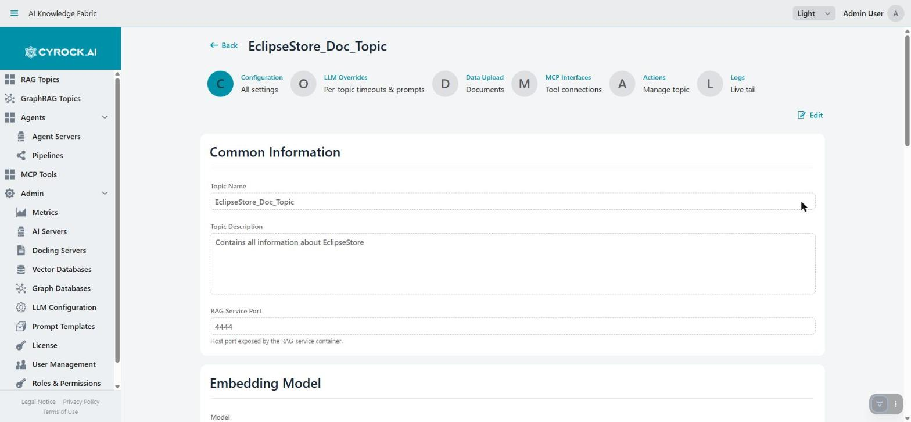
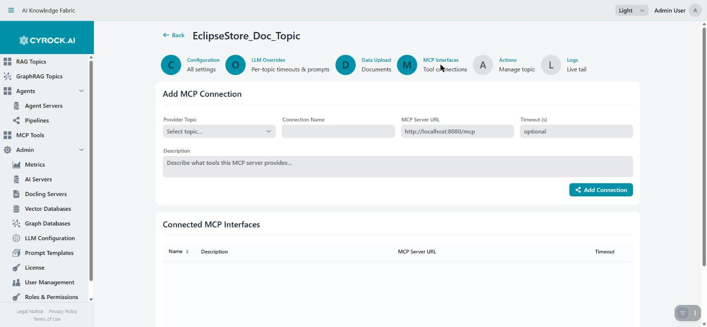

# Topic Configuration and Functions

The Topic detail page (`/topic?id=…`, reached from the Topic list) has **six tabs**. This document
covers each one.

| Tab | Purpose |
|---|---|
| **Configuration** | All settings from the wizard, editable |
| **LLM Overrides** | Per-topic timeouts and prompts, overriding the global defaults |
| **Data Upload** | Uploading documents and inspecting what is indexed |
| **MCP Interfaces** | Connecting tool servers |
| **Actions** | Download the generated manifest, delete the Topic |
| **Logs** | Live log tail |

> **Almost nothing takes effect while the Topic is running.** Configuration is delivered as
> environment variables when the container starts. After changing a setting, **stop and start** the
> Topic. The exceptions are MCP connections and document uploads, which are applied live.

---

## 1. Configuration

The six tabs sit across the top of every Topic page. Fields are read-only until you click **Edit** in
the top right.

The same fields as the creation wizard — name, description, prompt, port, roles, models, Docling,
vector database, retrieval strategy, chat attachments — now on one editable page. See
[Creation step by step](../4.2-Creation/Creation-Step-by-Step.md) for what each field means.

Requires `TOPIC_EDIT`.

Two fields deserve repeating, because changing them here has consequences the form does not spell out:

| Field | Consequence of changing it |
|---|---|
| **Embedding model** | Every existing vector becomes meaningless. Retrieval returns nothing useful until all documents are re-ingested |
| **Vector database** | The Topic points at a fresh, empty collection. Previously indexed documents are neither migrated nor deleted — they stay in the old database |

In both cases the Topic will answer as if it had no knowledge, without any error message. Re-upload
the documents after such a change.

**One field here is the exception to the restart rule:** the **Chunking Strategy** is sent with each
upload rather than baked into the container, so changing it needs only a save and applies from the
next upload on. Chunk size and overlap next to it stay read-only — changing those would leave old and
new embeddings inconsistent. See
[Creation step by step](../4.2-Creation/Creation-Step-by-Step.md#the-two-chunking-strategies) for what
the two strategies do and what `SEMANTIC` costs.

---

## 2. LLM Overrides

Per-topic overrides of the global defaults from **Admin → LLM Configuration**:

| Override | Effect |
|---|---|
| **Context Memory** | Messages kept in conversation context for this Topic |
| **Chat Timeout** | Also covers reranking and chunk enrichment, which reuse the chat model |
| **Embedding Timeout** | For ingestion and query embedding |
| **Picture Description Timeout** | For the vision model |
| **Docling Timeout** | Per document converted in Docling. Only used when this Topic has a Docling server |
| **System Prompt** | Replaces the global prompt template for this Topic |
| **RAG Context Template** | How retrieved passages are injected |
| **No-Answer Response** | Text returned when nothing relevant was found |

An empty override falls back to the global value.

> **A System Prompt override replaces the whole template**, including the `{{USER_EDITABLE_PROMPT}}`
> placeholder. Without that placeholder the Topic's own user prompt is silently discarded — keep it
> unless you intend exactly that.

Typical use: a Topic running a slow local model gets a longer Chat Timeout without changing anything
for Topics on a cloud provider.

---

## 3. Data Upload

Where documents enter the knowledge base. Requires `TOPIC_UPLOAD` — without it the upload area is
hidden and only the file lists are visible.

Note the line of accepted extensions under the drop zones: it is derived from the Topic's configured
content type, so a Topic set to Plaintext will refuse a PDF here.

### Uploading

Two drop zones, side by side:

| Control | Use |
|---|---|
| **Select Files** / *Drop files here* | Individual files |
| **Select Folder** / *Drop folder here* | A whole directory at once |

Up to **500 files** per selection. If the Topic has a datasource type set, the file picker is
restricted to that type's extensions — a convenience filter, not the real validation.

Then press **Start Embedding**. Files are uploaded and embedded one by one, with a progress line
(*Uploading… 3 / 12 done*) and a per-file status marker.

### Two things that are easy to get wrong

**Uploading is not indexing.** Selecting files stages them; nothing is embedded until you press
**Start Embedding**.

**Progress survives navigation.** The batch is tracked server-side, so you can leave the tab and come
back — the progress line is still there and still updating. Closing the browser does not cancel a
running batch.

### When something fails

An amber banner appears with the reason and a **↻ Retry upload** action. The batch stays staged
server-side, so a retry **resumes** rather than restarting — already-embedded files are not processed
twice.

Typical causes: the embedding model's server is unreachable, Docling is down while ingesting a PDF, or
the embedding timeout is too short for the document size.

### Inspecting what is indexed

Three tabs under **Indexed Documents**:

| Tab | Shows | Read it when |
|---|---|---|
| **Database** | Files recorded in the platform's own database for this Topic | Checking what was submitted |
| **Server Files** | Filenames the rag-service actually holds | Verifying ingestion really happened |
| **Chunks** | Every stored chunk with its text and source file | Diagnosing answer quality |

**The Chunks tab is the most useful diagnostic in the product.** It shows exactly what the model can
retrieve. If answers are poor, look here first: garbled text means the conversion failed (usually
Docling), chunks split mid-sentence explain incoherent answers, and a document missing entirely means
ingestion silently failed rather than retrieval.

> **Database vs. Server Files can disagree**, and the discrepancy is meaningful: a file listed in
> Database but not in Server Files was submitted but never successfully ingested.

---

## 4. MCP Interfaces

Connects the Topic's language model to external tools. Works only while the Topic is `RUNNING`,
and connections are registered **live** — no restart.

### Adding a connection

**Add MCP Connection** takes a name, a description, the MCP server URL, and a timeout, then
**Add Connection** registers it. Connected interfaces are listed below with a **Disconnect** action.

The description matters more than it looks: it is what tells the model *when* to use the tool.

### Requirements

- **The chat model must support tool calling.** A model without it ignores connected tools entirely.
  This is the most frequent reason MCP "does not work" — there is no error, the tools are simply never
  called.
- The MCP server must be reachable **from inside the Topic container** — the same host-alias rules as
  everywhere else (`host.docker.internal`, or `172.17.0.1` on plain Linux Docker).

### Topic → Topic

Every running Topic exposes an MCP endpoint of its own, so one Topic can be connected to another and
query it as a tool. This keeps knowledge bases separate while still answering questions that span
them. For a Topic-to-Topic URL the connecting container reaches the other through the Docker host, so
the host alias applies here too.

> If a tool call fails with a message about `outputSchema` validation, the real problem is usually the
> **input** the model sent, not the tool's output schema — the message is misleading.

---

## 5. Actions

Two sections.

### Download the generated manifest

**Download docker-compose.yml** — or **Download Kubernetes YAML** in Kubernetes mode — hands you
exactly what the platform generates for this Topic, including all environment variables and the fully
assembled system prompt.

This is the best way to see what a Topic is *actually* configured with: what the model URLs resolved
to, which timeouts were applied, and what the final prompt looks like after template substitution.

> The file contains **API keys in plain text** (in Docker mode). Treat a downloaded manifest as a
> secret.

### Danger Zone

**Stop & Delete Topic** (requires `TOPIC_DELETE`), behind a confirmation dialog. It stops the
containers, **removes the associated volumes — vector data and downloaded Ollama models** — and
deletes the Topic record along with its chat history.

Irreversible. In Kubernetes mode the Deployment, Service, and PVC are removed instead.

> If the Topic used an **external** vector database, its collection there is **not** cleaned up. Remove
> it in that database if storage matters — the collection is named `topic_<uuid without hyphens>`
> (`Topic_…` for Weaviate).

---

## 6. Logs

A live tail of the rag-service log: recent history first, then new entries streamed as they happen,
with filters by level and logger.

This is where ingestion and chat failures actually explain themselves. The UI shows a short message;
the log shows which downstream call failed and why. Read it when:

- An upload fails and the banner is not specific enough
- Chat returns an error or times out
- An MCP tool is not being called
- The Topic reached `RUNNING` but behaves as if unconfigured

Requires the log permissions (`TOPIC_LOGS` / `LOGS_READ`) — note the caveat about those in
[Roles & Permissions](../../3.0-Configuration/3.5-Users-Roles-and-Authentication/Roles-and-Permissions.md).

---

## Troubleshooting

| Symptom | Cause and fix |
|---|---|
| A configuration change had no effect | Delivered at container start. Stop and start the Topic |
| Retrieval stopped finding anything after an edit | The embedding model or vector database was changed. Re-ingest the documents |
| Upload area not visible | Missing `TOPIC_UPLOAD` |
| Files selected but nothing happens | Press **Start Embedding** — selecting only stages them |
| Upload fails partway | Read the banner, fix the cause, press **↻ Retry upload** — it resumes |
| Server Files is empty although Database lists files | Ingestion failed. Check the Logs tab |
| Chunks show garbled text | Document conversion failed — usually a missing or failing Docling server |
| Answers ignore an uploaded document | Check the Chunks tab: if the document is not there it was never indexed |
| MCP tools are never called | The chat model does not support tool calling, or the tool description does not say when to use it |
| MCP connection fails to add | The MCP URL is unreachable from inside the container. Use the host alias, not `localhost` |
| Deleting a Topic left data behind | External vector databases are not cleaned up. Remove the `topic_…` collection manually |

---

## Related

- [Overview](../4.1-Overview/Overview.md)
- [Creation step by step](../4.2-Creation/Creation-Step-by-Step.md)
- [Chat window](../4.4-Chat/Chat-Window.md)
- [Global LLM Configuration](../../3.0-Configuration/3.3-Global%20LLM%20configuration/Global-LLM-Configuration-and-Prompt-Templates.md)
