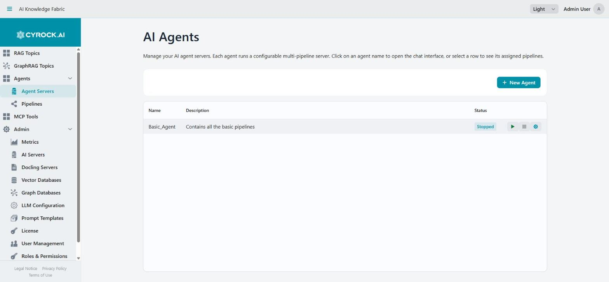
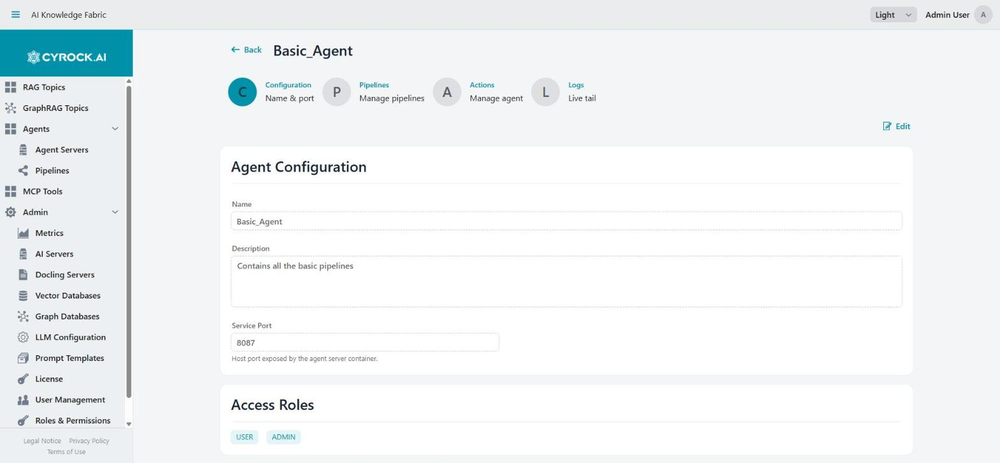
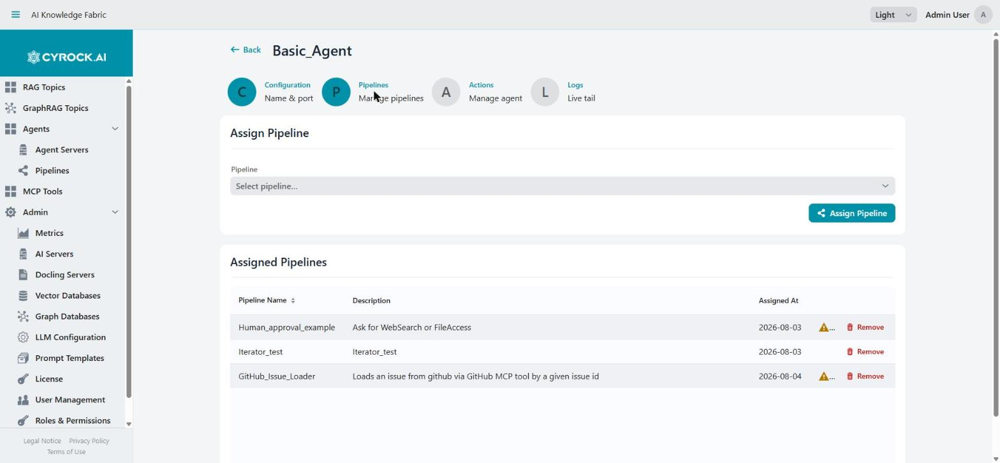

# Agent Server — Creation, Configuration, Pipeline Assignment

An **Agent** is the runtime: a container that executes pipelines. This document covers creating one,
configuring it, assigning pipelines, and the lifecycle.

Permissions: `AGENT_VIEW` to see the list, `AGENT_CREATE`, `AGENT_EDIT`, `AGENT_START`, `AGENT_DELETE`,
`AGENT_CHAT` for the respective actions.

<a href="../../../assets/screenshots/agents-list.jpg"></a>

Selecting a row expands it to show the pipelines assigned to that Agent. The name is only a link to the
chat while the Agent is running — a stopped Agent, as above, has nothing to talk to.

---

## 1. Before you start

| Requirement | Notes |
|---|---|
| At least one **pipeline** | An Agent without pipelines starts but can do nothing. Design it first — [5.3](../5.3-Pipelines/Pipeline-Editor.md) |
| A free **host port** | Each Agent needs its own |
| Docker or Kubernetes available | Otherwise the Agent goes to `ERROR` |
| License headroom | Free tier allows **2 Agents** |

---

## 2. Creating an Agent

**Agents → New Agent**. The form is deliberately small — an Agent carries almost no configuration of
its own, because everything substantive lives in the pipelines it runs.

| Field | Notes |
|---|---|
| **Name** | Unique. Letters only — spaces become underscores |
| **Description** | Free text |
| **Port** | Host port the agent server is exposed on. Must be free |
| **Roles** | Which roles may access this Agent |
| **Pipelines** | Which pipelines to assign — can be changed later |

Save, and the Agent appears in the list with a status.

### Lifecycle states

| Status | Meaning |
|---|---|
| `CREATED` | Record saved, nothing running |
| `STARTING` | Container starting; readiness poll running |
| `RUNNING` | Ready, pipelines registered |
| `STOPPED` | Container stopped. Configuration retained |
| `ERROR` | Start failed, or the readiness poll timed out |

---

## 3. What happens on Start

Understanding this sequence explains nearly every Agent problem:

```
1. A minimal container spec is generated
   → NO environment variables. Unlike a Topic, an Agent gets no
     configuration at container level.

2. The container is started.

3. The platform polls the agent's HTTP API for readiness
   → up to 30 seconds.

4. Once ready, EVERY assigned pipeline is registered
   → one call per pipeline.

5. Status becomes RUNNING.
```

Two failure modes follow directly:

- **The readiness poll must succeed within 30 seconds**, or registration never happens. The Agent may
  still show as running while having no pipelines at all.
- **Registration is per pipeline.** A pipeline that fails to convert (a module missing required config)
  can be rejected while the others register fine — leaving a partially functional Agent.

> After starting, **open the Pipelines tab and confirm the pipelines are actually registered.** A
> silently empty Agent is the single most common surprise here.

---

## 4. The detail page

<a href="../../../assets/screenshots/agent-detail-configuration.jpg"></a>

Four tabs (`/agent?id=…`):

| Tab | Contents |
|---|---|
| **Configuration** | Name, description, port, roles |
| **Pipelines** | Assign and unassign pipelines |
| **Actions** | Download the generated manifest, delete the Agent |
| **Logs** | Live log tail |

### Configuration

Name, description, port, and role access. Requires `AGENT_EDIT`.

The **port** is delivered at container start, so changing it requires a stop and start. Name,
description, and roles take effect immediately in the UI.

### Pipelines

<a href="../../../assets/screenshots/agent-pipelines.jpg"></a>

Assign or unassign pipelines. This is the tab you will use most.

The warning triangle next to a row flags a problem with that pipeline's definition — hover it to see
what. A pipeline that warns here is the usual reason a deployed Agent silently lacks a step.

**When the Agent is stopped**, changes take effect at the next start. **When it is running**, assigning
a pipeline registers it and unassigning removes it — no restart needed.

A single Agent can host several pipelines, and the caller picks one per conversation. That is the normal
arrangement: one Agent as the runtime, several pipelines as its capabilities.

### Actions

**Download the generated manifest** — the Compose file or Kubernetes YAML. Useful mainly to confirm the
image, tag, and port; there is little else in it, since the Agent carries no configuration.

**Danger Zone → Stop & Delete Agent** (requires `AGENT_DELETE`, confirmation dialog). Stops the
container, removes it, and deletes the Agent record along with its chat history.

> Deleting an Agent does **not** delete the pipelines assigned to it. Pipelines are independent records
> — they survive and can be assigned to another Agent.

### Logs

Live tail of the agent server's log: history first, then streamed entries, filterable by level and
logger.

**This is where pipeline runs explain themselves.** The chat shows a result or an error; the log shows
which module ran, which tool was called, what the model returned, and where a run stopped. For anything
non-obvious in a pipeline, read the log rather than guessing from the chat output.

---

## 5. Assigning pipelines — the deployment model

Two directions lead to the same place:

| From | How |
|---|---|
| **The Agent** | Agent detail → Pipelines tab → assign |
| **The Pipeline** | Save the pipeline in the designer; if it is assigned to running Agents, a **Deploy Changes?** dialog offers **Push Now** |

The second one is the loop you will live in while developing: edit → Save → *Push Now* → test in chat.
The dialog names every running Agent the pipeline is assigned to and pushes to all of them at once.

> **Saving a pipeline does not deploy it.** Without the push, the Agent keeps running the version it
> registered at start. If a change appears to have no effect, this is why — either accept the push
> prompt, or restart the Agent.

---

## 6. Where the models come from

An Agent has no model configuration. Every model-bearing module inside a pipeline — Agent, Embedding,
Guardrails, Validator (LLM mode), Structured Output — carries its **own** provider, model name, URL, and
optional API key.

Consequences:

- **The model URL must be reachable from inside the Agent container.** `localhost` refers to the
  container itself. Use `host.docker.internal`, or `172.17.0.1` on plain Linux Docker.
- The registered **AI Servers** are not consulted automatically. The designer's **Select AI Server &
  Model** button copies values from a registered server into the module — use it rather than typing.
- Different modules in one pipeline may deliberately use different models: a small fast model for
  validation, a large one for the main reasoning step.

---

## 7. Troubleshooting

| Symptom | Cause and fix |
|---|---|
| Agent reaches `RUNNING` but has no pipelines | The readiness poll or the registration failed. Check the Logs tab |
| Agent goes to `ERROR` | Docker unreachable, or the port is already in use |
| Some pipelines registered, one did not | That pipeline failed conversion — usually a module missing required config. Open it in the designer and check for empty required fields |
| Pipeline changes have no effect | The pipeline was saved but not pushed. Accept **Push Now**, or restart the Agent |
| Chat says no pipeline is available | None assigned, or none registered successfully |
| Model calls fail with a connection error | The model URL is not reachable from inside the container. Do not use `localhost` |
| Tool is never called | The module is not tool-capable, is missing required config, or its description does not say when to use it |
| `AGENT_*` buttons missing | Missing permissions, or the free-tier Agent limit is reached |
| Deleted an Agent, pipelines gone too? | No — pipelines are independent and survive |

---

## Related

- [Overview](../5.1-Overview/Overview.md)
- [Pipeline editor](../5.3-Pipelines/Pipeline-Editor.md)
- [Agent chat](../5.6-Chat/Agent-Chat.md)
