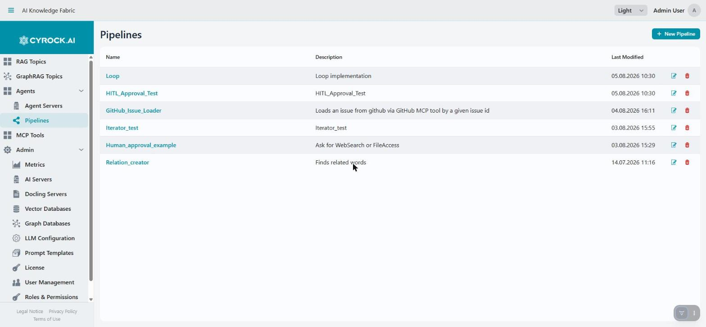
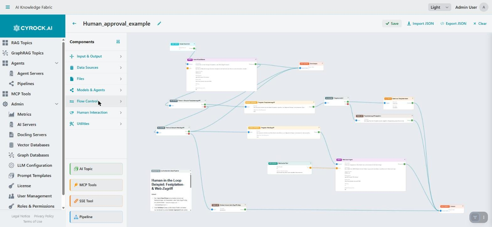

# Pipelines — Creation, Editor, Import/Export, Deployment

A **Pipeline** is a workflow definition built on a visual canvas. This document covers creating one,
working in the editor, and getting it onto an Agent.

Permissions: `PIPELINE_VIEW`, `PIPELINE_CREATE`, `PIPELINE_EDIT`, `PIPELINE_DELETE`.

---

## 1. Creating a pipeline

<a href="../../../assets/screenshots/pipelines-list.jpg"></a>

**Pipelines → New Pipeline** creates an empty definition and opens the designer
(`/pipeline?id=…`). Free tier allows **10 pipelines**. The pencil icon renames a pipeline in place; the
name itself opens the designer.

Inside the designer, the palette is on the left and the canvas fills the rest:

<a href="../../../assets/screenshots/pipeline-designer.jpg"></a>

The palette groups modules into the same categories as the
[module reference](../5.4-Modules/README.md); the four Integration modules sit permanently at the
bottom. **Save** commits the definition, **Export JSON** writes it to a file, and **Clear** empties the
canvas. Connections run from a module's output port to the next module's input port, and the coloured
dots are those ports.

A pipeline exists independently of any Agent. It can be assigned to several Agents, or to none while
you work on it.

---

## 2. The designer

Three areas:

```
┌────────────┬──────────────────────────────────┬──────────────┐
│  Palette   │            Canvas                │  Properties  │
│            │                                  │              │
│ Modules by │   Drag modules here, connect      │ Fields of the│
│ category   │   ports by dragging between them  │ selected node│
└────────────┴──────────────────────────────────┴──────────────┘
   Toolbar:  [Save]  [Import JSON]  [Export JSON]  [Clear]
```

### Working on the canvas

| Action | How |
|---|---|
| Add a module | Drag it from the palette |
| Connect modules | Drag from an output port to an input port |
| Configure a module | Click it — its fields appear in the Properties panel |
| Remove a module or connection | Select it and delete |
| Start over | **Clear** empties the canvas |

Properties are applied as you type — there is no per-field confirm. The canvas node re-renders to
reflect the change, and the selection highlight is preserved.

### Ports

| Port kind | Behaviour |
|---|---|
| **Input** | Receives the upstream module's output |
| **Output** | Passes a result downstream |
| **Tool** | Connect into an **Agent's Tools port** to make the module LLM-callable |

The Tool port is the important one: a module wired there is not executed in sequence. The language model
decides whether to call it, when, and with what arguments — driven by the module's **Description**.

### Property panels that change shape

Most modules show a flat list of fields. Five show a **selector plus conditional fields**, so the panel
changes as you choose:

| Module | Selector | Then shows |
|---|---|---|
| **Validator** | Validation Type — `CONDITION` / `SCRIPT` / `LLM` | Condition field+operator+value · Python script · or model fields |
| **Text Format** | Operation — Word Count / Case Conversion / Text Replace / Text Limit / Static Insert / Text Strip | The fields that operation needs |
| **Web Search** | Search Engine — Tavily / Google Custom Search / SearchApi | That engine's credential fields |
| **File Read** | Storage Type — Local Filesystem / AWS S3 / Azure Blob Storage | That backend's path and credential fields |
| **File Write** | same | same |

Pick the selector first — the rest of the panel does not exist until you do.

### Model quick-fill

Modules that call a model (Agent, Embedding, Guardrails, Validator in `LLM` mode, Structured Output)
need provider, model name, URL, and optionally an API key. **Select AI Server & Model** copies those
values from a registered AI Server instead of you typing them.

> The URL must be reachable **from inside the Agent container** — `host.docker.internal`, or
> `172.17.0.1` on plain Linux Docker. Never `localhost`.

---

## 3. Documenting a pipeline

The **Description** module is a Markdown note rendered directly on the canvas. It has no ports, connects
to nothing, and is **never deployed** — the converter drops it deliberately.

Use it freely: a non-trivial pipeline is hard to read six months later, and this costs nothing at
runtime.

---

## 4. Saving and deploying

**Save** stores the graph. That is all it does.

If the pipeline is assigned to one or more **running** Agents, a **Deploy Changes?** dialog appears
naming them, with **Push Now** and **Not Now**. *Push Now* converts the graph and re-registers it on
every one of those Agents.

```
Edit  →  Save  →  Push Now  →  test in Agent chat  →  repeat
```

> **Save alone changes nothing at runtime.** Without the push, the Agent keeps executing the version it
> registered when it started. If an edit appears to have no effect, this is almost always why. You can
> also restart the Agent, which re-registers everything.

### What the conversion drops

The saved graph is translated for the agent server, and **anything invalid is silently omitted**:

| Situation | Result |
|---|---|
| Module missing a **required** field | The module is dropped from the deployment |
| A **Description** node | Always dropped |
| A module type the converter does not handle | Dropped |
| A module wired into a Tools port that **is not tool-capable** | The tool connection is ignored |
| A tool module that was itself dropped | Removed from the Agent's tool list too |

There is no error marker on the canvas for this. **A pipeline that "does nothing" usually has a module
with an empty required field.** Click through each node and check for required fields left blank.

Only these 11 types work as tools: MCP Tool, SSE Tool, API Call, AI Topic, SQL Database, Data Faker,
KV Store Read, KV Store Write, Pipeline, Web Search, Python Script.

---

## 5. Import and Export

**Export JSON** shows the pipeline's definition as JSON, to copy out. **Import JSON** takes a definition
and loads it onto the canvas.

Uses:

- **Move a pipeline between installations** — dev to production, or to a colleague's instance.
- **Version control** — commit the JSON alongside your project and diff changes.
- **Backup** before a risky restructuring.
- **Templating** — export a working pipeline, re-import it, and adapt it.

Two things to check after importing into a different installation:

| Carried in the JSON | Needs review |
|---|---|
| Module graph, connections, all property values | **Topic IDs** — an AI Topic module references a UUID that does not exist on the target system |
| | **Pipeline IDs** — a nested Pipeline module likewise |
| | **Model URLs** — hostnames differ between environments |
| | **Credentials** — API keys and connection strings |

> Exported JSON can contain **API keys, connection strings, and search-engine credentials** in plain
> text. Treat an export as a secret; scrub it before committing to a shared repository.

---

## 6. Deleting a pipeline

From the pipeline list, with confirmation. The platform removes its Agent assignments first, so a
pipeline in use can be deleted — but any Agent running it loses that capability.

Check which Agents use it before deleting.

---

## 7. Building a pipeline that works

A practical order of work:

1. **Sketch the flow first** — Chat Input, the steps, Chat Output. Get the shape right before
   configuring anything.
2. **Fill in required fields as you add each module.** Leaving them for later is how modules end up
   silently dropped.
3. **Decide step vs. tool per module.** A step always runs; a tool runs only if the model chooses it.
4. **Write real Descriptions on every tool.** This is the model's only instruction about when to use it.
5. **Save and push, then test in chat** — [5.6](../5.6-Chat/Agent-Chat.md).
6. **Read the Agent's Logs tab** when a run does not behave. The log names each module as it executes.
7. **Add a Description note** explaining the intent.

---

## 8. Troubleshooting

| Symptom | Cause and fix |
|---|---|
| Pipeline runs but a step never executes | The module was dropped in conversion — check for empty required fields |
| Edits have no effect | Saved but not pushed. Accept **Push Now** or restart the Agent |
| A tool is never called | Not tool-capable, or its Description does not tell the model when to use it |
| Properties panel looks almost empty | It is a selector-driven module — choose the type/operation/engine first |
| Model calls fail | The URL is not reachable from inside the container |
| Imported pipeline is broken | Topic/pipeline IDs and model URLs do not exist on this installation. Re-select them |
| Loop never terminates | A Loop needs a Validator inside its Body whose Pass output is wired onward. Max Iterations is the backstop |
| Nothing appears in chat | No Chat Output, or the chain to it is broken |
| **New Pipeline** missing | Missing `PIPELINE_CREATE`, or the free-tier limit of 10 is reached |

---

## Related

- [Overview](../5.1-Overview/Overview.md)
- [Module reference](../5.4-Modules/README.md)
- [MCP tools, Topics, nested pipelines, SSE](../5.5-Integration/Integration.md)
- [Agent server](../5.2-Agent-Server/Agent-Server.md)
