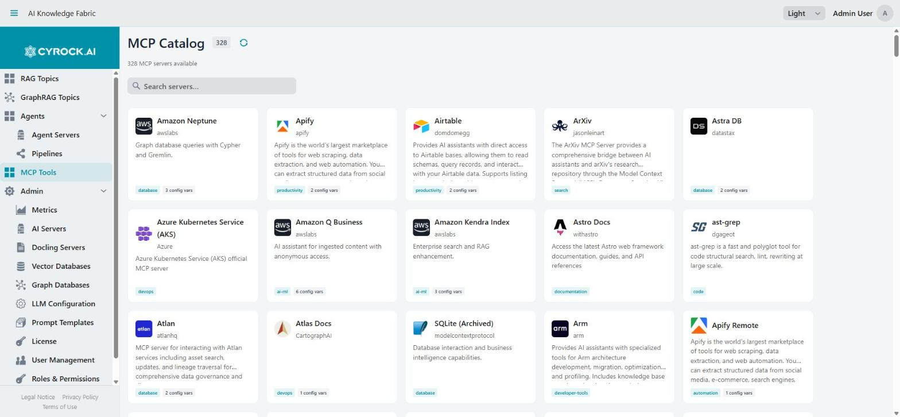

# Integration — MCP Tools, Topics, Nested Pipelines, SSE

Four modules connect a pipeline to things outside itself. They share one mechanism — the **Tool port** —
and understanding that mechanism explains all four.

| Module | Connects to |
|---|---|
| [MCP Tool](../5.4-Modules/MCP-Tool.md) | A tool from the Docker MCP catalog, run by the agent server |
| [SSE Tool](../5.4-Modules/SSE-Tool.md) | An MCP server you already run, over an HTTP/SSE URL |
| [AI Topic](../5.4-Modules/AI-Topic.md) | A RAG Topic in this installation |
| [Pipeline](../5.4-Modules/Pipeline.md) | Another pipeline |

The **MCP Tools** entry in the navigation menu browses the catalog an MCP Tool module can draw from:

<a href="../../../assets/screenshots/mcp-catalog.jpg"></a>

Each card shows the server's publisher and how many configuration variables it needs — that count is
what you will have to supply on the module. The catalog is fetched from a public index, so the number
of entries grows over time and is not fixed by your installation.

---

## 1. The mechanism: step vs. tool

Every integration module can be wired two ways, and the difference decides how the pipeline behaves.

```
AS A STEP                          AS A TOOL
─────────                          ─────────
Chat Input                         Chat Input
    │                                  │
    ▼                                  ▼
 AI Topic   ← always runs           Agent ◄──── Tools ──── AI Topic
    │                                  │                   Web Search
    ▼                                  ▼                   API Call
  Agent                            Chat Output
    │                              (the model decides which,
    ▼                               if any, to call)
Chat Output
```

| | As a step | As a tool |
|---|---|---|
| Wired to | Input/Output ports | An **Agent's Tools port** |
| Runs | Always, in order | Only if the model decides to |
| Input | The previous module's output | Arguments the model composes |
| You control | The exact flow | Only what is *available* |

**Use a step when the answer always requires it.** If every question needs the HR documents consulted,
wire the AI Topic as a step — it is deterministic and cheaper.

**Use a tool when it depends on the question.** If some questions need documents, some need a web search,
and some need neither, wire them all as tools and let the model choose.

### Three requirements for tools to work at all

1. **The Agent's model must support tool calling.** Without it, everything on the Tools port is ignored —
   no error, no log entry, the tools simply never fire. This is the most common cause of "MCP does not
   work".
2. **The module must be tool-capable.** Only 11 types are; anything else on a Tools port is dropped.
3. **The Description must say when to use it.** It is the only information the model has for deciding.

> **Tool descriptions are not documentation — they are instructions.** *"Customer database"* tells a model
> almost nothing. *"Look up a customer's order history by customer ID. Use when the user asks about past
> orders."* tells it exactly when to call and with what.

---

## 2. Using MCP tools

Two modules, for two situations:

| Situation | Module | Key field |
|---|---|---|
| A tool from the Docker MCP catalog, managed for you | **MCP Tool** | `Name` — must match what the agent server expects |
| An MCP server you already run, or a hosted one | **SSE Tool** | `URL` — the SSE endpoint |

### MCP Tool

The agent server starts and manages the tool. The **Name is not a label** — it must be the identifier the
agent server expects, or the tool never resolves.

### SSE Tool

You supply a URL. Name is a free label; the URL identifies the server; the Description guides the model.

**The URL must be reachable from inside the Agent container:**

| Where the MCP server runs | URL host |
|---|---|
| On the Docker host, Docker Desktop | `host.docker.internal` |
| On the Docker host, plain Linux Docker | `172.17.0.1` |
| Another container on the same network | Its service name |
| Elsewhere / hosted | Its hostname |

`localhost` refers to the Agent container itself and will not work.

### Tool Filter — the control that matters

Both modules take a **Tool Filter**: exact tool names to expose. Empty means **all of them**.

An MCP server often offers read *and* write operations. Unfiltered, the model can reach every one. Filter
down to what the pipeline actually needs — this is the difference between an agent that reads your
filesystem and one that can delete from it.

---

## 2a. The MCP catalog

**MCP Tools** in the main navigation (requires `MCP_VIEW`) browses a public catalog of MCP servers. It is
also where the Pipeline Designer's catalog picker gets its entries.

### How it loads

The catalog is fetched from public sources over the internet and held in an **in-memory cache**. The
application warms that cache in the background at startup, so the first visit is usually fast — a cold
fetch takes on the order of twenty seconds, which is what the warm-up exists to hide.

Consequences worth knowing:

- **The catalog needs outbound internet access.** In an air-gapped installation it stays empty; use
  [SSE Tool](../5.4-Modules/SSE-Tool.md) with your own servers instead.
- **The cache is in memory**, so it is rebuilt on every restart.
- **Servers whose details cannot be fetched are dropped** from the listing rather than shown broken. A
  catalog that looks shorter than expected usually means some fetches failed.

### GitHub rate limits

Catalog metadata comes from GitHub, which rate-limits unauthenticated requests. Under that limit the
catalog can load partially or not at all.

Set a GitHub token to raise the limit:

```
MCP_GITHUB_TOKEN=ghp_...
```

A read-only token with no scopes is sufficient — it is used only for public metadata. See the
[installation guide](../../2.0-Installation/docker-compose-installation.md).

### Each catalog entry declares its own secrets

Catalog tools differ in what credentials they need. When you add one in the designer, the properties panel
renders a **Secrets** section built from that tool's own metadata — one field per declared secret, with the
tool's example value as a hint. Some tools need none, others several.

> Those values are stored in the pipeline definition and therefore appear **in plain text in an exported
> pipeline JSON**. Scrub exports before sharing them.

---

## 3. Using Topics in pipelines

The **AI Topic** module is the highest-value integration here: it gives an agent your document knowledge
without rebuilding retrieval inside the pipeline.

```
                          ┌── AI Topic  "HR_Policies"
Chat Input ──► Agent ◄────┼── AI Topic  "Technical_Manuals"
                  │       └── Web Search
                  ▼
             Chat Output
```

The model reads each Topic's purpose and routes the question. One agent, several knowledge bases, no
duplication of documents.

**Requirements and behaviour:**

- **The Topic must be `RUNNING`.** A stopped Topic fails at call time, not at deployment — the pipeline
  deploys fine and then errors when the tool is invoked.
- **The Topic's own configuration still applies** — its retrieval strategy, prompt, and no-answer response.
  Tune answer quality in the Topic, not in the pipeline.
- **Mention what each Topic knows** in the Agent's instruction. The model routes on the Topic's description
  and your instruction; without a hint, it guesses.

### Topic vs. pipeline: which should answer?

| | Just use a Topic | Topic inside a pipeline |
|---|---|---|
| Question answered from documents | ✅ simplest | unnecessary overhead |
| Documents **plus** a live API call | ❌ | ✅ |
| Documents plus branching or a file write | ❌ | ✅ |
| Several document sets, routed per question | via Topic-to-Topic MCP | ✅ cleaner |

Do not wrap a Topic in a pipeline just to chat with it — chat with the Topic directly.

---

## 4. Pipeline in pipeline

The **Pipeline** module runs another pipeline, as a tool or as a step.

**As a step** — extract a reusable section:

```
Chat Input ──► Pipeline "normalise_customer_record" ──► Agent ──► Chat Output
```

**As a tool** — give an agent a complex capability behind one name:

```
Chat Input ──► Agent ◄── Tools ── Pipeline "generate_monthly_report"
```

Why compose:

- **Reuse.** A shared sub-pipeline is fixed once and every caller benefits.
- **Readability.** A pipeline with 25 modules and three branches is unreadable; four pipelines of six are
  not.
- **Layering.** A thin front pipeline routes to specialised ones.

**Two things to watch:**

- **Cycles are not prevented.** A pipeline that calls itself, directly or through a chain, will not
  terminate sensibly. Nothing stops you wiring it.
- **Changes need pushing.** Editing a nested pipeline affects callers only once it has been pushed to the
  running Agent — saving is not deploying.

---

## 5. Portability: what breaks on export/import

Exported pipeline JSON carries the graph and all property values. Two kinds of value do **not** transfer:

| Value | Why it breaks |
|---|---|
| **Topic ID** in an AI Topic module | The UUID does not exist on the target installation |
| **Pipeline ID** in a Pipeline module | Likewise |
| **Model URLs** | Hostnames differ between environments |
| **Credentials** | API keys, connection strings, search-engine keys |

After importing on another system, open every AI Topic and Pipeline module and re-select the target. The
module keeps a stale UUID otherwise and fails at run time rather than at import.

> Exports can contain **API keys and connection strings in plain text**. Scrub them before committing to a
> shared repository.

---

## 6. Choosing between the four

| You want to… | Use |
|---|---|
| Give an agent your own documents | **AI Topic** |
| Give an agent a catalog capability (filesystem, fetch) | **MCP Tool** |
| Connect an MCP server you run | **SSE Tool** |
| Reuse pipeline logic | **Pipeline** |
| Query one Topic from another, without an agent | Topic → MCP Interfaces tab (not a pipeline module) |
| Call a plain REST API | [API Call](../5.4-Modules/API-Call.md) — MCP is not needed for ordinary HTTP |

---

## 7. Troubleshooting

| Symptom | Cause and fix |
|---|---|
| Tools are never called, no error | The Agent's model does not support tool calling. Use a tool-capable model |
| A module on the Tools port does nothing | It is not one of the 11 tool-capable types |
| The model calls the wrong tool, or none | Descriptions are too vague. Say *when* to call each one |
| SSE Tool cannot connect | The URL is not reachable from inside the container. Do not use `localhost` |
| MCP Tool never resolves | The `Name` does not match what the agent server expects |
| AI Topic fails at call time | The Topic is not `RUNNING` |
| Imported pipeline's Topic/Pipeline modules fail | Stale UUIDs from the source installation. Re-select them |
| An agent can do more than intended | Tool Filter is empty, exposing every tool the server offers |
| Nested pipeline changes have no effect | Saved but not pushed to the running Agent |
| Tool call reports an `outputSchema` validation problem | Usually the **input** the model sent, not the schema. The message is misleading |

---

## Related

- [Overview](../5.1-Overview/Overview.md)
- [Module reference](../5.4-Modules/README.md)
- [Pipeline editor](../5.3-Pipelines/Pipeline-Editor.md)
- [Topic MCP configuration](../../4.0-RAG%20Topics/4.3-Configuration/Configuration.md)
