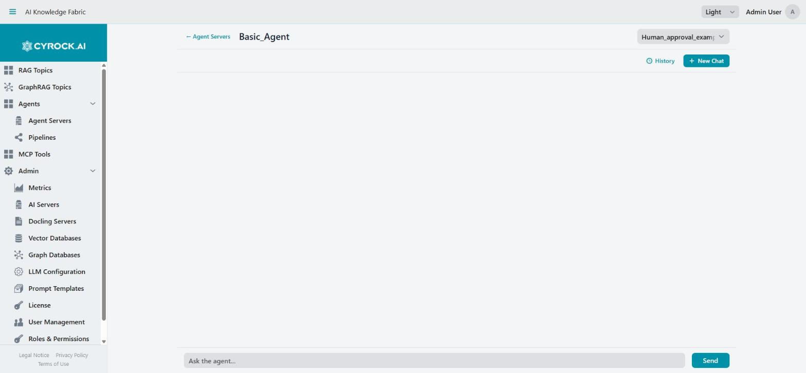

# Agent Chat

The Agent chat interface (`/agent_chat?id=…`) is where you run and test pipelines interactively. Open it
from the Agent list.

Requires `AGENT_CHAT`, plus access to that Agent through your role.

---

## 1. What differs from Topic chat

<a href="../../../assets/screenshots/agent-chat.jpg"></a>

The pipeline selector sits in the **top right**, next to the Agent's name. Above is a fresh session on a
stopped Agent, so the conversation area is empty — nothing is shown to indicate the Agent is not
running, and the failure only surfaces when you send the first message.

The layout mirrors [Topic chat](../../4.0-RAG%20Topics/4.4-Chat/Chat-Window.md), with one structural
addition — **you choose which pipeline to run**:

```
┌──────────────────────────────────────────────────────────┐
│ ← Agents    Support_Agent                                │
│ Pipeline: [ ticket_triage            ▾ ]                 │  ← the difference
├──────────────────────────────────────────────────────────┤
│                              [History]  [+ New Chat]     │
├──────────────────────────────────────────────────────────┤
│   You:  Customer reports the export is failing           │
│                                                          │
│   Agent: Classified as severity 2. Opened ticket #4812.  │
├──────────────────────────────────────────────────────────┤
│  [Ask the agent...                     ]  [Send]  [Stop] │
│  📎                                                      │
└──────────────────────────────────────────────────────────┘
```

| | Topic chat | Agent chat |
|---|---|---|
| What answers | One RAG Topic | The **selected pipeline** |
| Selector | none | **Pipeline selector** |
| Sources shown | Yes, cited files | Only if the pipeline routes through an AI Topic |
| Can act | No | Yes — writes files, calls APIs, updates records |
| May pause for input | No | Yes, via Human Approval |

> **The Agent may take real action.** A Topic only answers; a pipeline can send an email, write a file, or
> update a database. Treat testing accordingly — point new pipelines at test targets first.

---

## 2. Selecting a pipeline

The **Pipeline** selector lists the pipelines assigned to this Agent that registered successfully. Choose
one before sending — it defines what the Agent does with your message.

**An empty selector means no pipeline is available.** Either none is assigned, or registration failed at
start. Check the Agent's **Pipelines** tab and its **Logs** tab — see
[Agent server](../5.2-Agent-Server/Agent-Server.md).

Switching pipelines mid-conversation changes which workflow handles subsequent messages. Start a **New
Chat** when you switch, so earlier context from a different pipeline does not bleed in.

---

## 3. Sending and stopping

Type and press **Enter** or **Send**. While the pipeline runs, a **Stop** button appears (also **Esc**).

Agent runs are usually **slower than Topic chat**, and legitimately so — a pipeline may make several model
calls, call tools, loop, and query databases before replying. A multi-step pipeline taking a minute is
normal.

If runs time out, the relevant setting is the **Model Timeout on the module that stalled** — each
model-bearing module carries its own, defaulting to 20 minutes. The Agent's log shows which module was
running.

---

## 4. Human Approval — when the run pauses

A pipeline containing a [Human Approval](../5.4-Modules/Human-Approval.md) module **stops and waits for
you**. The chat presents the prompt with:

| Control | Effect |
|---|---|
| **Yes** | Approve — the run continues |
| **No** | Reject — the run continues down the rejection path |
| **Free-text** | A custom judgment, when the module allows it (default) |

The run is genuinely suspended until you answer, and only then does the downstream step execute. This is
the point of the module: whatever comes after it does not happen without your decision.

> A **scheduled** pipeline containing Human Approval will sit paused with nobody to answer. Keep approval
> gates in interactive pipelines.

---

## 5. Sessions

As in Topic chat, conversations are persistent and per user.

| Control | Effect |
|---|---|
| **+ New Chat** | Fresh conversation, empty context |
| **History** | Your previous conversations with this Agent |

Start a new chat when you switch pipelines, or when the subject changes — a pipeline whose Agent module has
context memory will otherwise interpret new questions in terms of the old ones.

> **Closing a chat tab deletes that conversation.** Use History to keep the ones you want.

---

## 6. Attachments, paste, drag & drop

The **📎** button attaches files to a single message; paste long text to have it become an attachment chip
instead of flooding the input; drag files onto the input field.

As with Topic chat, attachments are **ephemeral** — available to that one run, never persisted.

---

## 7. Errors and retrying

Failures are shown in place with **↻ Retry this message**, so your input is not lost. Fix the cause and
retry.

| Message | Meaning |
|---|---|
| Service unavailable / retryable | A dependency is down — a model endpoint, an MCP server, a database. Retry once it is back |
| Timeout | A module exceeded its Model Timeout |
| No pipeline available | None assigned or registered |

**For anything else, read the Agent's Logs tab.** The chat shows the outcome; the log shows which modules
ran, which tools were called, and where the run stopped. This is the difference between guessing and
knowing — and for pipeline work it is the primary diagnostic.

---

## 8. Testing a pipeline

The development loop:

1. Edit the pipeline in the designer.
2. **Save**, and accept **Push Now** — without the push, the Agent keeps running the old version.
3. Return to Agent chat, start a **New Chat**, and send a test message.
4. Read the **Logs** tab to see which modules actually executed.
5. Repeat.

Two symptoms and their usual causes:

| Symptom | Usual cause |
|---|---|
| A step clearly never ran | The module was **dropped at deployment** — a required field is empty. The log will not mention it at all |
| A tool was never called | The model does not support tool calling, or the tool's Description does not say when to use it |

---

## 9. Troubleshooting

| Symptom | Cause and fix |
|---|---|
| Cannot open Agent chat | The Agent is not `RUNNING`, or you lack `AGENT_CHAT` / access to it |
| Pipeline selector empty | No pipeline assigned, or registration failed. Check the Pipelines and Logs tabs |
| Edits have no effect | Saved but not pushed. Accept **Push Now** or restart the Agent |
| A module silently did nothing | It was dropped at deployment — check its required fields |
| Tools never fire | Model lacks tool calling, or the Description is uninformative |
| Run pauses and nothing happens | A Human Approval module is waiting for your answer |
| Very slow replies | Normal for multi-step pipelines. Check the log for the module that is taking time |
| Answers cite no sources | Expected unless the pipeline routes through an AI Topic module |
| A conversation vanished | Closing a chat tab deletes it. Use **History** |

---

## Related

- [Agent server](../5.2-Agent-Server/Agent-Server.md) — assignment, registration, logs
- [Pipeline editor](../5.3-Pipelines/Pipeline-Editor.md) — the edit-save-push loop
- [Module reference](../5.4-Modules/README.md)
- [Topic chat](../../4.0-RAG%20Topics/4.4-Chat/Chat-Window.md) — the simpler sibling
