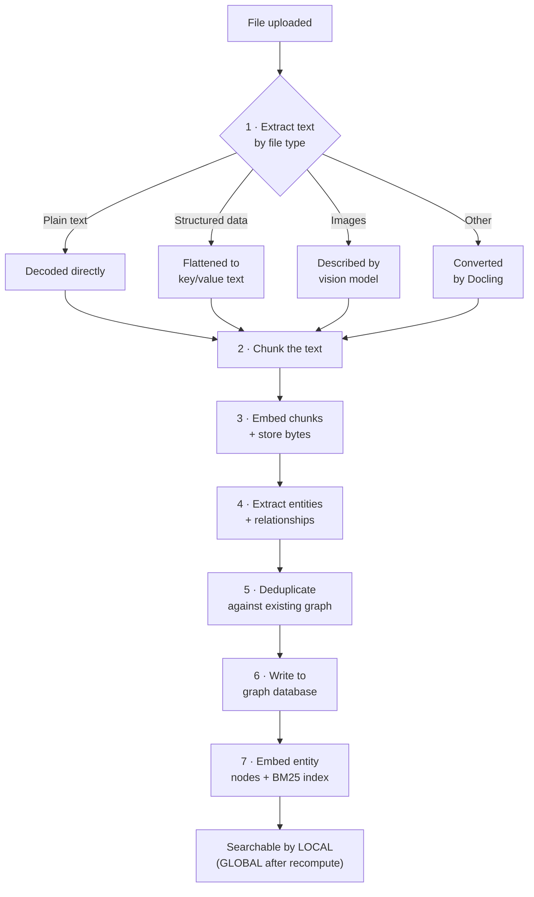
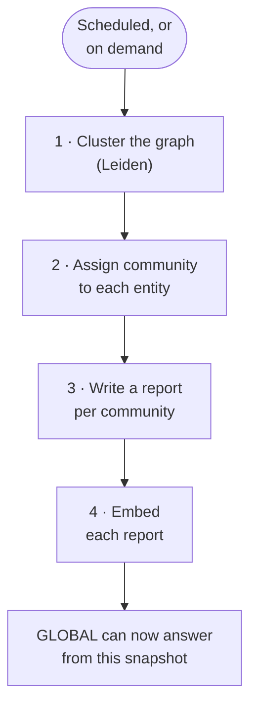

# How a Document Becomes Graph

Uploading a document to a GraphRAG Topic does noticeably more work than uploading to a RAG Topic. This
page walks through what happens between "file selected" and "this content is answerable", so that a
slow upload, an unusually large model bill, or a GLOBAL answer that seems to be missing something all
have an obvious place to look.

---

## The path from file to graph

Two things about that list are easy to miss:

- **Steps 4–6 are what a plain RAG Topic simply does not do.** They are also the reason GraphRAG
  ingestion is markedly slower and more expensive than RAG ingestion — extraction is one full LLM call
  per chunk, on top of the embedding call every chunk already needed.
- **A document only becomes answerable by GLOBAL once communities are recomputed.** Steps 1–7 make it
  answerable by LOCAL immediately. GLOBAL answers from community reports, which are not regenerated on
  every upload — see the next section.

---

## Communities are not automatic per upload

This runs on the refresh cycle you set in the wizard (a cron expression, with quick presets), or
on demand from the Topic's **Actions** tab — see
[Recomputing communities](../6.5-Configuration/Configuration.md#recomputing-communities). Between two
recomputes, newly ingested documents are invisible to GLOBAL even though LOCAL already sees them —
which is the single most common reason a GraphRAG Topic seems to "know" something when asked directly
but not when asked about it thematically.

> **Deleting a document does not undo this either.** Removing a file strips its contributed chunk ids
> from every entity/relationship it touched, deleting what is left with none — but existing community
> reports are not regenerated, so a GLOBAL answer can keep summarising a removed entity until the next
> recompute.

---

## Two ingestion routes, not one

Everything above describes `POST /graphrag/ingest/document` — the route the wizard's **Data Upload**
tab uses, and the only one reachable from the UI. A second route,
`POST /graphrag/ingest/graph`, exists for an external system that already has its own graph data
modelled and wants to *replicate* it into this Topic's graph database directly — skipping extraction
and dedup entirely, since the caller is asserting the entities and relationships rather than asking a
model to infer them from text. This is not reachable from the UI; if your data arrives this way, it was
set up by whoever integrated the exporting system.

The practical consequence you can observe in the UI: a source listed under **Data Upload** with
`(graph ingestion)` next to its name arrived through this second route. It has no uploaded bytes behind
it — nothing to download — and is not affected by the delete-by-document flow the same way an uploaded
file is. See [the glossary](../6.2-Concepts/Glossary.md#graph-sync-vs-document) for the distinction as
it appears on chat citations.

---

## Related

- [Models and their roles](../6.2-Concepts/Models-and-Roles.md) — Extraction, Dedup, and Community
  Report are three of the seven
- [How a prompt is answered](Retrieval-Workflows.md) — what all this ingestion work is *for*
- [File types, Docling, and image handling](../6.4-Creation/File-Types-Docling-Images.md)
- [Configuration and functions — Recomputing communities](../6.5-Configuration/Configuration.md#recomputing-communities)
