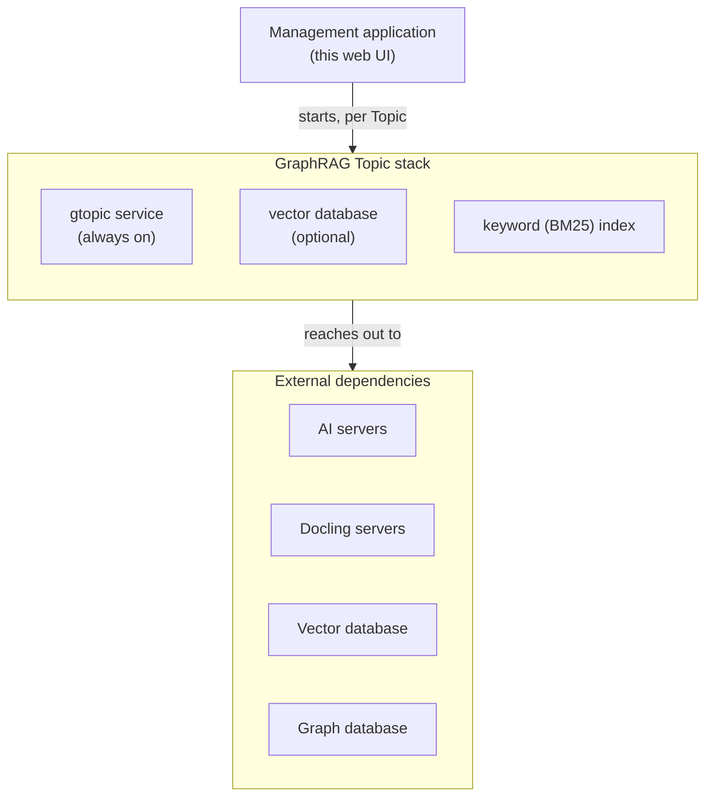

# Why GraphRAG, and the architecture behind it

## 1. Why GraphRAG

Plain RAG retrieves **chunks** — passages of text ranked by how similar their embedding is to the
question's. That works well when the answer lives inside one or two passages. It works poorly for two
kinds of question that come up constantly in real document sets:

- **"How are X and Y connected?"** — the answer is spread across several documents, each mentioning
  only a piece of the relationship. No single chunk contains it, so similarity search never surfaces
  the connection as a whole.
- **"What are the main themes/risks/topics across all of this?"** — a broad question has no single
  passage that answers it; the answer is a synthesis over the *whole* corpus, not a handful of
  matching chunks.

GraphRAG addresses both by building a second representation of your content alongside the chunks:

- **A knowledge graph** — the entities documents talk about (people, products, systems, error codes,
  whatever your content is actually about) and the relationships between them, extracted by a
  language model as documents are ingested. A question about a connection can now be answered by
  **traversing** the graph outward from the entities the question mentions, instead of hoping one
  chunk happens to state the connection directly.
- **Community reports** — the graph is periodically clustered into topical **communities** (groups of
  densely connected entities), and a language model writes a short summary of each one. A broad
  question is answered from these summaries directly, because they already *are* the synthesis a
  chunk-level search cannot produce.

The trade-off is real and worth stating up front: a GraphRAG Topic costs more to ingest (extraction is
an LLM call per chunk, on top of embedding) and more to maintain (community reports need periodic
recomputation as the graph changes), in exchange for being able to answer questions plain RAG
structurally cannot. If your questions are always "what does the manual say about X" — single-passage,
lookup-shaped — a RAG Topic is simpler, cheaper, and just as good. If your questions are relational
("what depends on what") or need a corpus-wide synthesis, GraphRAG is the tool that reaches them.

| | RAG Topic | GraphRAG Topic |
|---|---|---|
| Retrieves | Chunks ranked by embedding similarity | Chunks **and** a subgraph of entities/relationships, **or** community summaries, depending on the question |
| Good at | "What does the document say about X" | The same, **plus** "how is X connected to Y" and "what are the main themes here" |
| Ingestion cost | One embedding call per chunk | One embedding call per chunk, **plus** one extraction call per chunk, **plus** periodic clustering and one report-writing call per community |
| Ongoing maintenance | None | Community reports must be recomputed as content changes, or GLOBAL questions answer from stale summaries |

---

## 2. Architecture — what actually runs

Same shape as a RAG Topic: **the management application does not answer chat itself — it generates and
orchestrates a container.** Pressing *Start* on a GraphRAG Topic provisions real infrastructure, just
like a RAG Topic, but the container it starts is a different image (`cyrockai/knowledge-fabric-gtopic`,
not `knowledge-fabric-topic`) and it talks to one more kind of external server: a graph database.

Everything true of a RAG Topic's operating model is equally true here:

1. **Configuration is delivered at container start**, as environment variables. Changing a setting
   means stopping and starting the Topic. The single documented exception is the retrieval-relevant
   knobs that are genuinely per-request in the RAG side (chunking strategy) — GraphRAG has no
   equivalent live-editable setting; everything here is baked in at start.
2. **Each Topic gets its own host port**, chosen in the wizard.
3. **Docker (or Kubernetes) must be available.** Without it, a GraphRAG Topic goes `STARTING` → `ERROR`
   exactly like a RAG Topic.

### What is genuinely new compared to a RAG Topic

- **A graph database is a hard requirement, not an option.** There is no embedded graph store the way
  there is an embedded vector store — you must register one under **Admin → Graph Databases** before a
  GraphRAG Topic can be created at all.
- **Two storage backends are in play at once**: the vector database holds chunk embeddings (as
  before), entity-node embeddings, and community-report embeddings; the graph database holds the
  entities and relationships themselves, as real graph structure you could query with Cypher directly
  if you wanted to.
- **A BM25 keyword index lives inside the container**, in its own volume, independent of which vector
  store you chose — see [the glossary entry on keyword search](../6.2-Concepts/Glossary.md#bm25--keyword-search)
  for why this exists as a separate thing from the vector database.
- **Seven model roles instead of two.** A RAG Topic only ever needs a chat model and an embedding
  model. A GraphRAG Topic can assign five *additional* roles — extraction, deduplication, community
  report writing, routing, and follow-up synthesis — each independently, or left to simply reuse the
  chat model. See [Models and their roles](../6.2-Concepts/Models-and-Roles.md).

### Lifecycle states

Identical to a RAG Topic's:

| Status | Meaning |
|---|---|
| `CREATED` / `CONFIGURED` | Saved in the database, nothing running yet |
| `STARTING` | Container is being pulled and started |
| `RUNNING` | Ready for uploads and chat |
| `STOPPED` | Container stopped. Configuration and indexed data are retained |
| `ERROR` | Start failed — most often Docker unreachable, a misconfigured server, or a required model role left unset |

---

## Related

- [Why GraphRAG — quick start](Getting-Started.md)
- [How a prompt is answered — LOCAL, GLOBAL, HYBRID](Retrieval-Workflows.md)
- [How a document becomes graph](Ingestion-Workflow.md)
- [Models and their roles](../6.2-Concepts/Models-and-Roles.md)
- [Glossary of terms](../6.2-Concepts/Glossary.md)
