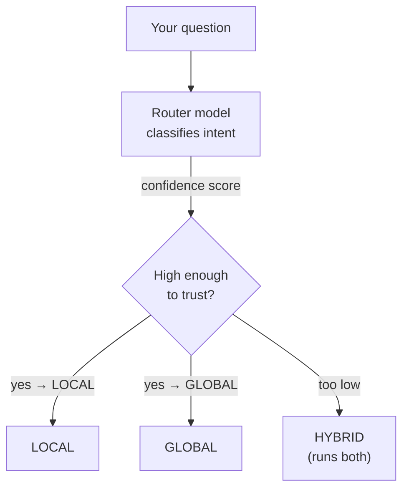
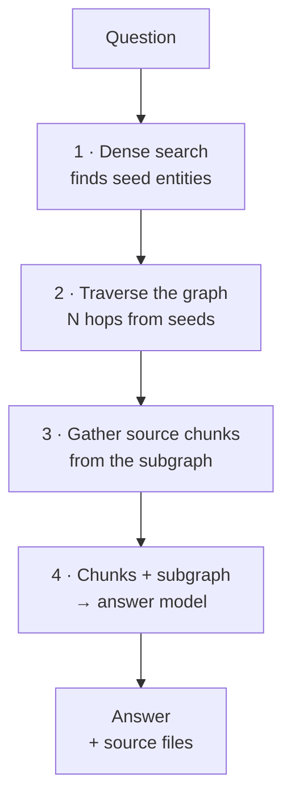
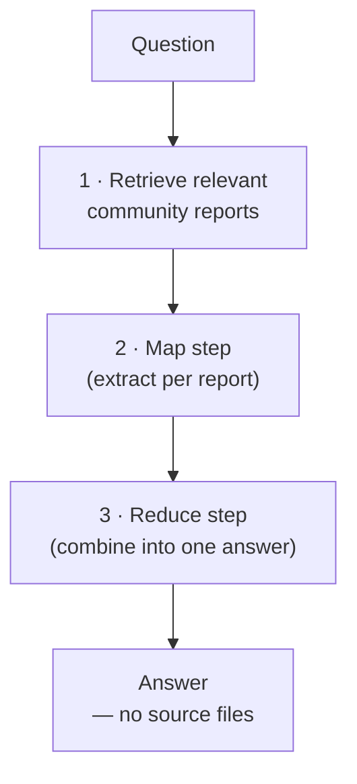
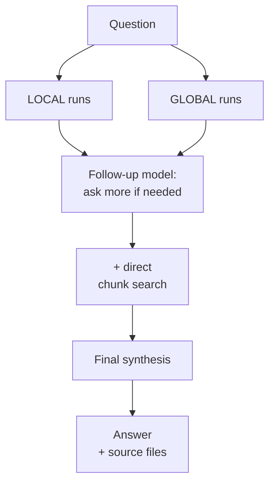

# How a Prompt Is Answered — LOCAL, GLOBAL, HYBRID

Every chat message to a GraphRAG Topic is answered by exactly one of three retrieval strategies. You
never pick the strategy yourself — a **router** model reads the question and decides, on every single
message. Understanding what each strategy actually does is the single most useful thing to know about
GraphRAG, because it explains why two questions asked back to back can feel completely different in
how thoroughly they get answered.

---

## The router — deciding how to answer

The router's own reported confidence has to clear a configurable threshold before its classification
is trusted; below that, the Topic falls back to `HYBRID` rather than guessing — `HYBRID` is the safest
default because it runs both other strategies rather than picking the wrong one outright. This
threshold is the one thing about routing you configure yourself, on the wizard's Retrieval step; the
fallback behaviour itself is not configurable, because "run both" is close to always the right answer
to "I'm not sure".

The router itself never touches your documents — it purely classifies. Retrieval, and the model call
that eventually writes the answer, happen in one of the three branches below.

---

## LOCAL — precise, entity-centred lookup

Use case: a question that names something specific — a person, a product, an error code, "tell me
about X".

LOCAL is the strategy closest to plain RAG's chunk retrieval, with one real difference: instead of
searching chunks directly, it searches **entities** first and pulls in whatever is *structurally
connected* to them — which is exactly what lets it answer "what depends on X" or "who reports to Y"
correctly, where a pure similarity search over chunks would only find passages that happen to mention
the same words.

---

## GLOBAL — broad, thematic synthesis

Use case: "what are the main topics here", "summarise the risks across all of this" — anything with no
single passage that answers it.

GLOBAL never touches individual chunks or documents at retrieval time — it answers entirely from
**community reports**, which is why it returns no source-file citations at all: there is no single
document to point back to for a synthesis over an entire theme. This also means GLOBAL is only as good
as your communities are current — see
[Recomputing communities](../6.5-Configuration/Configuration.md#recomputing-communities) for what keeps
them fresh.

---

## HYBRID — both of the above, plus follow-up reasoning

Use case: whatever the router could not confidently classify as purely LOCAL or purely GLOBAL — in
practice, most real questions that combine "what is X" with "how does it relate to everything else".

HYBRID is deliberately the most expensive strategy — it runs LOCAL and GLOBAL as *inputs* rather than
picking one, and can spend several extra model calls asking itself follow-up questions before
synthesising a final answer. That cost buys the strategy most likely to satisfy a question you did not
carefully phrase for either of the other two — which is exactly why it is also what the router falls
back to when it is unsure.

---

## What this means in practice

- **The same question can be answered completely differently depending on phrasing.** "Who is the
  project lead for X" (LOCAL) and "what are the biggest risks across the project" (GLOBAL) are answered
  from entirely different data, by entirely different code paths.
- **Source citations only appear for LOCAL and HYBRID.** A GLOBAL answer citing nothing back is
  expected behaviour, not a bug — see the note above.
- **If GLOBAL or HYBRID answers feel stale**, the graph's communities have not been recomputed since
  new content arrived — see [Recomputing communities](../6.5-Configuration/Configuration.md#recomputing-communities).
- **Every bound mentioned above — hop count, subgraph size, chunk caps, follow-up rounds — is
  configurable** on the wizard's Retrieval step and described field by field in
  [Retrieval strategies](../6.2-Concepts/Retrieval-Strategies.md).

---

## Related

- [Retrieval strategies — the configurable bounds behind each one](../6.2-Concepts/Retrieval-Strategies.md)
- [Models and their roles](../6.2-Concepts/Models-and-Roles.md) — which model does the routing, the map/reduce, and the follow-up synthesis
- [Glossary of terms](../6.2-Concepts/Glossary.md)
- [How a document becomes graph](Ingestion-Workflow.md)
