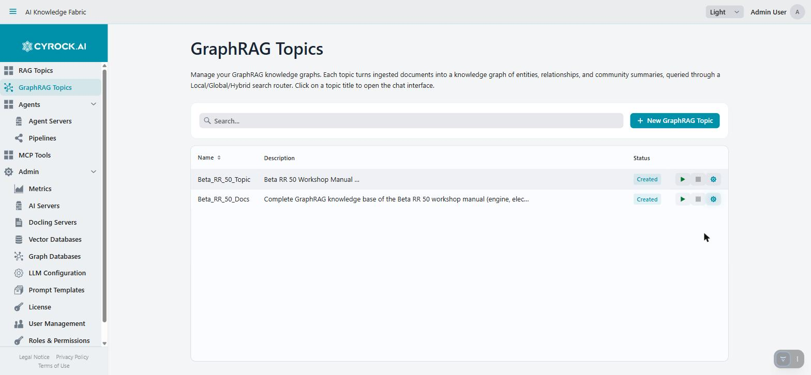

# The GraphRAG Topics Page

**GraphRAG Topics** in the main navigation (`/graphrag-topics`) is the list every GraphRAG Topic lives
on — the same idea as the RAG **Topics** list, one row per Topic, reached from its own menu entry rather
than being mixed into the RAG Topic list.

| Column | Meaning |
|---|---|
| **Name** | The Topic's name. Becomes a link to its chat once the Topic is `RUNNING` |
| **Description** | Free text from step 1 of the wizard, truncated in the grid |
| **Status** | The lifecycle badge — see below |

Requires `GRAPHRAG_VIEW` to see the list at all; **+ New GraphRAG Topic** requires `GRAPHRAG_CREATE`.
Like every list in the product, rows are filtered to the Topics your roles are actually granted access
to — see [Roles & Permissions](../../3.0-Configuration/3.5-Users-Roles-and-Authentication/Roles-and-Permissions.md).

---

## 1. Starting and stopping

Three icons sit to the right of the status badge on every row:

| Icon | Action | Requires |
|---|---|---|
| ▶ (play) | Start the Topic | `GRAPHRAG_START` |
| ■ (stop) | Stop the Topic | `GRAPHRAG_START` |
| ⚙ (gear) | Open the Topic's detail page | `GRAPHRAG_VIEW` |

Pressing **Start** does exactly what starting a RAG Topic does: the management application generates a
Compose file (or Kubernetes manifests) from the Topic's stored configuration and launches the container
stack — the `gtopic` service, plus an embedded vector store if you did not register an external one.
Nothing about the graph database is started here; it is always an external server the container merely
connects to, so "starting" a GraphRAG Topic never provisions your graph store itself.

### Status badges

| Status | Meaning |
|---|---|
| `CREATED` / `CONFIGURED` | Saved in the database, nothing running yet |
| `STARTING` | The container is being pulled and started |
| `RUNNING` | Ready for uploads and chat — the name becomes a clickable link |
| `STOPPED` | Container stopped. Configuration and everything already ingested is retained |
| `ERROR` | Start failed — most often Docker unreachable, a misconfigured model or graph-database server, or a required model role left unset |

The same rules that apply to a RAG Topic's lifecycle apply here: **Docker (or Kubernetes) must be
available**, or a start goes straight to `ERROR`; a first start can take a while if an image needs
pulling; and stopping a Topic never deletes what it has already ingested — only the **Danger Zone**
action on its Actions tab does that (see [Configuration and functions](../6.5-Configuration/Configuration.md#5-actions)).

> **A GraphRAG Topic still needs a graph database it can reach even after `RUNNING`.** The container
> starting successfully only means the container itself came up — the first real proof that its graph
> database, vector database, and model servers are actually reachable is uploading a document or asking
> a question. An unreachable graph database at that point surfaces as a chat or upload error, not as a
> different status badge.

---

## 2. Settings

The gear icon opens the Topic's **detail page** (`/graphrag-topic?id=…`), which is where every setting
from the creation wizard lives afterwards, editable, alongside document upload, prompt overrides, MCP
connections, start/stop/delete, and the live log tail — six tabs in total.

This page only covers the list-level basics. The detail page's tabs are each covered in full on
[Configuration and functions](../6.5-Configuration/Configuration.md), including **which tab to open for
which task** — that page is the one to bookmark once a Topic already exists.

---

## Related

- [Why GraphRAG, and the architecture behind it](../6.1-Overview/Overview.md)
- [Creation step by step](../6.4-Creation/Creation-Step-by-Step.md)
- [Configuration and functions](../6.5-Configuration/Configuration.md)
- [GraphRAG Chat Window](../6.6-Chat/Chat-Window.md)
