# Creating a GraphRAG Topic — Step by Step

A GraphRAG Topic is created in a **four-step wizard** (**GraphRAG Topics → New GraphRAG Topic**,
`/graphrag-topicForms`). Requires the `GRAPHRAG_CREATE` permission.

The stepper at the top shows all four steps at once — **Basic Information**, **Data Ingestion**,
**Vector Settings**, **Retrieval** — and, unlike some wizards, lets you jump directly to any step you
have already reached, forward or back. **Next** still validates the current step before letting you
leave it. On the last step the button reads **Save**.

> This page walks the wizard field by field. If you have not already read
> [Why GraphRAG](../6.1-Overview/Overview.md) and [Models and their roles](../6.2-Concepts/Models-and-Roles.md),
> several fields below will make more sense with that context first.

---

## Before you start

Everything a RAG Topic needs, **plus a graph database** — see
[Getting Started](../6.1-Overview/Getting-Started.md#what-you-need-before-you-start) for the full table.
The one prerequisite that blocks the wizard entirely if missing: a **graph database** registered under
**Admin → Graph Databases**. There is no embedded graph store to fall back to the way there is for
vectors.

---

## Step 1 — Basic Information

<a href="../../../assets/screenshots/graphrag-wizard-step1-basic.jpg">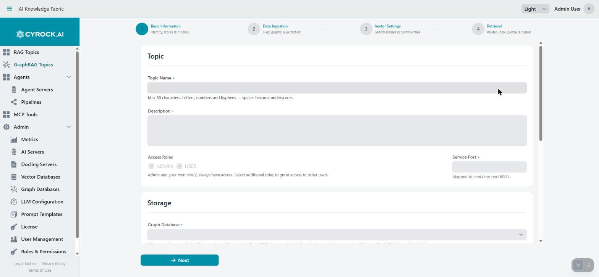</a>

Name, description, access, storage, and the two required model roles all live on this one step.

| Field | Required | Notes |
|---|---|---|
| **Topic Name** | Yes | Max 50 characters. Letters, numbers, and hyphens — spaces become underscores |
| **Description** | Yes | Free text, shown in the GraphRAG Topics list |
| **Access Roles** | — | Which roles may access this Topic. Admin and your own role(s) always have access |
| **Service Port** | Yes | Host port the container's API is exposed on — mapped to the container's internal port 8080 |

### Storage

| Field | Required | Notes |
|---|---|---|
| **Graph Database** | Yes | Where entities and relationships are stored. GraphRAG has **no embedded graph store** — if this list is empty, register one under **Admin → Graph Databases** first |
| **Use the container's embedded vector store** | — | Checkbox. Ticked, the Topic gets its own EclipseStore volume, exactly like a RAG Topic's default. Unticked, pick a **Vector Database** below it |
| **Vector Database** | Only if not using the embedded store | Everything registered under **Admin → Vector Databases** |
| **Collection Name** | Yes | Used **verbatim** as the vector collection name — node, chunk, and report collections are suffixed off it automatically. Two Topics must not share a name on one database |

<a href="../../../assets/screenshots/graphrag-wizard-step1-storage-models.jpg">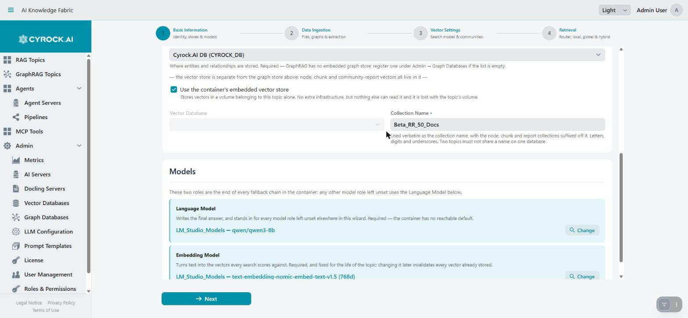</a>

> **Unlike a RAG Topic, the vector store choice here is an explicit checkbox, not "leave it empty for
> embedded".** An accidental omission (no external database chosen, box left unticked) is caught by
> validation rather than silently defaulting to something you didn't decide.

### Models

Two roles, and both are required — there is no reachable built-in default for either, unlike the RAG
image:

| Field | Required | Notes |
|---|---|---|
| **Language Model** | Yes | Writes the final answer, and is the fallback for every optional role left unset elsewhere in the wizard |
| **Embedding Model** | Yes | Embeds chunks, entity nodes, and community reports alike. Fixed for the life of the Topic — changing it later invalidates everything already stored |

Each **Select Model** opens a picker with one tab per registered AI Server:

<a href="../../../assets/screenshots/graphrag-wizard-model-picker.jpg">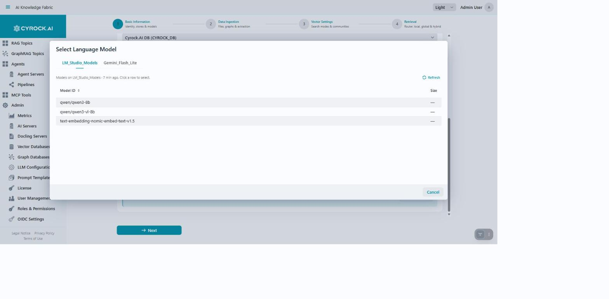</a>

Choosing an embedding model additionally asks for its output dimension, pre-filled with the model's
native size:

<a href="../../../assets/screenshots/graphrag-wizard-embedding-dimension.jpg">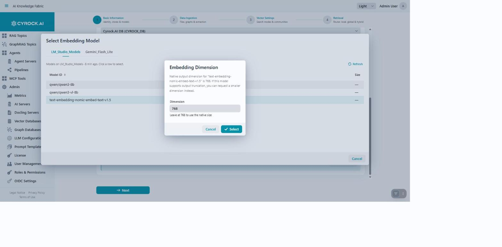</a>

Leave it as-is unless you deliberately want a smaller, truncated vector.

---

## Step 2 — Data Ingestion

The step that decides what a document upload actually accepts and how it is turned into graph.

### Ingestion Paths

| Field | Meaning |
|---|---|
| **File Ingestion** | Uploaded documents are chunked, and an LLM extracts entities and relationships from each chunk. Ticked by default — everything else on this step configures this path |
| **Graph Ingestion** | An external system pushes a ready-made graph directly, so no extraction runs. Its nodes are database rows rather than files — they can be cited but never downloaded |

Both of the container's ingest endpoints stay open regardless of these switches — they decide what the
**application** offers and validates, not what a direct API call to the container can do.

### Files

<a href="../../../assets/screenshots/graphrag-wizard-step2-filetypes.jpg">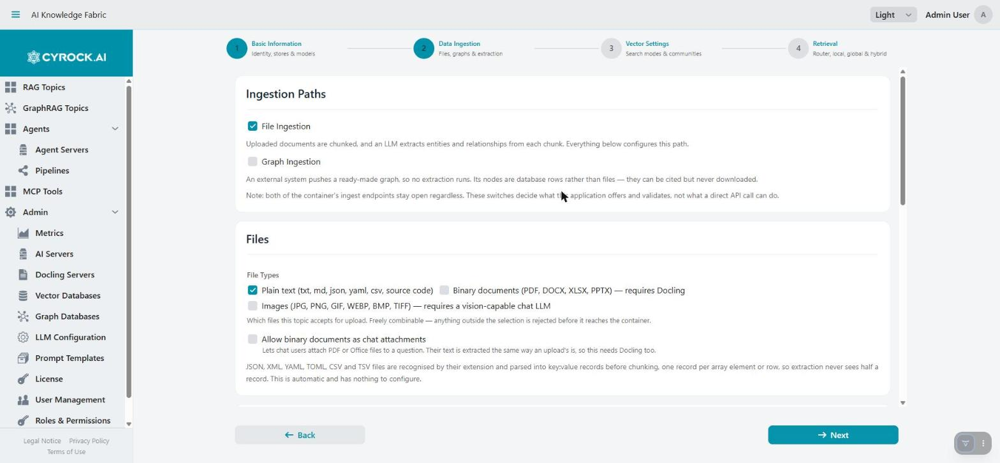</a>

A **File Types** checkbox group, freely combinable:

| Option | Requires |
|---|---|
| **Plain text** (txt, md, json, yaml, csv, source code) | Nothing |
| **Binary documents** (PDF, DOCX, XLSX, PPTX) | A Docling server |
| **Images** (JPG, PNG, GIF, WEBP, BMP, TIFF) | A vision-capable chat LLM |

Plus **Allow binary documents as chat attachments** — lets chat users attach a PDF or Office file to a
question, extracted the same way an upload's is, so this also needs Docling.

JSON, XML, YAML, TOML, CSV, and TSV files are recognised by extension and parsed into key/value records
before chunking automatically — this has nothing to configure and applies regardless of which boxes are
ticked. See [File types, Docling, and image handling](File-Types-Docling-Images.md) for **why** these
checkboxes matter so much more here than they might seem to.

### Docling and Image Handling

<a href="../../../assets/screenshots/graphrag-wizard-step2-docling-imagehandling.jpg">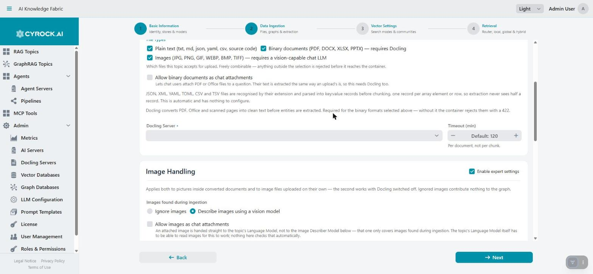</a>

Ticking **Binary documents** reveals a required **Docling Server** picker plus a **Timeout (min)** field
(per document, not per chunk; empty uses the global default). Ticking **Images** reveals **Image
Handling**: ignore images entirely, or describe them with a vision model — the **Image Describer Model**
picker sits right there, with a **Use the topic's Language Model** checkbox beside it and a per-topic
timeout below.

Full detail, including why this role has no fallback the way the other five do:
[File types, Docling, and image handling](File-Types-Docling-Images.md).

### Graph Extraction and Chunking

<a href="../../../assets/screenshots/graphrag-wizard-step2-extraction-chunking.jpg">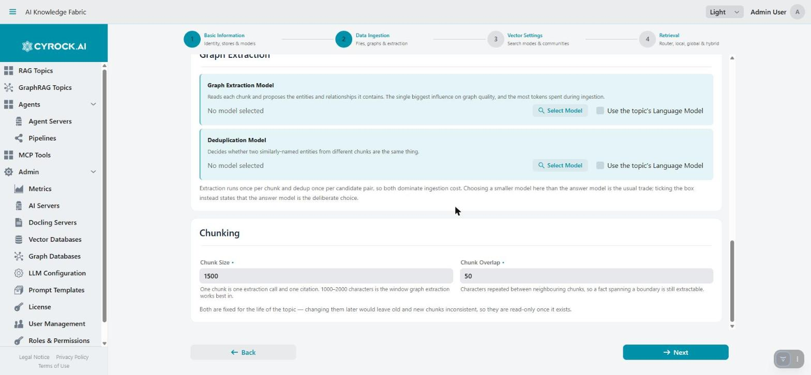</a>

| Field | Default | Notes |
|---|---|---|
| **Graph Extraction Model** | Inherits Language Model | Reads each chunk and proposes its entities and relationships. The single biggest influence on graph quality, and the most tokens spent during ingestion |
| **Deduplication Model** | Inherits Language Model | Decides whether two similarly-named entities from different chunks are the same thing |
| **Chunk Size** | `1500` | One chunk is one extraction call and one citation. 1000–2000 characters is the window graph extraction works best in |
| **Chunk Overlap** | `50` | Characters repeated between neighbouring chunks, so a fact spanning a boundary is still extractable |

Both extraction and dedup run **field by field** against the Language Model's own server when
inherited — ticking the box states that reusing the answer model is the deliberate choice, rather than
leaving the role unconfigured. Chunk size and overlap are both fixed for the life of the Topic, exactly
like a RAG Topic's — changing them later would leave old and new chunks inconsistent.

---

## Step 3 — Vector Settings

<a href="../../../assets/screenshots/graphrag-wizard-step3-overview.jpg">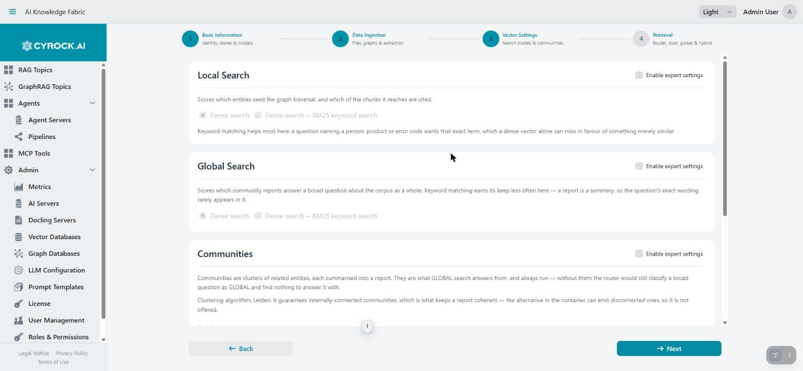</a>

Three sections, each gated behind its own **Enable expert settings** checkbox — greyed and read-only
until ticked, with working defaults underneath so a first pass through the wizard can skip all three
entirely. See [the glossary](../6.2-Concepts/Glossary.md#expert-settings-gate) for why this is per
section rather than one global switch.

### Local Search / Global Search

Unlocked, each offers the same choice:

<a href="../../../assets/screenshots/graphrag-wizard-step3-local-unlocked.jpg">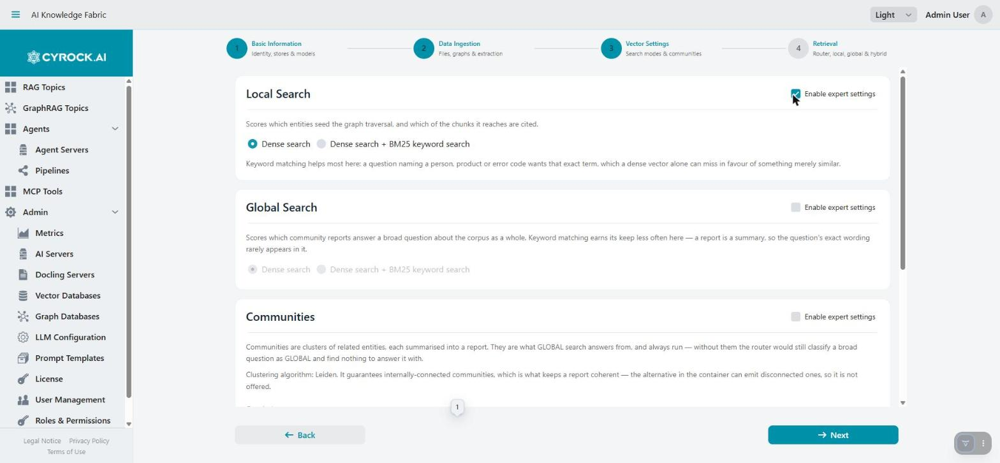</a>

**Dense search** alone, or **dense search + BM25 keyword search** — on by default for both. Keyword
matching helps most for a question naming a person, product, or error code exactly, which a dense
vector alone can miss in favour of something merely similar. See
[Retrieval strategies](../6.2-Concepts/Retrieval-Strategies.md#dense-vs-dense--keyword-search-applies-to-local-and-global).

### Communities

<a href="../../../assets/screenshots/graphrag-wizard-step3-communities.jpg">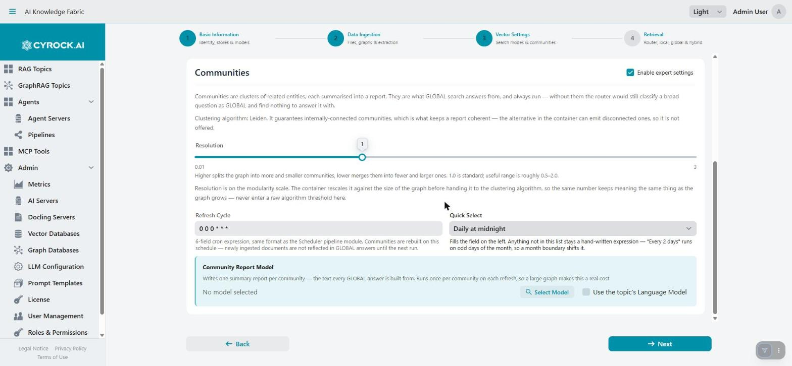</a>

Always on — there is no switch to disable communities, since GLOBAL search would still be routed
questions with nothing to answer them from.

| Field | Default | Notes |
|---|---|---|
| **Resolution** | `1.0` | Slider, `0.01`–`3.0`. Higher splits the graph into more, smaller communities; lower merges into fewer, larger ones. Useful range is roughly `0.5`–`2.0` |
| **Refresh Cycle** | `0 0 0 * * *` (daily at midnight) | A 6-field cron expression — the **Quick Select** dropdown next to it fills common schedules in; anything else stays a hand-written expression |
| **Community Report Model** | Inherits Language Model | Writes one summary report per community — the text every GLOBAL answer is built from. Runs once per community on each refresh, so a large graph makes this a real recurring cost |

Clustering algorithm is fixed to **Leiden** — it guarantees internally-connected communities, which is
what keeps a report coherent. See
[Retrieval strategies](../6.2-Concepts/Retrieval-Strategies.md#communities--clustering-behind-global).

---

## Step 4 — Retrieval

### Router

<a href="../../../assets/screenshots/graphrag-wizard-step4-router-locked.jpg">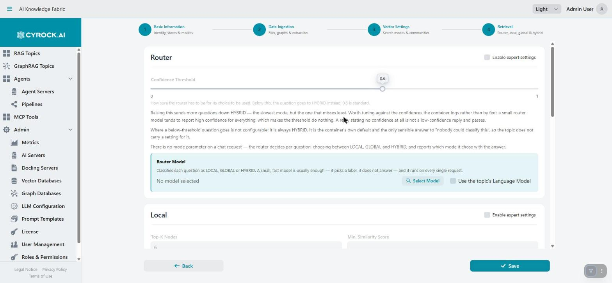</a>

| Field | Default | Notes |
|---|---|---|
| **Confidence Threshold** | `0.6` | How sure the router has to be for its choice to be used. Below this, the question goes to HYBRID instead — that fallback itself is not configurable |
| **Router Model** | Inherits Language Model | Classifies each question as LOCAL, GLOBAL, or HYBRID. A small, fast model is usually enough — it picks a label, it does not answer, and it runs on every single request |

There is no mode parameter on a chat request — the router decides per question and reports which mode
it chose alongside the answer.

### Local

<a href="../../../assets/screenshots/graphrag-wizard-step4-local-unlocked.jpg">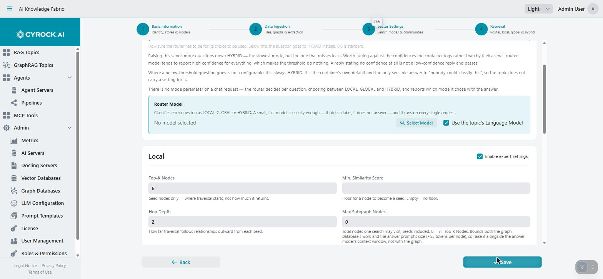</a>

Behind its own expert-settings gate. `Top-K Nodes`, `Min. Similarity Score`, `Hop Depth`, `Max Subgraph
Nodes`, and (further down) `Top-K Chunks` — see
[Retrieval strategies](../6.2-Concepts/Retrieval-Strategies.md#local) for what each one actually bounds;
the short version is that **Top-K Chunks**, not Top-K Nodes, is the field that controls how many source
files an answer can cite.

### Global and Hybrid

<a href="../../../assets/screenshots/graphrag-wizard-step4-global-hybrid.jpg">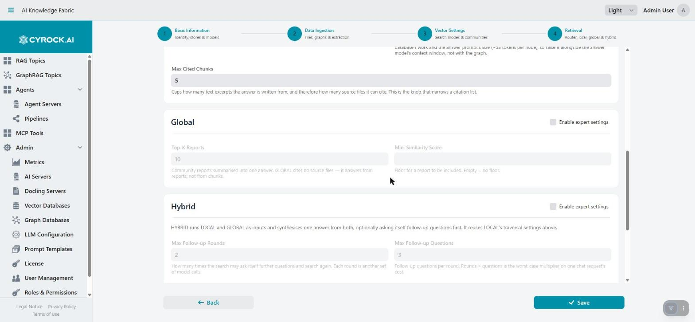</a>

**Global** has exactly one size knob (**Top-K Reports**) plus a minimum score — it returns no chunks and
no source files, so there is nothing else to bound.

**Hybrid** reuses Local's traversal settings and adds its own bounds:

<a href="../../../assets/screenshots/graphrag-wizard-step4-hybrid-followup.jpg">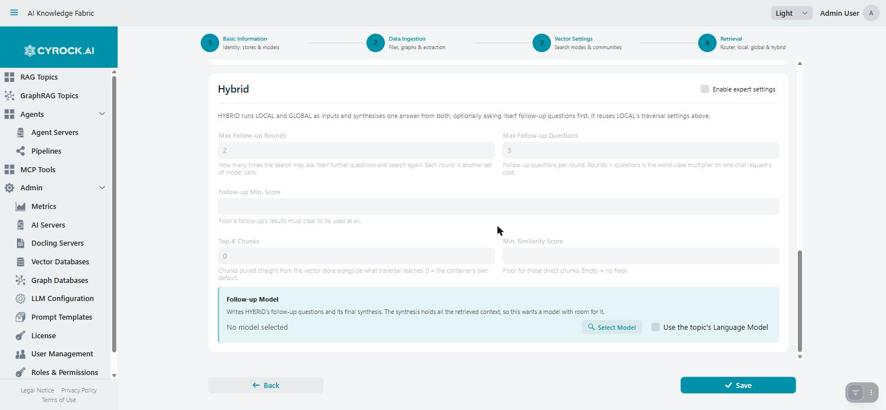</a>

| Field | Default | Notes |
|---|---|---|
| **Max Follow-up Rounds** | `2` | How many times HYBRID may ask itself further questions and search again |
| **Max Follow-up Questions** | `3` | Follow-up questions per round. Rounds × questions is the worst-case multiplier on one chat request's cost |
| **Follow-up Min. Score** | — | Floor a follow-up's own results must clear to be used at all |
| **Top-K Chunks** | `0` (image default) | Chunks pulled straight from the vector store alongside whatever the graph traversal reaches |
| **Min. Similarity Score** | — | Floor for those direct chunks |
| **Follow-up Model** | Inherits Language Model | Writes HYBRID's follow-up questions and its final synthesis. This call holds all the retrieved context, so it benefits from a model with real context-window room |

Press **Save** to create the Topic. It appears in the list with status `CREATED` — see
[The GraphRAG Topics page](../6.3-Main-Page/Main-Page.md#1-starting-and-stopping) for starting it.

---

## Troubleshooting

| Symptom | Cause and fix |
|---|---|
| **New GraphRAG Topic** button missing | Missing `GRAPHRAG_CREATE` |
| Graph Database dropdown is empty | None registered yet — add one under **Admin → Graph Databases** first |
| Step 1 won't validate past Models | Both the Language Model and Embedding Model are required — there is no reachable built-in default for either |
| Step 2 won't validate after ticking Binary documents | A Docling Server must be selected once that file type is ticked |
| Step 2 won't validate after ticking Images | Either pick a dedicated Image Describer Model, or tick "use the Language Model" **and** make sure that model is vision-capable and not hosted on Anthropic |
| A section on step 3 or 4 looks greyed out | Its **Enable expert settings** checkbox is unticked — the defaults underneath are already sensible, tick it only to change them |
| Save is refused with a model-role error | A required role (Language Model, Embedding Model, or an inherited role pointing at an Anthropic server for Image Describer) is missing a reachable configuration |
| Topic goes to `ERROR` right after Start | Docker not reachable, the chosen port is already in use, or the graph database is unreachable |

---

## Related

- [Getting Started](../6.1-Overview/Getting-Started.md)
- [Why GraphRAG, and the architecture behind it](../6.1-Overview/Overview.md)
- [Models and their roles](../6.2-Concepts/Models-and-Roles.md)
- [Retrieval strategies](../6.2-Concepts/Retrieval-Strategies.md)
- [File types, Docling, and image handling](File-Types-Docling-Images.md)
- [Configuration and functions](../6.5-Configuration/Configuration.md)
