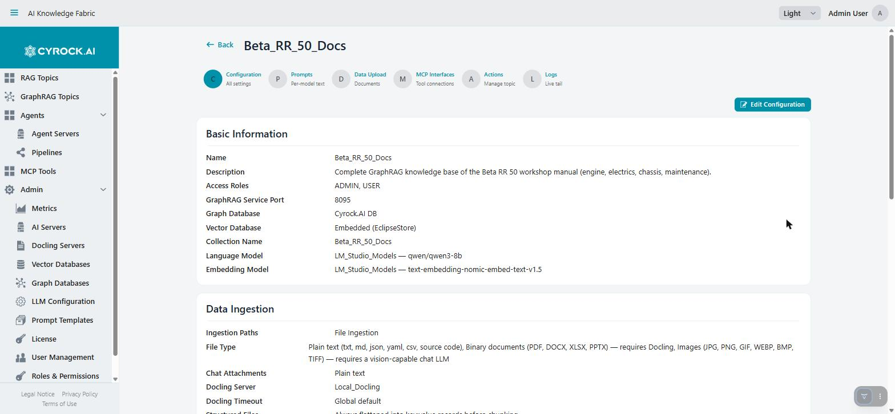
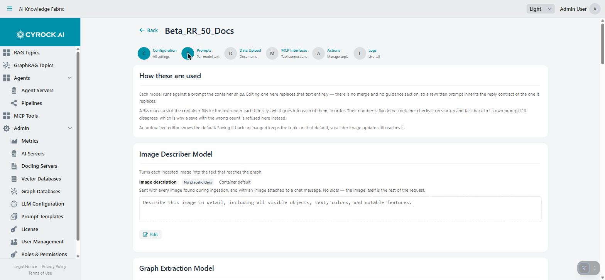
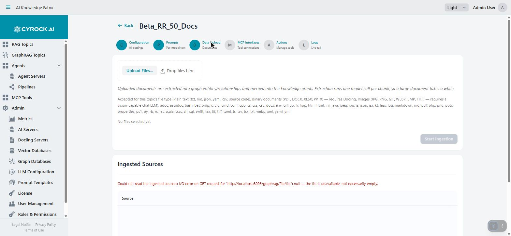
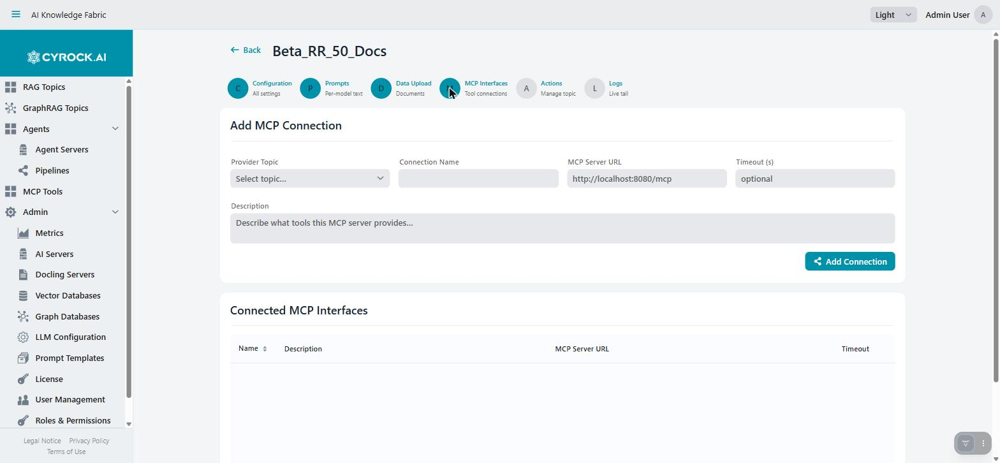
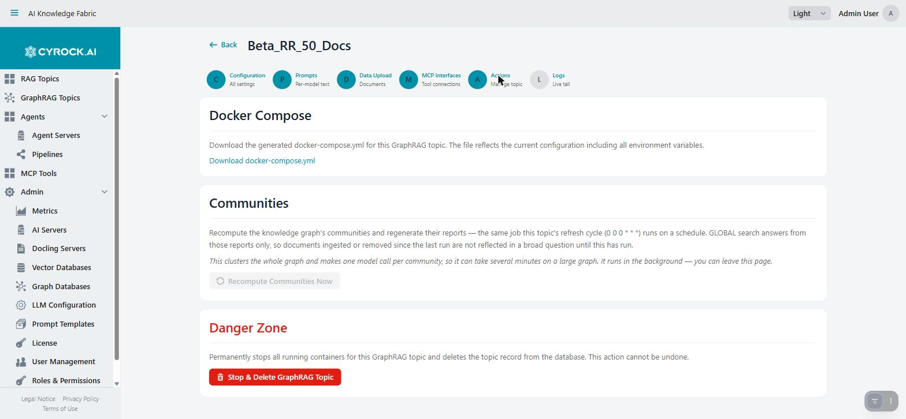
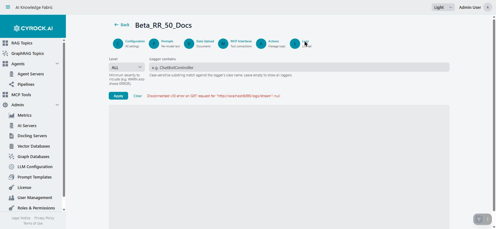

# GraphRAG Topic Configuration and Functions

The GraphRAG Topic detail page (`/graphrag-topic?id=…`, reached from the GraphRAG Topics list) has
**six tabs**. This page covers each one — and, since several of them only matter at specific moments in
a Topic's life, **which tab to reach for when**.

| Tab | Purpose |
|---|---|
| **Configuration** | Every setting from the wizard, read-only summary with an Edit action |
| **Prompts** | Per-model-role prompt text, overridable individually |
| **Data Upload** | Uploading documents and inspecting what has been ingested |
| **MCP Interfaces** | Connecting tool servers |
| **Actions** | Download the generated manifest, recompute communities on demand, delete the Topic |
| **Logs** | Live log tail |

> **Almost nothing takes effect while the Topic is running.** Configuration is delivered as environment
> variables when the container starts — after changing a setting on the Configuration tab, **stop and
> start** the Topic. The exceptions that apply live, with no restart: MCP connections, document uploads,
> prompt overrides on their own next use, and the on-demand community recompute.

---

## 1. Configuration

A read-only summary of everything set in the wizard — name, description, access roles, service port,
graph database, vector database, collection name, both required models, file types, Docling, chat
attachments, the extraction/dedup/community-report/router/follow-up model roles, and every retrieval
bound. **Edit Configuration**, top right, makes the whole page editable in place; requires
`GRAPHRAG_EDIT`.

This is the fastest way to answer "what is this Topic actually configured with" without reopening the
wizard step by step — every field from [Creation step by step](../6.4-Creation/Creation-Step-by-Step.md)
appears here, grouped the same way.

Two fields worth repeating, because changing them here has consequences the page does not spell out:

| Field | Consequence of changing it |
|---|---|
| **Embedding Model** | Every existing vector — chunks, entity nodes, community reports — becomes meaningless. Retrieval returns nothing useful until everything is re-ingested and communities recomputed |
| **Graph Database** or **Vector Database** | The Topic points at a fresh, empty store. Previously ingested content is neither migrated nor deleted — it stays behind in the old store |

In both cases the Topic answers as if it knew nothing, with no error message pointing at why.

---

## 2. Prompts

Every piece of text the container sends to a model is overridable here, grouped by which model role it
belongs to, in the order a document and then a question actually reach them: image describer →
extraction → dedup → community report → router → answer → follow-up.

Three rules that apply to every prompt on this tab:

- **Editing one replaces it entirely.** There is no merge and no guidance section — a rewritten prompt
  inherits the reply contract of the one it replaces, so keep whatever structure the original relied on
  if the model downstream is parsing its output.
- **A `%s` marks a slot the container fills in**, and the text under each prompt's title documents what
  goes into each one, in order. Their count is fixed — the container checks it on startup and falls back
  to its own built-in prompt, with a warning, if a saved override disagrees. This page refuses such a
  save before it ever reaches the container.
- **An untouched editor shows the default**, and saving it back unchanged **removes** the override —
  "I changed nothing" keeps following the container's own built-in text rather than freezing today's
  snapshot of it, so a later image update that improves the default still reaches this Topic.

The chat **system prompt** sits on this tab too, under the answer model, but is not one of these
overridable prompts in the same sense — it is your Topic's own persona/instructions text (the same idea
as a RAG Topic's), substituted into a shared template, and it is the one call in the whole pipeline your
tone and rules actually apply to. See
[Models and their roles](../6.2-Concepts/Models-and-Roles.md#language-model-the-answer-model) for exactly
which call that is per retrieval strategy.

Requires `GRAPHRAG_EDIT` to save changes.

---

## 3. Data Upload

Where documents enter the graph. Requires `GRAPHRAG_UPLOAD` — without it the upload area is hidden and
only the source list is visible.

The accepted-extensions line under the drop zone is derived from this Topic's File Types (Configuration
tab), so a Topic with only Plain text ticked will refuse a PDF here, at upload time, with a clear reason
— see [why defining file types precisely matters](../6.4-Creation/File-Types-Docling-Images.md#why-defining-file-types-precisely-actually-matters).

Press **Start Ingestion** after selecting files. Ingestion here does noticeably more than a RAG Topic's
upload — one extraction model call per chunk, on top of embedding — so it is visibly slower. See
[how a document becomes graph](../6.1-Overview/Ingestion-Workflow.md) for the full pipeline underneath.

### Ingested Sources

A list of what has contributed to this Topic's graph so far. Two things worth knowing before reading it:

- **A source's name is either an uploaded filename, or an external system's own record id** for content
  that arrived through the separate graph-sync route — see
  [graph-sync vs. document](../6.2-Concepts/Glossary.md#graph-sync-vs-document). Only an uploaded
  document can be downloaded; a graph-sync row has no bytes behind it.
- **Delete strips this document's contribution rather than deleting entities outright.** Because an
  entity can be extracted from more than one document, removing a file un-attributes its chunk ids from
  every entity and relationship it touched and deletes only what is left with none — so a delete
  reporting many "stripped" and few "deleted" elements is the *normal* shape, not a partial failure.
  **Community reports are not regenerated by a delete** — a GLOBAL answer can keep summarising a removed
  entity until the next community recompute (below).

---

## 4. MCP Interfaces

Identical in shape and purpose to a RAG Topic's MCP Interfaces tab: connects this Topic's answer model to
external tools, live, with no restart required. Works only while the Topic is `RUNNING`.

**Add MCP Connection** takes a provider topic or a raw MCP Server URL, a connection name, an optional
timeout, and a description — the description is what tells the model *when* to reach for the tool.
Connected interfaces are listed below with a disconnect action.

The same requirement applies as on the RAG side: **the answer model must support tool calling**, or
connected tools are simply never used, with no error anywhere. See
[MCP Interfaces](../../4.0-RAG%20Topics/4.3-Configuration/Configuration.md#4-mcp-interfaces) for the full
detail on this mechanism, since it is genuinely the same feature reused.

---

## 5. Actions

Three sections.

### Download the generated manifest

**Download docker-compose.yml** (or the Kubernetes YAML equivalent) hands you exactly what the platform
generated for this Topic — every environment variable, every resolved model endpoint, every prompt
override actually baked in. The best way to see what a Topic is *really* running, rather than what the
form says it should be running.

> The file contains **API keys in plain text** in Docker mode. Treat a downloaded manifest as a secret.

### Recomputing communities

**Recompute Communities Now** runs the same job the Topic's refresh cycle schedules on its own: cluster
the whole graph, write each entity's community assignment, and regenerate every community report from
scratch. This exists in the UI because **community reports are the only thing GLOBAL search reads**, and
nothing else refreshes them — a document ingested or removed since the last run stays invisible to a
GLOBAL (or the GLOBAL half of a HYBRID) question until this runs.

Practical notes:

- **It runs in the background** — clustering the whole graph and writing one report per community can
  take several minutes on a large graph. You can leave the page; it keeps running.
- **A skipped run reports why, not an error.** An empty graph, or a run already in progress, are normal
  states this button passes straight through rather than failing on.
- Requires `GRAPHRAG_UPLOAD` (the same permission as ingestion) and is only offered while the Topic is
  `RUNNING`.

Run this on demand whenever you need a GLOBAL question answered from the *current* state of the graph
rather than waiting for the scheduled refresh cycle — right after a large batch upload, for instance.

### Danger Zone

**Stop & Delete GraphRAG Topic**, behind a confirmation dialog, requires `GRAPHRAG_DELETE`. Stops the
running container, removes its volumes (embedded vector store and the BM25 keyword index, if either
existed), and deletes the Topic record along with its chat history. **Irreversible.**

> Neither an external graph database's data nor an external vector database's collection is touched by
> this action — only what the container itself owned. Clean those up separately if storage matters.

---

## 6. Logs

A live tail of the `gtopic` container's log, with the same filter-by-level and filter-by-logger controls
as a RAG Topic's Logs tab. Read it when an upload, a chat answer, or a community recompute fails with a
message that is not specific enough to act on — the log names which downstream call actually failed
(the graph database, the vector database, a model server) and why.

Requires the log permissions (`TOPIC_LOGS` / `LOGS_READ`) — see the caveat about their naming in
[Roles & Permissions](../../3.0-Configuration/3.5-Users-Roles-and-Authentication/Roles-and-Permissions.md).

---

## Troubleshooting

| Symptom | Cause and fix |
|---|---|
| A configuration change had no effect | Delivered at container start — stop and start the Topic |
| Retrieval stopped finding anything after an edit | The embedding model, graph database, or vector database was changed. Re-ingest, and recompute communities |
| A prompt edit "didn't save" | If the text was left exactly equal to the default, saving it **removes** the override — that is correct behaviour, not a bug |
| Prompt save refused | The `%s` slot count in your edit does not match the original — check the count noted under the prompt's title |
| Upload area not visible | Missing `GRAPHRAG_UPLOAD` |
| A source can't be downloaded | It arrived through graph ingestion (a database row from an external system), not a file upload — see [graph-sync vs. document](../6.2-Concepts/Glossary.md#graph-sync-vs-document) |
| A delete reports many "stripped" elements and few "deleted" ones | Normal — other documents still reference those entities. Only what nothing else references is actually deleted |
| GLOBAL answers ignore recently ingested or removed content | Communities have not been recomputed since. Use **Recompute Communities Now**, or wait for the refresh cycle |
| Recompute reports "skipped" | The graph is empty, or a run is already in progress — not an error |
| MCP tools are never called | The answer model does not support tool calling, or the connection's description does not say when to use it |
| Deleting a Topic left data behind | External graph/vector databases are not cleaned up automatically. Remove the collection/data manually |

---

## Related

- [The GraphRAG Topics page](../6.3-Main-Page/Main-Page.md)
- [Creation step by step](../6.4-Creation/Creation-Step-by-Step.md)
- [How a document becomes graph](../6.1-Overview/Ingestion-Workflow.md)
- [How a prompt is answered — LOCAL, GLOBAL, HYBRID](../6.1-Overview/Retrieval-Workflows.md)
- [GraphRAG Chat Window](../6.6-Chat/Chat-Window.md)
- [Glossary of terms](../6.2-Concepts/Glossary.md)
