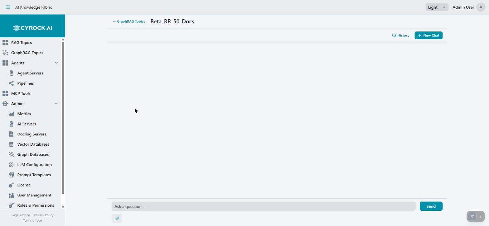
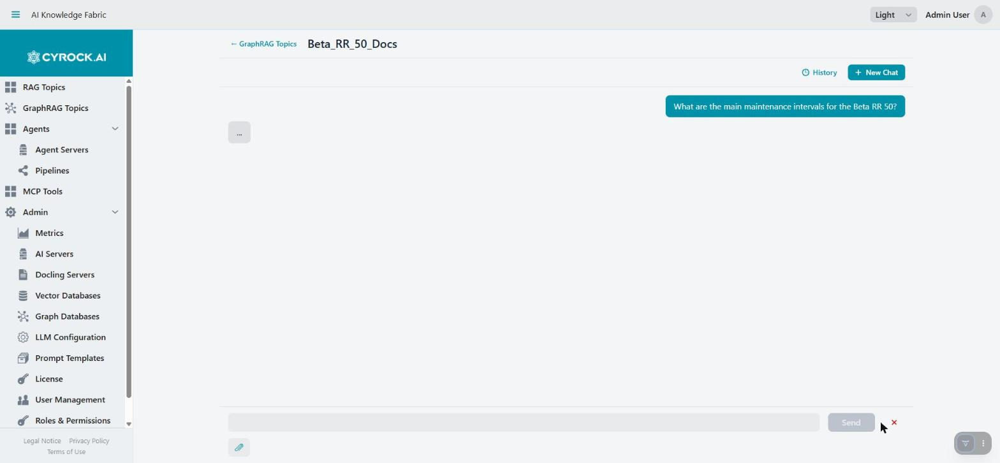
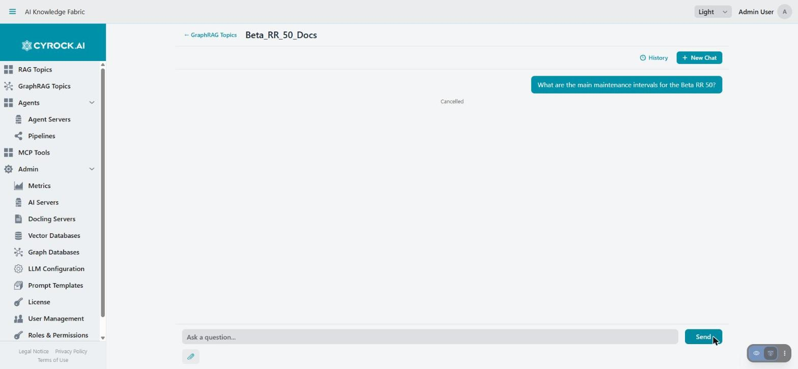

# GraphRAG Chat Window

The chat interface (`/graphrag_chat_client?id=…`) is where you actually talk to a GraphRAG Topic. Open
it by clicking the Topic's name in the GraphRAG Topics list — the name is clickable once the Topic is
`RUNNING`.

Requires the `GRAPHRAG_CHAT` permission, plus access to that specific Topic through your role.

> This page only covers what is **different** from a RAG Topic's chat. Layout, sessions, and
> attachments work the same way — see [RAG Topics — Chat Window](../../4.0-RAG%20Topics/4.4-Chat/Chat-Window.md)
> for the parts that are identical, and read
> [How a prompt is answered](../6.1-Overview/Retrieval-Workflows.md) first if you have not already;
> the mode badge below only makes sense with that context.

---

## 1. What's genuinely different here

### Every answer names which strategy handled it

Unlike a RAG Topic, a GraphRAG Topic never answers just one way — the router picks LOCAL, GLOBAL, or
HYBRID for every single question, and the answer arrives labelled with which one it was. This is the
single most useful piece of information on the whole page: if an answer feels oddly narrow or oddly
vague, the mode it was routed to explains why before you even check the sources.

While a reply is in flight, sources (if any) arrive **before** the answer text starts streaming — the
retrieval step always completes first, then the model writes. See
[Chat streaming](../../4.0-RAG%20Topics/4.4-Chat/Chat-Window.md) for the general mechanics; the ordering
is the one thing worth calling out here specifically, since it is what you are looking at during the
pause in the screenshot above.

### Sources look different depending on where they came from

A LOCAL or HYBRID answer lists **Sources:** exactly like a RAG Topic — one badge per file, each a
time-limited download link (see [source citations](../../4.0-RAG%20Topics/4.4-Chat/Chat-Window.md#3-sources)
for the expiry mechanics, which are identical). GraphRAG adds a second kind of badge you will not see on
the RAG side: a source whose entity arrived through the **graph-sync** route rather than a file upload
shows as a plain, non-clickable badge — `name (graph ingestion)` — because there are no bytes behind it
to download. See [graph-sync vs. document](../6.2-Concepts/Glossary.md#graph-sync-vs-document).

**A GLOBAL answer lists no sources at all.** That is expected, not a missing feature — GLOBAL answers
from community reports, which summarise the graph rather than citing any single document. See
[GLOBAL — broad, thematic synthesis](../6.1-Overview/Retrieval-Workflows.md#global--broad-thematic-synthesis).

### Stop actually stops the pipeline here

On a RAG Topic, pressing **Stop** closes the connection on your side but the underlying model call keeps
running on the server with nobody listening — the abort is best-effort in name only. On a GraphRAG
Topic, **Stop genuinely cancels the in-flight run**: the router→retrieval→answer pipeline executes
synchronously on the same request thread the cancellation reaches, so pressing it really does stop the
work, not just the display. A cancelled turn shows **Cancelled** under your question, as above, and
nothing is persisted for it.

---

## 2. Everything else, in brief

These work exactly as on a RAG Topic — follow the linked section for the full detail:

| Topic | See |
|---|---|
| Layout, sending a question, Enter/Send | [RAG Chat Window §1–2](../../4.0-RAG%20Topics/4.4-Chat/Chat-Window.md#1-layout) |
| Source download links and their ~10-minute expiry | [RAG Chat Window §3](../../4.0-RAG%20Topics/4.4-Chat/Chat-Window.md#3-sources) |
| Sessions, History, and why closing a tab deletes the conversation | [RAG Chat Window §4](../../4.0-RAG%20Topics/4.4-Chat/Chat-Window.md#4-sessions-and-history) |
| Attaching files to a single question, paste and drag & drop | [RAG Chat Window §5](../../4.0-RAG%20Topics/4.4-Chat/Chat-Window.md#5-attachments) — which types are accepted is this Topic's own **Chat Attachments** setting, same idea as the RAG side; see [Image handling: ingestion upload vs. chat attachment](../6.4-Creation/File-Types-Docling-Images.md#image-handling-ingestion-upload-vs-chat-attachment) for why an attached image goes straight to the **Language Model**, never the Image Describer role |
| Errors shown in place with a retry action | [RAG Chat Window §6](../../4.0-RAG%20Topics/4.4-Chat/Chat-Window.md#6-errors-and-retrying) |

---

## 3. Getting better answers

| Symptom | What to do |
|---|---|
| Answer feels too narrow, missed the bigger picture | It was routed LOCAL. Rephrase more broadly ("what are the main…", "summarise…") to nudge it toward GLOBAL, or tune the **Router Confidence Threshold** so more borderline questions fall through to HYBRID |
| Answer feels vague, no citations at all | It was routed GLOBAL — that is correct behaviour, not a fault. If you wanted specifics, ask about the named entity directly |
| Answer cites a document you know was updated or removed | Communities have not been recomputed since. See [Recomputing communities](../6.5-Configuration/Configuration.md#recomputing-communities) |
| Answer misses an entity you know is in the graph | Raise **Top-K Nodes** or **Hops** on the Retrieval step, or check whether extraction actually found that entity in the first place |
| Answer cites more source files than feels useful | Lower **Top-K Chunks** — not Top-K Nodes. See [Retrieval strategies — LOCAL](../6.2-Concepts/Retrieval-Strategies.md#local) |
| HYBRID answers are slow | Expected — it runs LOCAL and GLOBAL as inputs and may ask itself follow-up questions on top. Lower **Max Follow-up Rounds/Questions** if the cost isn't worth it for your use case |

---

## Troubleshooting

| Symptom | Cause and fix |
|---|---|
| Topic name not clickable in the list | The Topic is not `RUNNING`. Start it first |
| No chat access at all | Missing `GRAPHRAG_CHAT`, or your role lacks access to this Topic |
| Every question returns the no-answer text | Nothing has been ingested yet, or nothing scored above the configured minimum similarity |
| A GLOBAL answer has no sources | Expected — see [above](#every-answer-names-which-strategy-handled-it) |
| A source badge reads "(graph ingestion)" and won't open | That entity arrived through graph-sync, not a file upload — there is nothing to download. See [graph-sync vs. document](../6.2-Concepts/Glossary.md#graph-sync-vs-document) |
| Pressing Stop leaves the reply hanging a moment | Normal — the router/retrieval/answer pipeline is mid-step; it still stops shortly after |
| Reply never arrives | Check the Topic's **Logs** tab — a common cause is an unreachable graph database, vector database, or model server for one of the seven roles |

---

## Related

- [RAG Topics — Chat Window](../../4.0-RAG%20Topics/4.4-Chat/Chat-Window.md) — the shared mechanics this page builds on
- [How a prompt is answered — LOCAL, GLOBAL, HYBRID](../6.1-Overview/Retrieval-Workflows.md)
- [Retrieval strategies in detail](../6.2-Concepts/Retrieval-Strategies.md)
- [Configuration and functions](../6.5-Configuration/Configuration.md)
- [Glossary of terms](../6.2-Concepts/Glossary.md)
