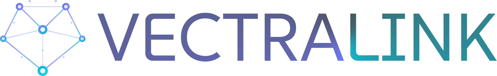

<p align="center">
  
</p>

<p align="center">
  <strong>Vector Database Synchronization</strong>
</p>

A modular Java framework that keeps your vector embeddings in sync with your source‑of‑truth data and lets you query by semantic similarity — all with simple, neutral APIs.

Vectralink bridges two worlds:
- Natural data (e.g., rows in MySQL) — your authoritative source.
- Vector data (embeddings in a vector DB like Qdrant) — for semantic search, recommendations, and RAG.

When your natural data changes, Vectralink updates its vectors automatically via CDC. When you need similar items, Vectralink provides a compact API to vectorize your object, run a vector search, and return your domain entities directly.

---

## Table of contents
- What is Vectralink
- Architecture at a glance
- Modules overview
- Quick start (build & run the demo)
- Getting started in your app (code snippets)
- Key concepts (Core API recap)
- Requirements and compatibility
- Repository layout
- Roadmap and future work
- Troubleshooting

---

## What is Vectralink
Vectralink is a multi‑module Maven project (Java 21) focused on:
- Consistency: keep embeddings synchronized with your natural data via CDC.
- Modularity: plug different vector stores, embedders, and data sources.
- Simplicity: minimal neutral abstractions; bring your own frameworks.

Typical use cases:
- Semantic search over your product/content/user catalogs.
- Recommendations and deduplication.
- RAG pipelines (LLM context retrieval) with your own data.

See the Demo for an end‑to‑end example: MySQL → Debezium → VectorStoreUpdater → Qdrant → SimilaritySearchHandler → Vaadin UI.

## Architecture at a glance
High‑level data flow:
1) A record changes (insert/update/delete) in the natural DB.
2) Debezium emits a CDC event (`before`/`after`).
3) Core’s `VectorStoreUpdater` uses your `Vectorizer` to create an embedding and persists it into a `VectorStore` (e.g., Qdrant). Deletes/updates are handled accordingly.
4) Your app performs queries using `SimilaritySearchHandler`: vectorize input → search vectors → map matches back to domain entities.

Key roles:
- Vectorizer: your embedding step (`Data` → `Vector`).
- VectorStore: persists vectors + metadata and performs similarity search.
- SimilaritySearchHandler: returns matches as natural `Data` by looking up IDs from match metadata.
- DebeziumConnector: streams DB changes into the Core pipeline.

## Modules overview
- [core](core/README.md) — foundational abstractions: `Vector`, `Vectorizer`, `Metadata`, `VectorStore`, `VectorSearch*`, `SimilaritySearch*`, CDC helpers (`DataChange*`, `DataIdProvider`, `VectorStoreUpdater`).
- [qdrant](qdrant/README.md) — concrete `VectorStore<String, Vector.Float>` backed by Qdrant: insert/search/delete and payload mapping from/to `Metadata`.
- [spring](spring/README.md) — adapters to use Spring Data repositories as Core `DataRetriever<ID>` for natural‑data similarity search.
- [debezium](debezium/README.md) — runs Debezium Embedded and forwards CDC events as Core `DataChange` to your pipeline.
- [pinecone](pinecone/README.md) — concrete `VectorStore<String, Vector.Float>` backed by Pinecone (Java SDK v6.x for API 2025-10).
- [pgvector](pgvector/README.md) — concrete `VectorStore<String, Vector.Float>` backed by pgvector (PostgreSQL extension).
- [weaviate](weaviate/README.md) — concrete `VectorStore<String, Vector.Float>` backed by Weaviate.
- [milvus](milvus/README.md) — concrete `VectorStore<String, Vector.Float>` backed by Milvus.
- [vectralink-debezium-spring](vectralink-debezium-spring/README.md) — Spring Boot auto‑configuration for Debezium CDC integration with bean validation.
- [demo](demo/README.md) — runnable end‑to‑end example (Spring Boot + Vaadin + Testcontainers for MySQL <-> Qdrant/Pinecone/Weaviate/pgvector/Milvus).
- [demo-bet-app](demo-bet-app/README.md) — sports betting domain demo with full Vectralink CDC pipeline (Debezium → Qdrant).
- [langchain4j](langchain4j/README.md) — placeholder for future adapters to use LangChain4j embedders as Core `Vectorizer` implementations.

## Quick start (build & run the demo)
Prerequisites:
- Java 21
- Docker running (for Testcontainers in the demo)
- Free ports: 8080 (UI), 3306 (MySQL), 6333/6334 (Qdrant)

Build everything from the repository root:
```bash
mvn -q -DskipTests package
```
Run the demo application:
[See `demo/README.md` for demo run instructions](demo/README.md)

Open:
- Demo UI: http://localhost:8080
- Qdrant dashboard: http://localhost:6333/dashboard

In the UI, click “Add random cities” and then a marker to see similarity search in action.

## Getting started in your app
Below are minimal, framework‑agnostic snippets. See module READMEs for full examples.

1) Define a Vectorizer (your embedding logic):
```java
import ai.cyrock.vectralink.*;

Vectorizer<Vector.Float> vectorizer = data -> {
    // Call your embedder here
    return Vector.Float(0.12f, 0.98f, 0.53f);
};
```

2) Use a VectorStore implementation (e.g., Qdrant):
```java
import ai.cyrock.vectralink.qdrant.QdrantVectorStore;
import io.qdrant.client.QdrantClient;

QdrantClient client = QdrantClient.newBuilder("localhost", 6334, false).build();
QdrantVectorStore store = QdrantVectorStore.New(client, "your_collection");
```

3) Insert vectors with metadata that links back to your domain IDs:
```java
record Product(String id, String title) {}
Data data = Data.New(new Product("p-1", "Wireless Mouse"));
Vector.Float v = vectorizer.vectorize(data);
Metadata md = Metadata.New(java.util.Map.of(Metadata.ID, "p-1"));
java.util.List<String> ids = store.insert(java.util.List.of(v), md);
```

4) Natural‑data similarity search end‑to‑end:
```java
// VectorStore extends VectorSearchHandler, so you can pass it directly
SimilaritySearchHandler sim = SimilaritySearchHandler.New(
    vectorizer,
    store,
    /* DataRetriever<ID> */ ids -> /* load domain objects by IDs */ java.util.List.of()
);

SimilaritySearchRequest req = SimilaritySearchRequest.New(Data.New(new Product("p-1", "Mouse")), 10, 0.0);
// SimilaritySearchResult res = sim.search(req);
```

5) Keep vectors in sync via CDC (Debezium → VectorStoreUpdater):
```java
DataIdProvider<String> idProvider = d -> d.get("id");
VectorStoreUpdater updater = VectorStoreUpdater.New(vectorizer, idProvider, store);
DataChangeNotifier notifier = DataChangeNotifier.New(updater);

// On create/update/delete events from DebeziumConnector -> call notifier.notifyDataChange(...)
```

More details and production tips are available in each module’s README.

## Key concepts (Core API recap)
- Vector — sealed interface with `Vector.Float` and `Vector.Double` plus helpers `Vector.Float(...)`, `Vector.Double(...)`.
- Metadata — dynamic key/value map; set `Metadata.ID` to correlate vectors with your natural data.
- VectorStore<VID, V> — insert/delete and search vectors; returns `VectorSearchResult<VID, V>` of `VectorSearchMatch<VID, V>`.
- VectorSearch* — request/result/match types to perform similarity search over vectors.
- SimilaritySearch* — request/result/handler to return matches at the natural‑data level using a `DataRetriever<ID>`.
- CDC primitives — `Data`, `DataIdProvider<ID>`, `DataChange`, `DataChangeHandler`, `DataChangeNotifier`, `VectorStoreUpdater`.

For a deeper introduction and more examples, see core/README.md.

## Requirements and compatibility
- Java 21
- Built with Maven; run from the repository root:
    - `mvn -q -DskipTests package`

## Repository layout
- core — core abstractions and quick starts
- qdrant — Qdrant‑backed VectorStore implementation
- pinecone — Pinecone‑backed VectorStore implementation
- pgvector — pgvector (PostgreSQL)‑backed VectorStore implementation
- weaviate — Weaviate‑backed VectorStore implementation
- milvus — Milvus‑backed VectorStore implementation
- spring — Spring Data adapters for retrieval
- debezium — Debezium Embedded connector -> Core pipeline
- vectralink-debezium-spring — Spring Boot auto‑configuration for Debezium CDC
- demo — runnable app wiring everything together (multiple vector DB profiles)
- demo-bet-app — sports betting domain demo with full CDC pipeline
- langchain4j — future LangChain4j integrations (placeholder)

## Roadmap and future work
- Additional connectors/stores (e.g., MongoDB, Elasticsearch)
- LangChain4j vectorizers and RAG helpers (langchain4j/)
- Hybrid relational + vector queries
- Multi‑modal embeddings (text/image/audio)
- IT module: comprehensive end‑to‑end test suite
- Full metadata‑based deletion support across all vector store implementations

## Troubleshooting
- Demo environment uses Testcontainers. Ensure Docker is running and required ports are free.
- First run may be slower due to image pulls and Vaadin frontend build.
- See demo/README.md for common issues and fixes.

### Vector Database Terminology Reference

A quick comparison of terminology across common vector search engines to assist with context switching and migration.

| Concept | Pinecone | Qdrant | pgvector (PostgreSQL) | Weaviate | Milvus |
| :--- | :--- | :--- | :--- | :--- | :--- |
| **Data Container** | Index | Collection | Table | Class (Collection) | Collection |
| **Metadata Storage**| Metadata | Payload | Column (JSONB) | Properties | Scalar Fields |
| **Single Record** | Vector / Record | Point | Row | Object | Entity |
| **Logical Partition**| Namespace | *(Filter based)* | Schema / WHERE clause | Tenant | Partition |
| **Search Operation** | `query` | `search` | `SELECT` | `Get` (GraphQL) | `search` |
| **ID Type** | String | String / Integer | PK (UUID/Int) | UUID (Enforced) | Int64 / String |

#### Implementation Notes
* **Pinecone:** Pure SaaS. `Namespaces` are physically separated, making them faster than metadata filtering.
* **Qdrant:** `Points` combine vector and JSON payload. Supports integer IDs (efficient).
* **pgvector:** Standard SQL syntax. No special API client required, just JDBC/JPA.
* **Weaviate:** GraphQL-first. Objects are strongly typed based on a defined schema.
* **Milvus:** `Partitions` are physical memory divisions, often used to optimize search speed in massive datasets.
